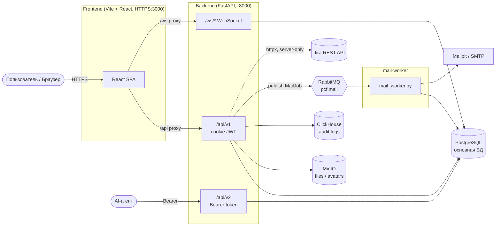
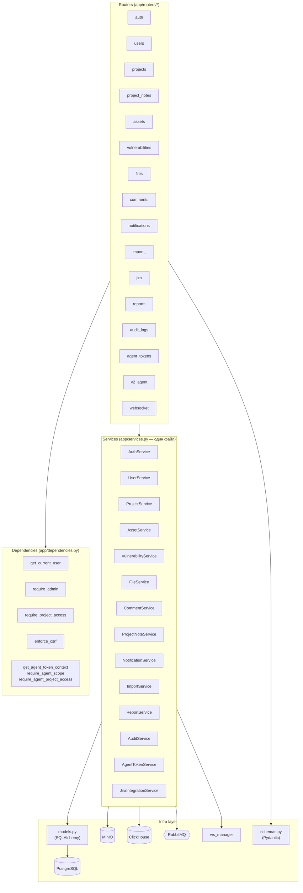
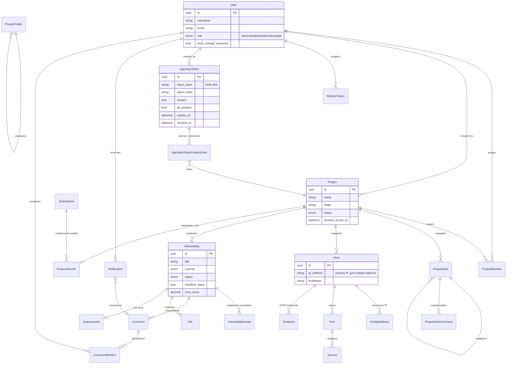
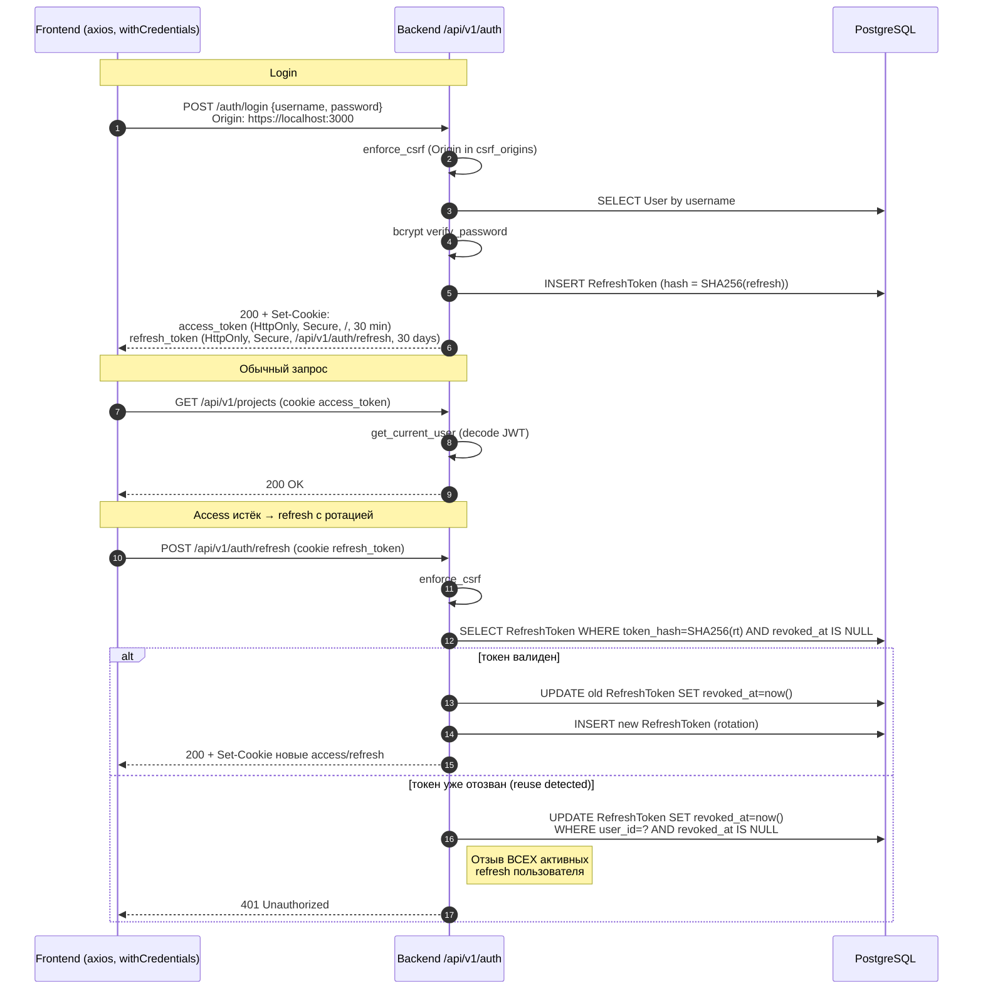
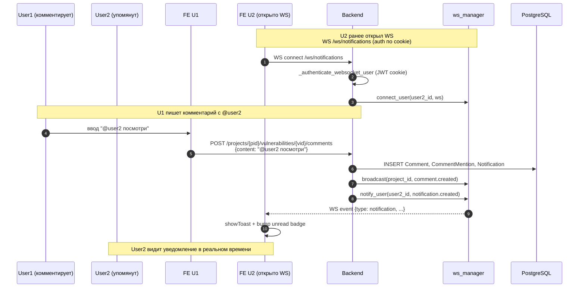
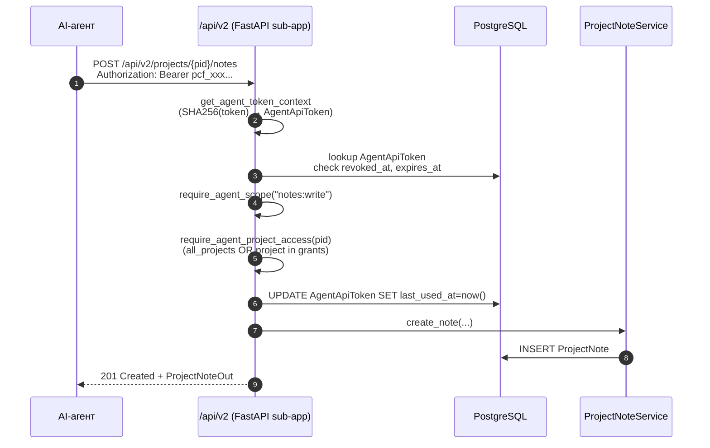

# PCF — Архитектурные диаграммы

Сопровождает [`ARCH.md`](./ARCH.md). Все диаграммы выполнены в Mermaid.

---

## 1. Архитектура контейнеров (Docker Compose)

---

## 2. Backend layered diagram

---

## 3. ER-диаграмма ключевых сущностей (краткая)

---

## 4. Auth: login + refresh с ротацией

---

## 5. WebSocket flow: уведомление о @mention

---

## 6. Agent API v2 — поток вызова

