# ARCH_DIAGRAMS — Подробные диаграммы STORM

> Дополняет [ARCH.md](ARCH.md). Все диаграммы — Mermaid (рендерятся в GitHub / VSCode / Markdown-просмотрщиках с поддержкой Mermaid).
>
> Каждая секция отвечает за один аспект системы: один сценарий — одна диаграмма.

---

## 1. System Context (C4-L1)

Кто и как взаимодействует со STORM.

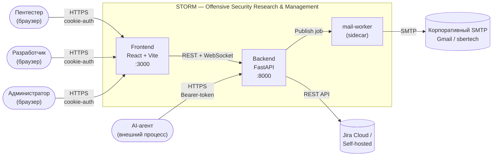
```mermaid
flowchart LR
    Pentester(["Пентестер<br/>(браузер)"])
    Developer(["Разработчик<br/>(браузер)"])
    Admin(["Администратор<br/>(браузер)"])
    AIAgent(["AI-агент<br/>(внешний процесс)"])

    subgraph STORM["STORM — Offensive Security Research & Management"]
        Frontend["Frontend<br/>React + Vite<br/>:3000"]
        Backend["Backend<br/>FastAPI<br/>:8000"]
        Worker["mail-worker<br/>(sidecar)"]
    end

    JiraCloud[("Jira Cloud /<br/>Self-hosted")]
    SMTP[("Корпоративный SMTP<br/>Gmail / sbertech")]

    Pentester -->|HTTPS<br/>cookie-auth| Frontend
    Developer -->|HTTPS<br/>cookie-auth| Frontend
    Admin -->|HTTPS<br/>cookie-auth| Frontend
    Frontend -->|REST + WebSocket| Backend
    AIAgent -->|HTTPS<br/>Bearer-token| Backend
    Backend -->|REST API| JiraCloud
    Backend -->|Publish job| Worker
    Worker -->|SMTP| SMTP
```

---

## 2. Container Diagram (C4-L2) — Docker Compose сервисы

Что развёрнуто в docker-compose и как сервисы общаются.

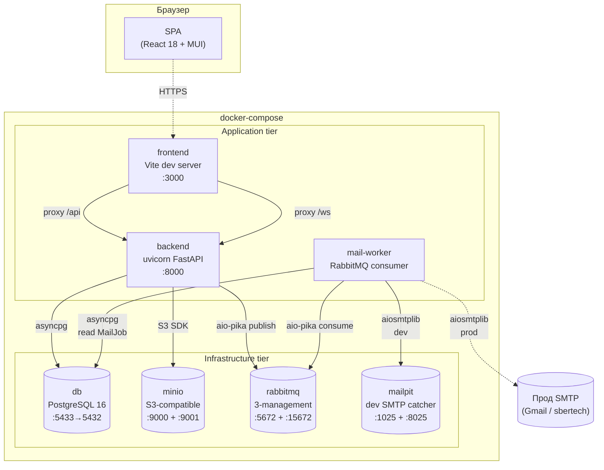
```mermaid
flowchart TB
    subgraph Browser["Браузер"]
        ClientApp["SPA<br/>(React 18 + MUI)"]
    end

    subgraph Compose["docker-compose"]
        direction TB

        subgraph App["Application tier"]
            Frontend["frontend<br/>Vite dev server<br/>:3000"]
            Backend["backend<br/>uvicorn FastAPI<br/>:8000"]
            MailWorker["mail-worker<br/>RabbitMQ consumer"]
        end

        subgraph Infra["Infrastructure tier"]
            Postgres[("db<br/>PostgreSQL 16<br/>:5433→5432")]
            MinIO[("minio<br/>S3-compatible<br/>:9000 + :9001")]
            Rabbit[("rabbitmq<br/>3-management<br/>:5672 + :15672")]
            Mailpit[("mailpit<br/>dev SMTP catcher<br/>:1025 + :8025")]
        end
    end

    ExternalSMTP[("Прод SMTP<br/>(Gmail / sbertech)")]

    ClientApp -.->|HTTPS| Frontend
    Frontend -->|proxy /api| Backend
    Frontend -->|proxy /ws| Backend

    Backend -->|asyncpg| Postgres
    Backend -->|S3 SDK| MinIO
    Backend -->|aio-pika publish| Rabbit

    MailWorker -->|aio-pika consume| Rabbit
    MailWorker -->|asyncpg<br/>read MailJob| Postgres
    MailWorker -->|aiosmtplib<br/>dev| Mailpit
    MailWorker -.->|aiosmtplib<br/>prod| ExternalSMTP
```

---

## 3. Backend — слоистая архитектура

Запрос проходит фиксированный путь Router → Dependency → Service → Model. Repository-pattern намеренно не вводится — сервисы работают с `AsyncSession` напрямую.

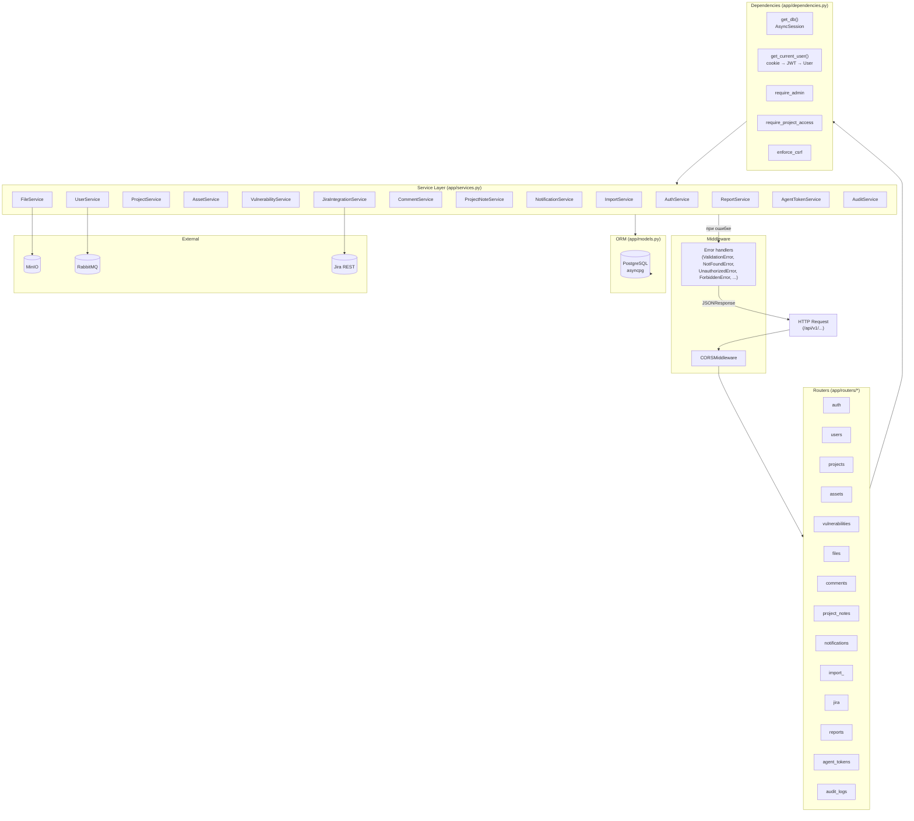
```mermaid
flowchart TB
    HTTP["HTTP Request<br/>(/api/v1/...)"]

    subgraph Middleware["Middleware"]
        CORS["CORSMiddleware"]
        ErrorHandlers["Error handlers<br/>(ValidationError, NotFoundError,<br/>UnauthorizedError, ForbiddenError, ...)"]
    end

    subgraph Routers["Routers (app/routers/*)"]
        AuthR["auth"]
        UsersR["users"]
        ProjectsR["projects"]
        AssetsR["assets"]
        VulnR["vulnerabilities"]
        FilesR["files"]
        CommentsR["comments"]
        NotesR["project_notes"]
        NotifR["notifications"]
        ImportR["import_"]
        JiraR["jira"]
        ReportsR["reports"]
        AgentR["agent_tokens"]
        AuditR["audit_logs"]
    end

    subgraph DI["Dependencies (app/dependencies.py)"]
        GetDB["get_db()<br/>AsyncSession"]
        GetUser["get_current_user()<br/>cookie → JWT → User"]
        RequireAdmin["require_admin"]
        RequireAccess["require_project_access"]
        EnforceCSRF["enforce_csrf"]
    end

    subgraph Services["Service Layer (app/services.py)"]
        AuthSrv["AuthService"]
        UserSrv["UserService"]
        ProjSrv["ProjectService"]
        AssetSrv["AssetService"]
        VulnSrv["VulnerabilityService"]
        FileSrv["FileService"]
        CommSrv["CommentService"]
        NoteSrv["ProjectNoteService"]
        NotifSrv["NotificationService"]
        ImpSrv["ImportService"]
        JiraSrv["JiraIntegrationService"]
        RepSrv["ReportService"]
        AgentSrv["AgentTokenService"]
        AuditSrv["AuditService"]
    end

    subgraph Models["ORM (app/models.py)"]
        DB[("PostgreSQL<br/>asyncpg")]
    end

    subgraph External["External"]
        MinIOExt[("MinIO")]
        RabbitExt[("RabbitMQ")]
        JiraExt[("Jira REST")]
    end

    HTTP --> CORS --> Routers
    Routers --> DI --> Services
    Services --> Models --> DB
    FileSrv --> MinIOExt
    UserSrv --> RabbitExt
    JiraSrv --> JiraExt
    Services -->|при ошибке| ErrorHandlers
    ErrorHandlers -->|JSONResponse| HTTP
```

---

## 4. Аутентификация — login, refresh, logout

JWT в HttpOnly Secure cookies, CSRF через SameSite=Strict + проверку Origin. Refresh-токены с ротацией.

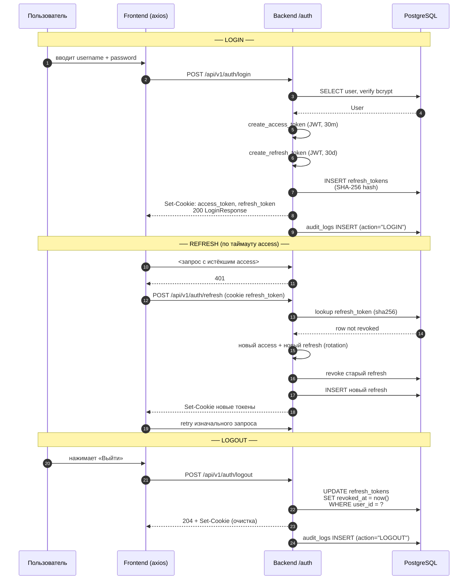
```mermaid
sequenceDiagram
    autonumber
    participant U as Пользователь
    participant FE as Frontend (axios)
    participant BE as Backend /auth
    participant DB as PostgreSQL

    Note over U,DB: ── LOGIN ──
    U->>FE: вводит username + password
    FE->>BE: POST /api/v1/auth/login
    BE->>DB: SELECT user, verify bcrypt
    DB-->>BE: User
    BE->>BE: create_access_token (JWT, 30m)
    BE->>BE: create_refresh_token (JWT, 30d)
    BE->>DB: INSERT refresh_tokens<br/>(SHA-256 hash)
    BE-->>FE: Set-Cookie: access_token, refresh_token<br/>200 LoginResponse
    BE->>DB: audit_logs INSERT (action="LOGIN")

    Note over U,DB: ── REFRESH (по таймауту access) ──
    FE->>BE: <запрос с истёкшим access>
    BE-->>FE: 401
    FE->>BE: POST /api/v1/auth/refresh (cookie refresh_token)
    BE->>DB: lookup refresh_token (sha256)
    DB-->>BE: row not revoked
    BE->>BE: новый access + новый refresh (rotation)
    BE->>DB: revoke старый refresh
    BE->>DB: INSERT новый refresh
    BE-->>FE: Set-Cookie новые токены
    FE->>BE: retry изначального запроса

    Note over U,DB: ── LOGOUT ──
    U->>FE: нажимает «Выйти»
    FE->>BE: POST /api/v1/auth/logout
    BE->>DB: UPDATE refresh_tokens<br/>SET revoked_at = now()<br/>WHERE user_id = ?
    BE-->>FE: 204 + Set-Cookie (очистка)
    BE->>DB: audit_logs INSERT (action="LOGOUT")
```

---

## 5. Управление сессией — refresh rotation детальнее

Защита от replay и кражи refresh-токена.

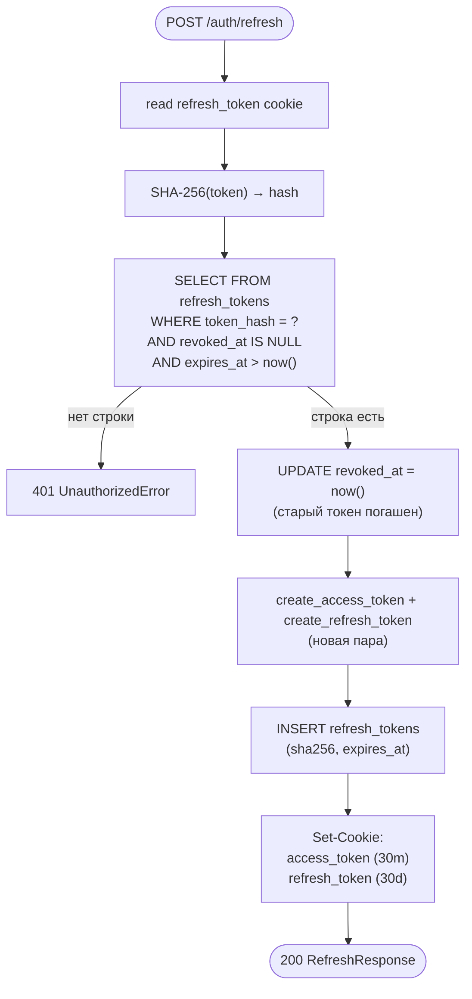
```mermaid
flowchart TB
    Start(["POST /auth/refresh"]) --> ReadCookie["read refresh_token cookie"]
    ReadCookie --> Hash["SHA-256(token) → hash"]
    Hash --> Lookup["SELECT FROM refresh_tokens<br/>WHERE token_hash = ?<br/>AND revoked_at IS NULL<br/>AND expires_at > now()"]
    Lookup -->|нет строки| Deny["401 UnauthorizedError"]
    Lookup -->|строка есть| Revoke["UPDATE revoked_at = now()<br/>(старый токен погашен)"]
    Revoke --> Issue["create_access_token + create_refresh_token<br/>(новая пара)"]
    Issue --> StoreNew["INSERT refresh_tokens<br/>(sha256, expires_at)"]
    StoreNew --> SetCookies["Set-Cookie:<br/>access_token (30m)<br/>refresh_token (30d)"]
    SetCookies --> Ok(["200 RefreshResponse"])
```

---

## 6. CSRF + Origin защита

`SameSite=Strict` блокирует cross-site cookies; дополнительно проверяем заголовок `Origin`.

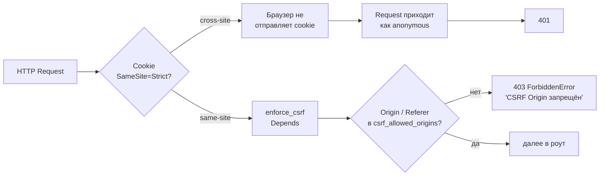
```mermaid
flowchart LR
    Req["HTTP Request"] --> CookieFlag{"Cookie<br/>SameSite=Strict?"}
    CookieFlag -->|cross-site| BrowserStrip["Браузер не<br/>отправляет cookie"]
    BrowserStrip --> Anon["Request приходит<br/>как anonymous"]
    Anon --> Deny401["401"]

    CookieFlag -->|same-site| EnforceCSRF["enforce_csrf<br/>Depends"]
    EnforceCSRF --> Origin{"Origin / Referer<br/>в csrf_allowed_origins?"}
    Origin -->|нет| Deny403["403 ForbiddenError<br/>'CSRF Origin запрещён'"]
    Origin -->|да| Pass["далее в роут"]
```

---

## 7. Доступ к проекту — IDOR-проверки

`require_project_access` гарантирует, что pentester видит только свои проекты, admin — все.

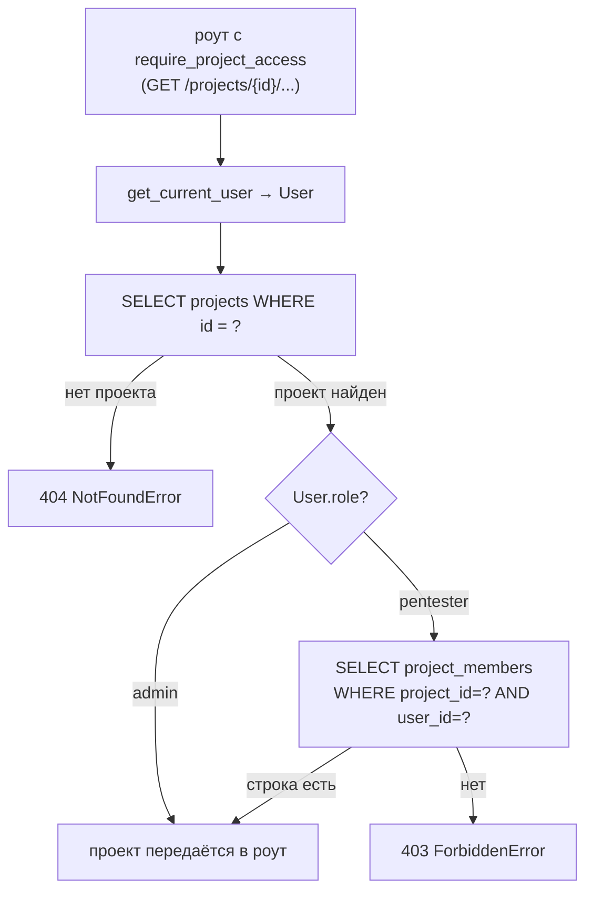
```mermaid
flowchart TB
    Endpoint["роут с require_project_access<br/>(GET /projects/{id}/...)"]
    Endpoint --> User["get_current_user → User"]
    User --> Lookup["SELECT projects WHERE id = ?"]
    Lookup -->|нет проекта| NotFound["404 NotFoundError"]
    Lookup -->|проект найден| Role{"User.role?"}
    Role -->|admin| Allow["проект передаётся в роут"]
    Role -->|pentester| Member["SELECT project_members<br/>WHERE project_id=? AND user_id=?"]
    Member -->|строка есть| Allow
    Member -->|нет| Forbid["403 ForbiddenError"]
```

---

## 8. Жизненный цикл уязвимости

Статусы и workflow_steps (этапы воспроизведения).

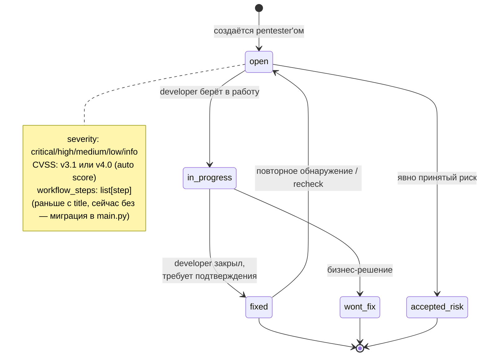
```mermaid
stateDiagram-v2
    [*] --> open: создаётся pentester'ом

    open --> in_progress: developer берёт в работу
    in_progress --> fixed: developer закрыл,<br/>требует подтверждения
    fixed --> open: повторное обнаружение / recheck
    in_progress --> wont_fix: бизнес-решение
    open --> accepted_risk: явно принятый риск

    note right of open
        severity: critical/high/medium/low/info
        CVSS: v3.1 или v4.0 (auto score)
        workflow_steps: list[step]
          (раньше с title, сейчас без — миграция в main.py)
    end note

    fixed --> [*]
    wont_fix --> [*]
    accepted_risk --> [*]
```

---

## 9. Загрузка evidence-файла в MinIO

Конвейер с валидацией и transaction outbox (метаданные в Postgres → объект в MinIO).

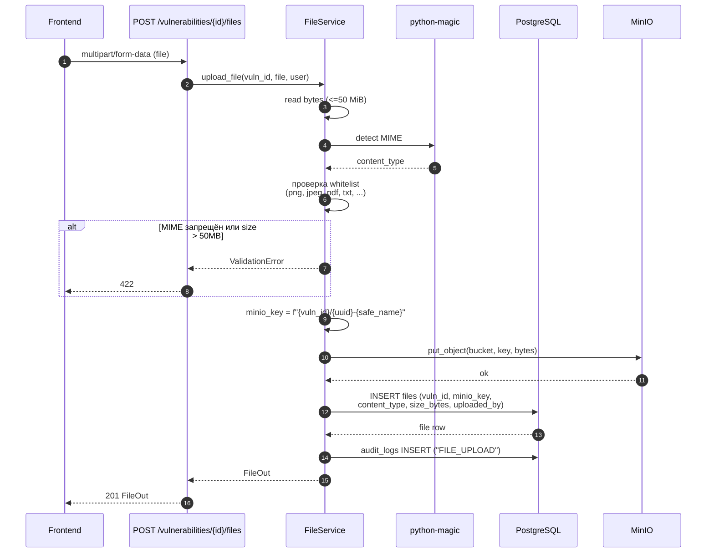
```mermaid
sequenceDiagram
    autonumber
    participant FE as Frontend
    participant R as POST /vulnerabilities/{id}/files
    participant FS as FileService
    participant Mag as python-magic
    participant DB as PostgreSQL
    participant M as MinIO

    FE->>R: multipart/form-data (file)
    R->>FS: upload_file(vuln_id, file, user)
    FS->>FS: read bytes (<=50 MiB)
    FS->>Mag: detect MIME
    Mag-->>FS: content_type
    FS->>FS: проверка whitelist<br/>(png, jpeg, pdf, txt, ...)
    alt MIME запрещён или size > 50MB
        FS-->>R: ValidationError
        R-->>FE: 422
    end
    FS->>FS: minio_key = f"{vuln_id}/{uuid}-{safe_name}"
    FS->>M: put_object(bucket, key, bytes)
    M-->>FS: ok
    FS->>DB: INSERT files (vuln_id, minio_key,<br/>content_type, size_bytes, uploaded_by)
    DB-->>FS: file row
    FS->>DB: audit_logs INSERT ("FILE_UPLOAD")
    FS-->>R: FileOut
    R-->>FE: 201 FileOut
```

---

## 10. Mail outbox + worker

Outbox pattern: письмо сначала сохраняется в БД как `MailJob`, потом ID публикуется в RabbitMQ. Воркер потребляет ID, забирает `MailJob` из БД и шлёт по SMTP.

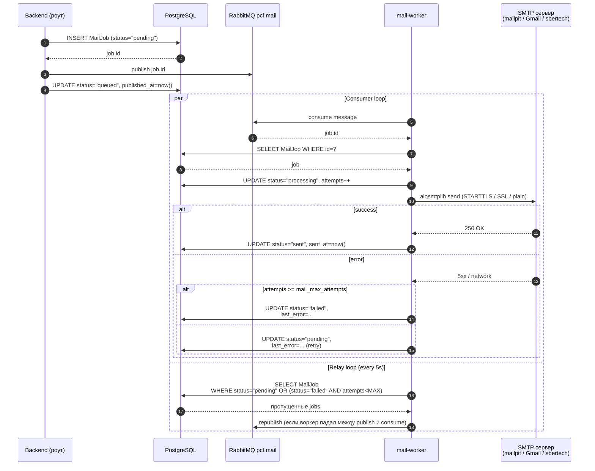
```mermaid
sequenceDiagram
    autonumber
    participant API as Backend (роут)
    participant DB as PostgreSQL
    participant MQ as RabbitMQ pcf.mail
    participant W as mail-worker
    participant SMTP as SMTP сервер<br/>(mailpit / Gmail / sbertech)

    API->>DB: INSERT MailJob (status="pending")
    DB-->>API: job.id
    API->>MQ: publish job.id
    API->>DB: UPDATE status="queued", published_at=now()

    par Consumer loop
        W->>MQ: consume message
        MQ-->>W: job.id
        W->>DB: SELECT MailJob WHERE id=?
        DB-->>W: job
        W->>DB: UPDATE status="processing", attempts++
        W->>SMTP: aiosmtplib send (STARTTLS / SSL / plain)
        alt success
            SMTP-->>W: 250 OK
            W->>DB: UPDATE status="sent", sent_at=now()
        else error
            SMTP-->>W: 5xx / network
            alt attempts >= mail_max_attempts
                W->>DB: UPDATE status="failed",<br/>last_error=...
            else
                W->>DB: UPDATE status="pending",<br/>last_error=... (retry)
            end
        end
    and Relay loop (every 5s)
        W->>DB: SELECT MailJob<br/>WHERE status="pending" OR (status="failed" AND attempts<MAX)
        DB-->>W: пропущенные jobs
        W->>MQ: republish (если воркер падал между publish и consume)
    end
```

---

## 11. Jira export — все защитные слои

Самая «тяжёлая» по защитам цепочка: SSRF + DNS rebind + race condition + сетевые ошибки.

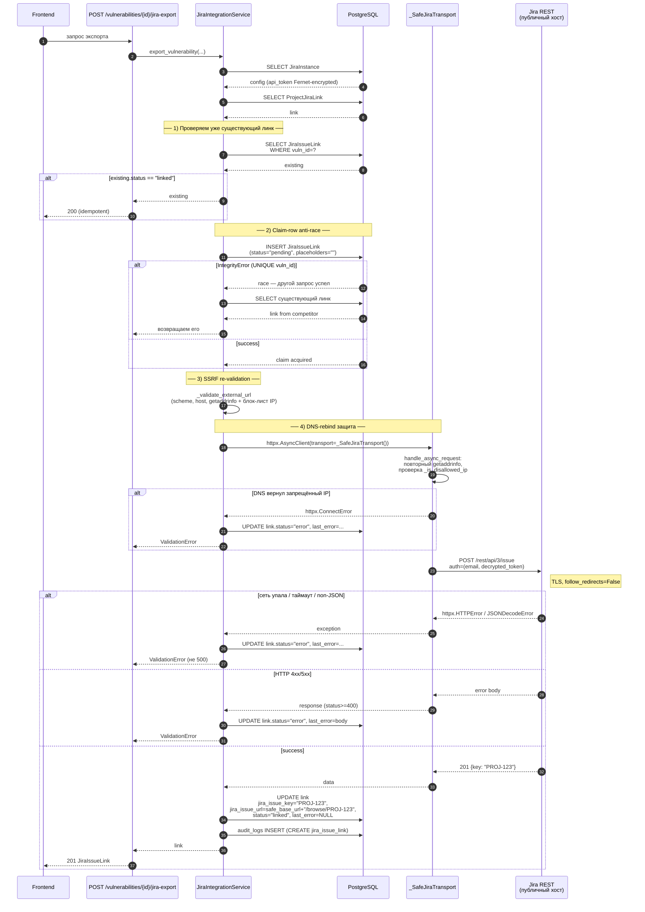
```mermaid
sequenceDiagram
    autonumber
    participant FE as Frontend
    participant R as POST /vulnerabilities/{id}/jira-export
    participant JS as JiraIntegrationService
    participant DB as PostgreSQL
    participant TR as _SafeJiraTransport
    participant J as Jira REST<br/>(публичный хост)

    FE->>R: запрос экспорта
    R->>JS: export_vulnerability(...)

    JS->>DB: SELECT JiraInstance
    DB-->>JS: config (api_token Fernet-encrypted)
    JS->>DB: SELECT ProjectJiraLink
    DB-->>JS: link

    Note over JS: ── 1) Проверяем уже существующий линк ──
    JS->>DB: SELECT JiraIssueLink<br/>WHERE vuln_id=?
    DB-->>JS: existing
    alt existing.status == "linked"
        JS-->>R: existing
        R-->>FE: 200 (idempotent)
    end

    Note over JS,DB: ── 2) Claim-row anti-race ──
    JS->>DB: INSERT JiraIssueLink<br/>(status="pending", placeholders="")
    alt IntegrityError (UNIQUE vuln_id)
        DB-->>JS: race — другой запрос успел
        JS->>DB: SELECT существующий линк
        DB-->>JS: link from competitor
        JS-->>R: возвращаем его
    else success
        DB-->>JS: claim acquired
    end

    Note over JS: ── 3) SSRF re-validation ──
    JS->>JS: _validate_external_url<br/>(scheme, host, getaddrinfo + блок-лист IP)

    Note over JS,TR: ── 4) DNS-rebind защита ──
    JS->>TR: httpx.AsyncClient(transport=_SafeJiraTransport())
    TR->>TR: handle_async_request:<br/>повторный getaddrinfo,<br/>проверка _is_disallowed_ip
    alt DNS вернул запрещённый IP
        TR-->>JS: httpx.ConnectError
        JS->>DB: UPDATE link.status="error", last_error=...
        JS-->>R: ValidationError
    end

    TR->>J: POST /rest/api/3/issue<br/>auth=(email, decrypted_token)
    Note right of J: TLS, follow_redirects=False
    alt сеть упала / таймаут / non-JSON
        J-->>TR: httpx.HTTPError / JSONDecodeError
        TR-->>JS: exception
        JS->>DB: UPDATE link.status="error", last_error=...
        JS-->>R: ValidationError (не 500)
    else HTTP 4xx/5xx
        J-->>TR: error body
        TR-->>JS: response (status>=400)
        JS->>DB: UPDATE link.status="error", last_error=body
        JS-->>R: ValidationError
    else success
        J-->>TR: 201 {key: "PROJ-123"}
        TR-->>JS: data
        JS->>DB: UPDATE link<br/>jira_issue_key="PROJ-123",<br/>jira_issue_url=safe_base_url+"/browse/PROJ-123",<br/>status="linked", last_error=NULL
        JS->>DB: audit_logs INSERT (CREATE jira_issue_link)
        JS-->>R: link
        R-->>FE: 201 JiraIssueLink
    end
```

---

## 12. SSRF & DNS-rebind защита — внутренности

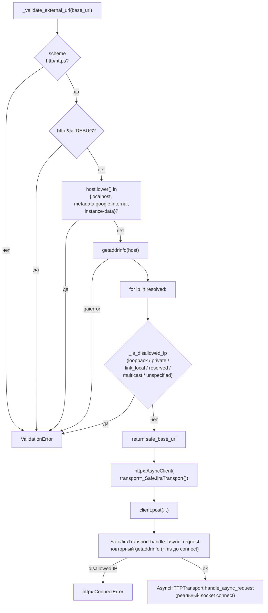
```mermaid
flowchart TB
    Validate["_validate_external_url(base_url)"]
    Validate --> CheckScheme{"scheme<br/>http/https?"}
    CheckScheme -->|нет| Reject1["ValidationError"]
    CheckScheme -->|да| ProdHttp{"http && !DEBUG?"}
    ProdHttp -->|да| Reject1
    ProdHttp -->|нет| HostBlock["host.lower() in<br/>{localhost, metadata.google.internal,<br/>instance-data}?"]
    HostBlock -->|да| Reject1
    HostBlock -->|нет| Resolve["getaddrinfo(host)"]
    Resolve -->|gaierror| Reject1
    Resolve --> ForEach["for ip in resolved:"]
    ForEach --> Disallowed{"_is_disallowed_ip<br/>(loopback / private /<br/>link_local / reserved /<br/>multicast / unspecified)"}
    Disallowed -->|да| Reject1
    Disallowed -->|нет| Pass["return safe_base_url"]

    Pass --> CreateTransport["httpx.AsyncClient(<br/>transport=_SafeJiraTransport())"]
    CreateTransport --> Request["client.post(...)"]
    Request --> TransportCheck["_SafeJiraTransport.handle_async_request:<br/>повторный getaddrinfo (~ms до connect)"]
    TransportCheck -->|disallowed IP| ConnectError["httpx.ConnectError"]
    TransportCheck -->|ok| ParentTransport["AsyncHTTPTransport.handle_async_request<br/>(реальный socket connect)"]
```

---

## 13. WebSocket — каналы и события

Backend держит три типа каналов через `ConnectionManager`.

```mermaid
flowchart TB
    Browser1["Pentester @ ProjectDetailPage"]
    Browser2["Developer @ ProjectDetailPage"]
    Browser3["Pentester @ ProjectsPage"]
    Browser4["Pentester в notification toast"]

    subgraph WS["ws_manager (ConnectionManager)"]
        ProjectsIdx["/ws/projects-index<br/>{ws_set}"]
        ProjectRoom["/ws/projects/{id}<br/>{project_id → ws_set}"]
        UserChan["/ws/notifications<br/>{user_id → ws_set}"]
    end

    subgraph Services["Service-layer events"]
        CreateVuln["VulnerabilityService.create"]
        EditHost["AssetService.update_host"]
        AddComment["CommentService.create<br/>(@mention)"]
        CreateProj["ProjectService.create"]
        AddNote["ProjectNoteService.create"]
    end

    Browser1 -->|connect| ProjectRoom
    Browser2 -->|connect| ProjectRoom
    Browser3 -->|connect| ProjectsIdx
    Browser4 -->|connect| UserChan

    CreateVuln -->|broadcast project_id| ProjectRoom
    EditHost -->|broadcast project_id| ProjectRoom
    AddComment -->|broadcast project_id| ProjectRoom
    AddComment -->|notify_user mentions| UserChan
    AddNote -->|broadcast project_id| ProjectRoom
    CreateProj -->|broadcast_projects_index| ProjectsIdx

    ProjectsIdx -->|"event":"created"<br/>"entity":"project"| Browser3
    ProjectRoom -->|"event":"created"<br/>"entity":"vulnerability"| Browser1
    ProjectRoom -->|"event":"updated"<br/>"entity":"host"| Browser2
    UserChan -->|"event":"notification"<br/>"entity":"notification"| Browser4
```

Подписка происходит вместе с handshake, аутентификация — `access_token` из cookie.

---

## 14. AI Agent API `/api/v2` — scoping и проверка доступа

Отдельное FastAPI-приложение, смонтированное на `/api/v2`. Аутентификация — Bearer-токен, выпущенный администратором.

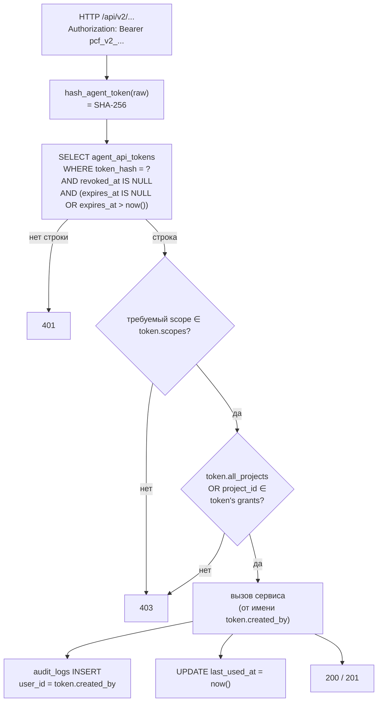
```mermaid
flowchart TB
    Request["HTTP /api/v2/...<br/>Authorization: Bearer pcf_v2_..."]
    Request --> Hash["hash_agent_token(raw)<br/>= SHA-256"]
    Hash --> Lookup["SELECT agent_api_tokens<br/>WHERE token_hash = ?<br/>AND revoked_at IS NULL<br/>AND (expires_at IS NULL OR expires_at > now())"]
    Lookup -->|нет строки| Deny["401"]
    Lookup -->|строка| ScopeCheck{"требуемый scope ∈ token.scopes?"}
    ScopeCheck -->|нет| Deny403["403"]
    ScopeCheck -->|да| ProjectCheck{"token.all_projects<br/>OR project_id ∈<br/>token's grants?"}
    ProjectCheck -->|нет| Deny403
    ProjectCheck -->|да| Service["вызов сервиса<br/>(от имени token.created_by)"]
    Service --> Audit["audit_logs INSERT<br/>user_id = token.created_by"]
    Service --> UpdateLastUsed["UPDATE last_used_at = now()"]
    Service --> Response["200 / 201"]
```

### Карта scopes → endpoints

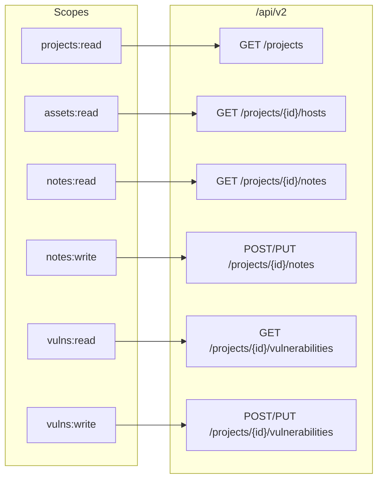
```mermaid
flowchart LR
    subgraph Scopes
        SR["projects:read"]
        AR["assets:read"]
        NR["notes:read"]
        NW["notes:write"]
        VR["vulns:read"]
        VW["vulns:write"]
    end

    subgraph V2["/api/v2"]
        ListProjects["GET /projects"]
        ListHosts["GET /projects/{id}/hosts"]
        ListNotes["GET /projects/{id}/notes"]
        WriteNote["POST/PUT /projects/{id}/notes"]
        ListVulns["GET /projects/{id}/vulnerabilities"]
        WriteVuln["POST/PUT /projects/{id}/vulnerabilities"]
    end

    SR --> ListProjects
    AR --> ListHosts
    NR --> ListNotes
    NW --> WriteNote
    VR --> ListVulns
    VW --> WriteVuln
```

---

## 15. Audit log — запись и чтение

Единое хранилище — PostgreSQL. Запись синхронная с основной транзакцией, чтение через фильтры с full-text по action / entity_type / ip / username / cast(details::text).

```mermaid
flowchart TB
    subgraph Write
        ServiceOp["любая Service-операция<br/>(CRUD, LOGIN, FILE_UPLOAD, ...)"]
        ServiceOp --> Commit["self.db.commit()<br/>(основная транзакция)"]
        Commit --> AuditLog["AuditService.log(<br/>action, user_id, entity_type,<br/>entity_id, details, ip_address)"]
        AuditLog --> AuditAdd["db.add(AuditLog(...))"]
        AuditAdd --> AuditCommit["db.commit()"]
    end

    subgraph Read["GET /api/v1/audit-logs (admin)"]
        Query["параметры:<br/>user_id, username, action,<br/>entity_type, entity_id, ip_address,<br/>query, created_from, created_to,<br/>page, size"]
        Query --> Join["select(AuditLog, User.username)<br/>.outerjoin(User on user_id)"]
        Join --> Filters["WHERE conditions:<br/>• не показывать LOGIN with source=refresh<br/>• ILIKE для текстовых полей<br/>• datetime range для created_at"]
        Filters --> FullText{"query?"}
        FullText -->|есть| FTSearch["OR(<br/>action ILIKE,<br/>entity_type ILIKE,<br/>ip ILIKE,<br/>User.username ILIKE,<br/>cast(details::text) ILIKE)"]
        FullText -->|нет| Count
        FTSearch --> Count["COUNT(*) FROM stmt"]
        Count --> Page["ORDER BY created_at DESC<br/>OFFSET (page-1)*size<br/>LIMIT size"]
        Page --> Response["PaginatedResponse[AuditLogOut]"]
    end
```

---

## 16. Word-отчёты — конвейер генерации

ПП = все страницы landscape, СЗИ = portrait. Общая логика в `_build_common`.

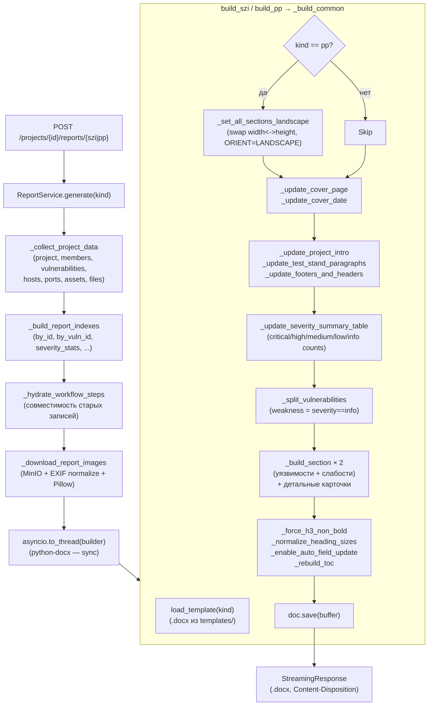
```mermaid
flowchart TB
    Trigger["POST /projects/{id}/reports/{szi|pp}"]
    Trigger --> Service["ReportService.generate(kind)"]
    Service --> Collect["_collect_project_data<br/>(project, members, vulnerabilities,<br/>hosts, ports, assets, files)"]
    Collect --> Indexes["_build_report_indexes<br/>(by_id, by_vuln_id, severity_stats, ...)"]
    Indexes --> Hydrate["_hydrate_workflow_steps<br/>(совместимость старых записей)"]
    Hydrate --> Images["_download_report_images<br/>(MinIO + EXIF normalize + Pillow)"]
    Images --> ToThread["asyncio.to_thread(builder)<br/>(python-docx — sync)"]

    subgraph Builder["build_szi / build_pp → _build_common"]
        LoadTpl["load_template(kind)<br/>(.docx из templates/)"]
        Orient{"kind == pp?"}
        Orient -->|да| Landscape["_set_all_sections_landscape<br/>(swap width<->height, ORIENT=LANDSCAPE)"]
        Orient -->|нет| Skip
        Landscape --> Cover["_update_cover_page<br/>_update_cover_date"]
        Skip --> Cover
        Cover --> Intro["_update_project_intro<br/>_update_test_stand_paragraphs<br/>_update_footers_and_headers"]
        Intro --> Summary["_update_severity_summary_table<br/>(critical/high/medium/low/info counts)"]
        Summary --> Split["_split_vulnerabilities<br/>(weakness = severity==info)"]
        Split --> Sections["_build_section × 2<br/>(уязвимости + слабости)<br/>+ детальные карточки"]
        Sections --> Normalize["_force_h3_non_bold<br/>_normalize_heading_sizes<br/>_enable_auto_field_update<br/>_rebuild_toc"]
        Normalize --> Save["doc.save(buffer)"]
    end

    ToThread --> Builder
    Save --> Response["StreamingResponse<br/>(.docx, Content-Disposition)"]
```

---

## 17. Импорт OpenAPI/Swagger по endpoint'ам

Импорт спецификации в каталог endpoint'ов хоста.

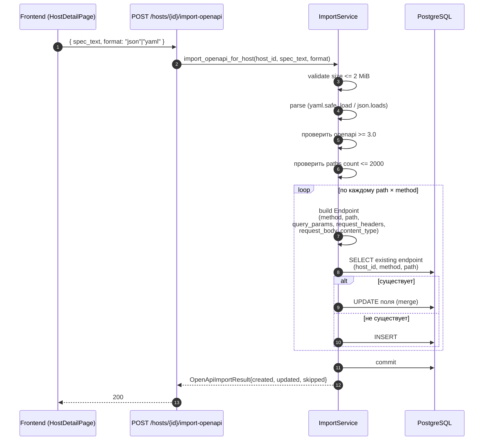
```mermaid
sequenceDiagram
    autonumber
    participant FE as Frontend (HostDetailPage)
    participant R as POST /hosts/{id}/import-openapi
    participant IS as ImportService
    participant DB as PostgreSQL

    FE->>R: { spec_text, format: "json"|"yaml" }
    R->>IS: import_openapi_for_host(host_id, spec_text, format)
    IS->>IS: validate size <= 2 MiB
    IS->>IS: parse (yaml.safe_load / json.loads)
    IS->>IS: проверить openapi >= 3.0
    IS->>IS: проверить paths count <= 2000
    loop по каждому path × method
        IS->>IS: build Endpoint<br/>(method, path,<br/>query_params, request_headers,<br/>request_body, content_type)
        IS->>DB: SELECT existing endpoint<br/>(host_id, method, path)
        alt существует
            IS->>DB: UPDATE поля (merge)
        else не существует
            IS->>DB: INSERT
        end
    end
    IS->>DB: commit
    IS-->>R: OpenApiImportResult{created, updated, skipped}
    R-->>FE: 200
```

---

## 18. PCF JSON импорт — атомарный

Полный rollback при любой ошибке. Идемпотентность по идентифицирующим полям.

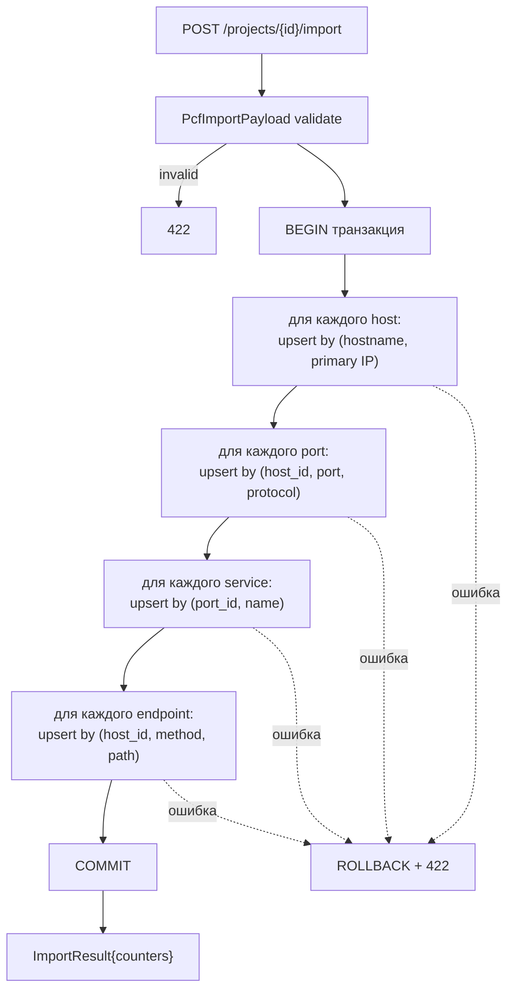
```mermaid
flowchart TB
    Start["POST /projects/{id}/import"]
    Start --> Parse["PcfImportPayload validate"]
    Parse -->|invalid| Reject["422"]
    Parse --> Begin["BEGIN транзакция"]
    Begin --> Hosts["для каждого host:<br/>upsert by (hostname, primary IP)"]
    Hosts --> Ports["для каждого port:<br/>upsert by (host_id, port, protocol)"]
    Ports --> Services["для каждого service:<br/>upsert by (port_id, name)"]
    Services --> Endpoints["для каждого endpoint:<br/>upsert by (host_id, method, path)"]
    Endpoints --> Commit["COMMIT"]
    Commit --> Ok["ImportResult{counters}"]

    Hosts -.->|ошибка| Rollback
    Ports -.->|ошибка| Rollback
    Services -.->|ошибка| Rollback
    Endpoints -.->|ошибка| Rollback
    Rollback["ROLLBACK + 422"]
```

---

## 19. Frontend — высокоуровневая структура

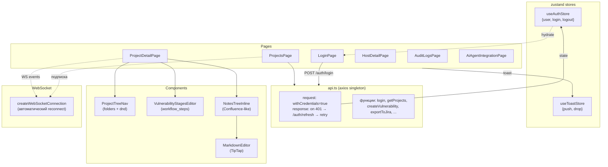
```mermaid
flowchart TB
    subgraph Stores["zustand stores"]
        Auth["useAuthStore<br/>{user, login, logout}"]
        Toast["useToastStore<br/>{push, drop}"]
    end

    subgraph API["api.ts (axios singleton)"]
        Intercept["request: withCredentials=true<br/>response: on 401 → /auth/refresh → retry"]
        Funcs["функции: login, getProjects,<br/>createVulnerability, exportToJira, ..."]
    end

    subgraph Pages
        Login["LoginPage"]
        Projects["ProjectsPage"]
        ProjectDetail["ProjectDetailPage"]
        HostDetail["HostDetailPage"]
        Audit["AuditLogsPage"]
        Agent["AiAgentIntegrationPage"]
    end

    subgraph Comp["Components"]
        TreeNav["ProjectTreeNav<br/>(folders + dnd)"]
        Stages["VulnerabilityStagesEditor<br/>(workflow_steps)"]
        Notes["NotesTreeInline<br/>(Confluence-like)"]
        MD["MarkdownEditor<br/>(TipTap)"]
    end

    subgraph WS["WebSocket"]
        WSConn["createWebSocketConnection<br/>(автоматический reconnect)"]
    end

    Login -->|POST /auth/login| API
    Auth -.->|hydrate| Login
    Projects --> API
    Projects -.->|подписка| WSConn
    ProjectDetail --> TreeNav
    ProjectDetail --> Stages
    ProjectDetail --> Notes
    Notes --> MD
    ProjectDetail -.->|WS events| WSConn

    Intercept -->|state| Auth
    Pages -->|toast| Toast
```

---

## 20. ER-диаграмма (укорочённая)

Полное описание — в [DB_SCHEMA.md](DB_SCHEMA.md). Здесь укрупнённая карта связей.

```mermaid
erDiagram
    USERS ||--o{ REFRESH_TOKENS : has
    USERS ||--o{ PROJECT_MEMBERS : member_of
    USERS ||--o{ AGENT_API_TOKENS : creates
    USERS ||--o{ MAIL_JOBS : recipient_or_creator
    USERS ||--o{ AUDIT_LOGS : actor

    PROJECTS ||--o{ PROJECT_MEMBERS : has
    PROJECTS ||--o{ HOSTS : contains
    PROJECTS ||--o{ VULNERABILITIES : contains
    PROJECTS ||--o{ PROJECT_NOTES : contains
    PROJECTS ||--o| PROJECT_JIRA_LINKS : linked_to
    PROJECT_FOLDERS ||--o{ PROJECTS : groups

    HOSTS ||--o{ HOST_IP_ADDRESSES : has
    HOSTS ||--o{ PORTS : has
    HOSTS ||--o{ ENDPOINTS : has
    PORTS ||--o{ SERVICES : has

    VULNERABILITIES ||--o{ VULNERABILITY_ASSETS : "linked to assets"
    VULNERABILITIES ||--o{ FILES : evidence
    VULNERABILITIES ||--o{ COMMENTS : has
    VULNERABILITIES ||--o| JIRA_ISSUE_LINKS : exported_to

    COMMENTS ||--o{ COMMENT_MENTIONS : mentions
    COMMENTS ||--o{ NOTIFICATIONS : triggers

    PROJECT_NOTES ||--o{ PROJECT_NOTE_COMMENTS : has

    AGENT_API_TOKENS ||--o{ AGENT_API_TOKEN_PROJECT_GRANTS : restricted_to

    JIRA_INSTANCES ||--o{ PROJECT_JIRA_LINKS : configured_via
```
