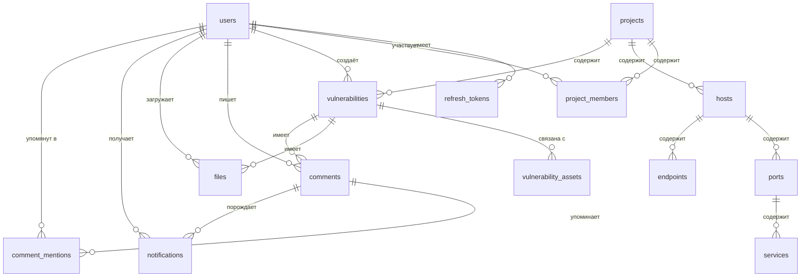

# Схема базы данных STORM
## Offensive Security Research & Management

> СУБД: **PostgreSQL** (единое хранилище — и доменные данные, и audit_logs)  
> Удаление: **физическое** (hard delete)  
> Аудит: CRUD-операции + события аутентификации + изменения статусов

---

## Диаграмма связей (ERD)



> **Примечание:** таблица `audit_logs` в PostgreSQL — единственный источник audit-журнала. Поиск (full-text) выполняется через `ILIKE` по action/entity_type/ip/username + `cast(details::text)`.

---

## Сущности

---

### `users` — Пользователи

| Колонка       | Тип                       | Ограничения              | Описание                          |
|---------------|---------------------------|--------------------------|-----------------------------------|
| id            | INTEGER                      | PK, autoincrement | Первичный ключ              |
| username            | VARCHAR(100)              | NOT NULL, UNIQUE         | Имя пользователя (логин)                      |
| email               | VARCHAR(255)              | NOT NULL, UNIQUE         | Электронная почта                             |
| full_name           | VARCHAR(255)              | NULLABLE                 | Отображаемое имя пользователя                 |
| avatar_minio_bucket | VARCHAR(63)               | NULLABLE                 | Бакет MinIO с аватаром                        |
| avatar_minio_key    | TEXT                      | NULLABLE                 | Ключ объекта аватара в MinIO                  |
| avatar_content_type | VARCHAR(127)              | NULLABLE                 | MIME-тип аватара                              |
| avatar_uploaded_at  | TIMESTAMPTZ               | NULLABLE                 | Дата загрузки аватара                         |
| password_hash       | VARCHAR(255)              | NOT NULL                 | Хэш пароля (bcrypt)                           |
| role                | ENUM('admin','pentester') | NOT NULL, DEFAULT 'pentester' | Аккаунтная роль                          |
| project_role        | ENUM('lead','pentester')  | NOT NULL, DEFAULT 'pentester' | Проектная роль — глобальная, задаётся в /members |
| is_active           | BOOLEAN                   | NOT NULL, DEFAULT TRUE   | Активен ли аккаунт                            |
| password_changed_at | TIMESTAMPTZ               | NULLABLE                 | Последняя успешная смена постоянного пароля   |
| created_at          | TIMESTAMPTZ               | NOT NULL, DEFAULT now()  | Дата регистрации                              |
| updated_at          | TIMESTAMPTZ               | NOT NULL, DEFAULT now()  | Дата последнего изменения                     |

**Индексы:** `email`, `username`

---

### `refresh_tokens` — JWT Refresh-токены

| Колонка    | Тип          | Ограничения              | Описание                                           |
|------------|--------------|--------------------------|----------------------------------------------------|
| id         | INTEGER         | PK                       | Первичный ключ                                     |
| user_id    | INTEGER         | NOT NULL, FK → users.id  | Владелец токена                                    |
| token_hash | VARCHAR(255) | NOT NULL, UNIQUE         | SHA-256 хэш refresh-токена (сам токен не хранится) |
| expires_at | TIMESTAMPTZ  | NOT NULL                 | Срок действия                                      |
| created_at | TIMESTAMPTZ  | NOT NULL, DEFAULT now()  | Дата выдачи                                        |
| revoked_at | TIMESTAMPTZ  | NULLABLE                 | Дата отзыва (NULL = активен)                       |

**Индекс:** `token_hash`, `user_id`  
**Примечание:** При logout или смене пароля все активные токены пользователя отзываются (устанавливается `revoked_at`).

---

### `mail_jobs` — Очередь отправки email

| Колонка         | Тип           | Ограничения                          | Описание                                  |
|-----------------|---------------|--------------------------------------|-------------------------------------------|
| id              | INTEGER          | PK                                   | Первичный ключ                             |
| user_id         | INTEGER          | NULLABLE, FK → users.id              | Получатель (если связан с пользователем)   |
| created_by      | INTEGER          | NULLABLE, FK → users.id              | Кто инициировал отправку                   |
| recipient_email | VARCHAR(255)  | NOT NULL                             | Email адрес получателя                     |
| subject         | VARCHAR(255)  | NOT NULL                             | Тема письма                                |
| template        | VARCHAR(100)  | NOT NULL                             | Имя шаблона/типа письма                    |
| payload         | JSON          | NOT NULL                             | Параметры письма                           |
| status          | VARCHAR(32)   | NOT NULL, DEFAULT 'pending'          | Статус задания (`pending`/`queued`/`processing`/`sent`/`failed`) |
| attempts        | INTEGER       | NOT NULL, DEFAULT 0                  | Количество попыток отправки                |
| published_at    | TIMESTAMPTZ   | NULLABLE                             | Время публикации в очередь                 |
| sent_at         | TIMESTAMPTZ   | NULLABLE                             | Время успешной отправки                    |
| last_error      | TEXT          | NULLABLE                             | Последняя ошибка отправки                  |
| created_at      | TIMESTAMPTZ   | NOT NULL, DEFAULT now()              | Дата создания                              |
| updated_at      | TIMESTAMPTZ   | NOT NULL, DEFAULT now()              | Дата последнего изменения                  |

**Индексы:** `recipient_email`, `template`, `status`

---

### `projects` — Пентест-проекты

| Колонка     | Тип          | Ограничения                   | Описание                      |
|-------------|--------------|-------------------------------|-------------------------------|
| id          | INTEGER         | PK                            | Первичный ключ                |
| name        | VARCHAR(255) | NOT NULL                      | Название проекта              |
| folder      | VARCHAR(255) | NOT NULL, DEFAULT ''          | Папка/группа проекта в интерфейсе |
| description | TEXT         | NULLABLE                      | Описание                      |
| start_date  | DATE         | NULLABLE                      | Дата начала                   |
| end_date    | DATE         | NULLABLE                      | Дата окончания                |
| timeline_frozen_at | TIMESTAMPTZ | NULLABLE                | Время фиксации таймлайна проекта |
| status      | ENUM('active','freeze','handover_to_development','vulnerability_recheck','completed','archived') | NOT NULL, DEFAULT 'active' | Статус    |
| created_by  | INTEGER         | NOT NULL, FK → users.id       | Кто создал                    |
| created_at  | TIMESTAMPTZ  | NOT NULL, DEFAULT now()       | Дата создания                 |
| updated_at  | TIMESTAMPTZ  | NOT NULL, DEFAULT now()       | Дата последнего изменения     |

---

### `project_members` — Участники проекта

Связывает пользователей с проектами. Роль определяется глобально (`users.role`).

| Колонка    | Тип         | Ограничения                     | Описание              |
|------------|-------------|----------------------------------|-----------------------|
| id         | INTEGER        | PK                               | Первичный ключ        |
| project_id | INTEGER        | NOT NULL, FK → projects.id       | Проект                |
| user_id    | INTEGER        | NOT NULL, FK → users.id          | Пользователь          |
| added_at   | TIMESTAMPTZ | NOT NULL, DEFAULT now()          | Дата добавления       |

**Уникальность:** `UNIQUE(project_id, user_id)`

---

### `hosts` — Хосты (узлы инфраструктуры)

| Колонка    | Тип          | Ограничения               | Описание                              |
|------------|--------------|---------------------------|---------------------------------------|
| id         | INTEGER         | PK                        | Первичный ключ                        |
| project_id | INTEGER         | NOT NULL, FK → projects.id | Проект                               |
| ip_address | VARCHAR(45)  | NULLABLE                  | IP-адрес (IPv4 или IPv6)              |
| hostname   | VARCHAR(255) | NULLABLE                  | Доменное имя / hostname               |
| status     | ENUM('up','down','unknown') | NOT NULL, DEFAULT 'unknown' | Статус доступности |
| notes      | TEXT         | NULLABLE                  | Произвольные заметки                  |
| created_at | TIMESTAMPTZ  | NOT NULL, DEFAULT now()   | Дата добавления                       |
| updated_at | TIMESTAMPTZ  | NOT NULL, DEFAULT now()   | Дата последнего изменения             |

**Ограничение:** хотя бы одно из полей `ip_address` или `hostname` должно быть заполнено (`CHECK`).  
**Индекс:** `project_id`

---

### `ports` — Порты хостов

| Колонка     | Тип                       | Ограничения              | Описание              |
|-------------|---------------------------|--------------------------|-----------------------|
| id          | INTEGER                      | PK                       | Первичный ключ        |
| host_id     | INTEGER                      | NOT NULL, FK → hosts.id  | Хост                  |
| port_number | SMALLINT                  | NOT NULL, CHECK(1..65535) | Номер порта          |
| protocol    | ENUM('tcp','udp')         | NOT NULL, DEFAULT 'tcp'  | Протокол              |
| state       | ENUM('open','closed','filtered') | NOT NULL, DEFAULT 'open' | Состояние порта |
| created_at  | TIMESTAMPTZ               | NOT NULL, DEFAULT now()  | Дата добавления       |
| updated_at  | TIMESTAMPTZ               | NOT NULL, DEFAULT now()  | Дата изменения        |

**Уникальность:** `UNIQUE(host_id, port_number, protocol)`

---

### `services` — Сервисы на портах

| Колонка    | Тип          | Ограничения              | Описание                     |
|------------|--------------|--------------------------|------------------------------|
| id         | INTEGER         | PK                       | Первичный ключ               |
| port_id    | INTEGER         | NOT NULL, FK → ports.id  | Порт                         |
| name       | VARCHAR(100) | NOT NULL                 | Название сервиса (http, ssh и т.д.) |
| version    | VARCHAR(100) | NULLABLE                 | Версия сервиса               |
| banner     | TEXT         | NULLABLE                 | Баннер сервиса               |
| created_at | TIMESTAMPTZ  | NOT NULL, DEFAULT now()  | Дата добавления              |
| updated_at | TIMESTAMPTZ  | NOT NULL, DEFAULT now()  | Дата изменения               |

---

### `endpoints` — HTTP-ручки / точки взаимодействия

| Колонка    | Тип                                                           | Ограничения              | Описание                        |
|------------|---------------------------------------------------------------|--------------------------|----------------------------------|
| id         | INTEGER                                                          | PK                       | Первичный ключ                   |
| host_id    | INTEGER                                                          | NOT NULL, FK → hosts.id  | Хост, к которому принадлежит     |
| path       | TEXT                                                          | NOT NULL                 | URL-путь (например, /api/login)  |
| method     | ENUM('GET','POST','PUT','PATCH','DELETE','HEAD','OPTIONS','QUERY')    | NULLABLE                 | HTTP-метод                       |
| description| TEXT                                                          | NULLABLE                 | Описание назначения              |
| created_at | TIMESTAMPTZ                                                   | NOT NULL, DEFAULT now()  | Дата добавления                  |
| updated_at | TIMESTAMPTZ                                                   | NOT NULL, DEFAULT now()  | Дата изменения                   |

**Индекс:** `host_id`

---

### `vulnerabilities` — Уязвимости

| Колонка              | Тип                                                            | Ограничения                    | Описание                              |
|----------------------|----------------------------------------------------------------|--------------------------------|---------------------------------------|
| id                   | INTEGER                                                           | PK                             | Первичный ключ                        |
| project_id           | INTEGER                                                           | NOT NULL, FK → projects.id     | Проект                                |
| title                | VARCHAR(500)                                                   | NOT NULL                       | Наименование уязвимости               |
| description          | TEXT                                                           | NULLABLE                       | Описание                              |
| severity             | ENUM('critical','high','medium','low','info')                  | NOT NULL                       | Уровень критичности                   |
| cvss_version         | ENUM('3.1','4.0')                                              | NULLABLE                       | Выбранная версия CVSS                 |
| cvss_score           | NUMERIC(4,1)                                                   | NULLABLE, CHECK(0..10)         | Числовой CVSS-балл                    |
| cvss_vector          | VARCHAR(255)                                                   | NULLABLE                       | Векторная строка CVSS                 |
| cwe_id               | VARCHAR(20)                                                    | NULLABLE                       | Идентификатор CWE (например, CWE-89)  |
| status               | ENUM('open','in_progress','fixed','wont_fix','accepted_risk') | NOT NULL, DEFAULT 'open'       | Статус уязвимости                     |
| workflow_steps       | JSON                                                           | NULLABLE                       | Структурированные этапы воспроизведения; у каждого этапа обязателен непустой `title`, `description` опционален, `image_file_ids` валидируются приложением и должны ссылаться только на `files` этой же уязвимости |
| steps_to_reproduce   | TEXT                                                           | NULLABLE                       | Шаги воспроизведения                  |
| impact               | TEXT                                                           | NULLABLE                       | Описание влияния                      |
| recommendations      | TEXT                                                           | NULLABLE                       | Рекомендации по устранению            |
| created_by           | INTEGER                                                           | NOT NULL, FK → users.id        | Автор записи                          |
| created_at           | TIMESTAMPTZ                                                    | NOT NULL, DEFAULT now()        | Дата создания                         |
| updated_at           | TIMESTAMPTZ                                                    | NOT NULL, DEFAULT now()        | Дата последнего изменения             |

**Индексы:** `project_id`, `severity`, `status`

---

### `vulnerability_assets` — Связь уязвимостей с активами (полиморфная)

Одна таблица для всех типов активов. `asset_type` определяет, к какой таблице относится `asset_id`.

| Колонка          | Тип                                              | Ограничения                           | Описание                          |
|------------------|--------------------------------------------------|---------------------------------------|-----------------------------------|
| id               | INTEGER                                             | PK                                    | Первичный ключ                    |
| vulnerability_id | INTEGER                                             | NOT NULL, FK → vulnerabilities.id     | Уязвимость                        |
| asset_type       | ENUM('host','port','service','endpoint')         | NOT NULL                              | Тип актива                        |
| asset_id         | INTEGER                                             | NOT NULL                              | ID актива в соответствующей таблице |

**Уникальность:** `UNIQUE(vulnerability_id, asset_type, asset_id)`  
**Примечание:** `asset_id` является ненастоящим FK на уровне БД из-за полиморфности. Целостность обеспечивается на уровне приложения.

---

### `files` — Файлы / доказательная база

Метаданные файлов хранятся в PostgreSQL. Сами файлы — в **MinIO**.

| Колонка          | Тип          | Ограничения                       | Описание                                    |
|------------------|--------------|-----------------------------------|---------------------------------------------|
| id               | INTEGER         | PK                                | Первичный ключ                              |
| vulnerability_id | INTEGER         | NOT NULL, FK → vulnerabilities.id | Привязка к уязвимости                       |
| original_name    | VARCHAR(500) | NOT NULL                          | Оригинальное имя файла                      |
| content_type     | VARCHAR(127) | NOT NULL                          | MIME-тип (image/png, application/pdf и т.д.)|
| size_bytes       | BIGINT       | NOT NULL, CHECK(size_bytes <= 52428800) | Размер файла в байтах (макс. 50 МБ)   |
| minio_bucket     | VARCHAR(63)  | NOT NULL                          | Бакет в MinIO                               |
| minio_key        | TEXT         | NOT NULL                          | Ключ объекта в MinIO                        |
| uploaded_by      | INTEGER         | NOT NULL, FK → users.id           | Кто загрузил                                |
| uploaded_at      | TIMESTAMPTZ  | NOT NULL, DEFAULT now()           | Дата загрузки                               |

**Индекс:** `vulnerability_id`

---

### `comments` — Комментарии к уязвимостям

| Колонка          | Тип         | Ограничения                       | Описание                   |
|------------------|-------------|-----------------------------------|----------------------------|
| id               | INTEGER        | PK                                | Первичный ключ             |
| vulnerability_id | INTEGER        | NOT NULL, FK → vulnerabilities.id | Уязвимость                 |
| user_id          | INTEGER        | NOT NULL, FK → users.id           | Автор комментария          |
| content          | TEXT        | NOT NULL                          | Текст комментария          |
| created_at       | TIMESTAMPTZ | NOT NULL, DEFAULT now()           | Дата создания              |
| updated_at       | TIMESTAMPTZ | NOT NULL, DEFAULT now()           | Дата редактирования        |

**Индекс:** `vulnerability_id`

---

### `comment_mentions` — Упоминания пользователей в комментариях

| Колонка    | Тип  | Ограничения                   | Описание               |
|------------|------|-------------------------------|------------------------|
| id         | INTEGER | PK                            | Первичный ключ         |
| comment_id | INTEGER | NOT NULL, FK → comments.id    | Комментарий            |
| user_id    | INTEGER | NOT NULL, FK → users.id       | Упомянутый пользователь|

**Уникальность:** `UNIQUE(comment_id, user_id)`

---

### `notifications` — In-app уведомления

Уведомления создаются ровно по четырём поводам (`NotificationType`), других нет:
упоминание `@username`, добавление в проект, смена статуса своей находки и смена
статуса проекта. Инициатора события никогда не уведомляем.

Предмет уведомления лежит на самой записи: у упоминаний это комментарий
(`comment_id` **либо** `note_comment_id`), у остальных — `project_id` /
`vulnerability_id`.

| Колонка          | Тип                          | Ограничения                            | Описание                                            |
|------------------|------------------------------|----------------------------------------|-----------------------------------------------------|
| id               | INTEGER                      | PK                                     | Первичный ключ                                      |
| user_id          | INTEGER                      | NOT NULL, FK → users.id                | Получатель уведомления                              |
| type             | ENUM('mention','project_member_added','vuln_status_changed','project_status_changed') | NOT NULL | Повод |
| comment_id       | INTEGER                      | NULLABLE, FK → comments.id             | Упоминание в комментарии к находке                  |
| note_comment_id  | INTEGER                      | NULLABLE, FK → project_note_comments.id| Упоминание в комментарии к заметке                  |
| project_id       | INTEGER                      | NULLABLE, FK → projects.id (CASCADE)   | Проект — для добавления в проект и смены его статуса |
| vulnerability_id | INTEGER                      | NULLABLE, FK → vulnerabilities.id (CASCADE) | Находка — для смены её статуса                 |
| actor_id         | INTEGER                      | NULLABLE, FK → users.id (SET NULL)     | Кто инициировал событие                             |
| status           | VARCHAR(50)                  | NULLABLE                               | Выставленный статус (для смен статуса)              |
| is_read          | BOOLEAN                      | NOT NULL, DEFAULT FALSE                | Прочитано ли                                        |
| created_at       | TIMESTAMPTZ                  | NOT NULL, DEFAULT now()                | Дата создания                                       |

**Индексы:** `user_id`, `(user_id, is_read)` (для счётчика непрочитанных)

---
## Иерархия активов

```
Project
└── Host (ip_address / hostname)
    ├── Port (port_number, protocol)
    │   └── Service (name, version)
    └── Endpoint (path, method)
```

---

## Связи уязвимостей с активами

```
Vulnerability ──► vulnerability_assets (asset_type + asset_id)
                    ├── asset_type = 'host'     → hosts.id
                    ├── asset_type = 'port'     → ports.id
                    ├── asset_type = 'service'  → services.id
                    └── asset_type = 'endpoint' → endpoints.id
```

---

## Статусы

### Уязвимости (`vulnerabilities.status`)

| Значение       | Описание                               |
|----------------|----------------------------------------|
| open           | Новая, не взята в работу               |
| in_progress    | Ведётся исправление                    |
| fixed          | Исправлена                             |
| wont_fix       | Исправление отклонено                  |
| accepted_risk  | Риск принят заказчиком                 |

### Проекта (`projects.status`)

| Значение                    | Описание                                  |
|----------------------------|--------------------------------------------|
| active                     | Активный проект                            |
| freeze                     | Работы приостановлены                      |
| handover_to_development    | Передача результатов разработке             |
| vulnerability_recheck      | Повторная проверка после исправлений        |
| completed                  | Завершён                                   |
| archived                   | В архиве                                   |

---

## Коды событий аудита (`audit_logs.action`)

| Код           | Когда фиксируется                              |
|---------------|------------------------------------------------|
| LOGIN         | Успешный вход                                  |
| LOGOUT        | Выход                                          |
| CREATE        | Создание любой сущности                        |
| UPDATE        | Редактирование любой сущности                  |
| DELETE        | Удаление любой сущности                        |
| STATUS_CHANGE | Изменение статуса (уязвимость, проект)         |
| FILE_UPLOAD   | Загрузка файла                                 |
| FILE_DELETE   | Удаление файла                                 |

---

## WebSocket события

При любой CRUD-операции над сущностями проекта бэкенд отправляет событие всем участникам проекта, подключённым по WebSocket. Формат события:

```json
{
  "event": "created" | "updated" | "deleted",
  "entity": "host" | "port" | "service" | "endpoint" | "vulnerability" | "comment" | "file",
  "project_id": <int>,
  "data": { /* объект сущности */ }
}
```

WebSocket-подключение авторизуется `access_token` из httpOnly cookie в handshake-запросе. Клиент подписывается на комнату конкретного проекта.

---

## Пагинация API

Все списочные эндпоинты поддерживают offset-пагинацию:

- `?page=1&size=20` — номер страницы (с 1) и размер страницы
- Ответ содержит: `items`, `total`, `page`, `size`, `pages`

---

## Замечания разработчику

1. Все первичные ключи — `INTEGER` (autoincrement).
2. Временные метки хранятся в `TIMESTAMPTZ` (UTC). Конвертация в локальное время — на стороне клиента.
3. Все ENUM-типы создавать через `CREATE TYPE` в PostgreSQL до создания таблиц.
4. Таблица `vulnerability_assets` — полиморфная. Целостность `asset_id` гарантируется приложением, а не FK-ограничением БД.
5. Файлы: при удалении записи из `files` приложение обязано также удалить объект из MinIO.
6. `audit_logs.details` — JSON-колонка с произвольной нагрузкой; для full-text-поиска backend кастует её в `Text` и применяет `ILIKE` (см. `routers/audit_logs.py`).
7. Для полей `updated_at` рекомендуется использовать триггер `BEFORE UPDATE` для автоматического обновления.
8. Миграции вести через Alembic (стандарт для Python/SQLAlchemy).
9. `refresh_tokens`: сам токен в БД не хранится — только его SHA-256 хэш. При валидации входящий токен хэшируется и сравнивается с `token_hash`.
10. `notifications`: при создании уведомления рекомендуется также отправлять WebSocket-push получателю (если он онлайн), чтобы счётчик непрочитанных обновился без перезагрузки.
11. Импорт данных использует **собственный JSON-формат PCF**. Схема фиксируется в документации API и валидируется на сервере через Pydantic-модели `PcfImportPayload`, `PcfImportHost`, `PcfImportPort`, `PcfImportService`, `PcfImportEndpoint`.
12. Повторный импорт PCF JSON не должен дублировать уже существующие хосты/порты/сервисы/endpoints: приложение выполняет merge по идентифицирующим полям и создаёт только отсутствующие сущности.
13. Регистрация пользователей закрыта — эндпоинт создания аккаунта доступен только с ролью `admin`.
14. Аудит-логи пишутся в PostgreSQL-таблицу `audit_logs` синхронно с основной транзакцией. Внешних аналитических хранилищ нет.
