# ENTITY_DIAGRAM — модель данных PCF

Документ описывает текущее состояние модели данных PostgreSQL (`backend/app/models.py`) и связанных Enum-типов (`backend/app/enums.py`).

> Аудит действий пользователей в production хранится в ClickHouse; таблица `audit_logs` в Postgres сохранена как «лёгкий» журнал.

---

## 1. Краткое описание сущностей

### Идентичность и доступ
- **User** — пользователь системы (логин, e-mail, аватар в MinIO, роль, флаг `must_change_password`, тэги).
- **RefreshToken** — хэш активного refresh-токена с TTL и `revoked_at`.
- **AgentApiToken** — bearer-токен для машинного API `/api/v2` (AI-агенты), со scope-ами и сроком жизни.
- **AgentApiTokenProjectGrant** — разрешение agent-токена на конкретный проект (если не `all_projects`).

### Почта
- **MailJob** — задание на отправку письма (для outbox-воркера).

### Проекты и оргструктура
- **Project** — пентест-проект (статус, даты, `timeline_frozen_at` для фиксации сроков).
- **ProjectFolder** — иерархия папок проектов (с уникальным `path`).
- **ProjectMember** — участник проекта.

### Jira-интеграция
- **JiraInstance** — глобальная конфигурация Jira (URL, e-mail, зашифрованный API-токен).
- **ProjectJiraLink** — привязка проекта PCF к ключу проекта в Jira.
- **JiraIssueLink** — связь конкретной уязвимости с issue в Jira.

### Заметки (Confluence-like)
- **ProjectNote** — иерархическое дерево заметок проекта.
- **ProjectNoteComment** — комментарий к странице заметки.

### Активы инфраструктуры
- **Host** — хост проекта (поле `ip_address` сохранено для обратной совместимости как «основной» IP).
- **HostIpAddress** — отдельный IP-адрес хоста (несколько на хост, флаг `is_primary`).
- **Port** — порт хоста (с проверкой 1..65535).
- **Service** — сервис на порту (имя, версия, баннер).
- **Endpoint** — HTTP endpoint хоста (метод, query params, request body/headers в JSON).

### Уязвимости и доказательства
- **Vulnerability** — найденная уязвимость (severity, CVSS v3.1/v4.0, CWE, workflow_steps, impact, recommendations, steps_to_reproduce).
- **VulnerabilityAsset** — полиморфная привязка уязвимости к host/port/service/endpoint.
- **File** — вложение к уязвимости в MinIO (ограничение 50 MB).
- **Comment** — комментарий к уязвимости.
- **CommentMention** — упоминание пользователя в комментарии.
- **Notification** — in-app уведомление (тип `mention`).
- **AuditLog** — журнал действий (легковесный, основной аудит — ClickHouse).

---

## 2. ER-диаграмма (Mermaid)

```mermaid
erDiagram
    USER ||--o{ REFRESH_TOKEN : "owns"
    USER ||--o{ AGENT_API_TOKEN : "creates"
    USER ||--o{ MAIL_JOB : "addressee/creator"
    USER ||--o{ PROJECT : "creates"
    USER ||--o{ PROJECT_FOLDER : "creates"
    USER ||--o{ PROJECT_MEMBER : "membership"
    USER ||--o{ JIRA_INSTANCE : "configures"
    USER ||--o{ PROJECT_JIRA_LINK : "creates"
    USER ||--o{ PROJECT_NOTE : "creates/updates"
    USER ||--o{ PROJECT_NOTE_COMMENT : "writes"
    USER ||--o{ VULNERABILITY : "creates"
    USER ||--o{ FILE : "uploads"
    USER ||--o{ COMMENT : "writes"
    USER ||--o{ COMMENT_MENTION : "mentioned"
    USER ||--o{ NOTIFICATION : "receives"
    USER ||--o{ AUDIT_LOG : "actor"

    AGENT_API_TOKEN ||--o{ AGENT_API_TOKEN_PROJECT_GRANT : "grants"
    PROJECT ||--o{ AGENT_API_TOKEN_PROJECT_GRANT : "granted_to"

    PROJECT_FOLDER ||--o{ PROJECT_FOLDER : "parent_of"

    PROJECT ||--o{ PROJECT_MEMBER : "has"
    PROJECT ||--o{ HOST : "contains"
    PROJECT ||--o{ VULNERABILITY : "has"
    PROJECT ||--o{ PROJECT_JIRA_LINK : "linked_to"
    PROJECT ||--o{ PROJECT_NOTE : "has"
    PROJECT ||--o{ PROJECT_NOTE_COMMENT : "has"

    PROJECT_NOTE ||--o{ PROJECT_NOTE : "parent_of"
    PROJECT_NOTE ||--o{ PROJECT_NOTE_COMMENT : "has"

    HOST ||--o{ HOST_IP_ADDRESS : "has_ips"
    HOST ||--o{ PORT : "exposes"
    HOST ||--o{ ENDPOINT : "serves"
    PORT ||--o{ SERVICE : "runs"

    VULNERABILITY ||--o{ VULNERABILITY_ASSET : "polymorphic_to"
    VULNERABILITY ||--o{ FILE : "evidence"
    VULNERABILITY ||--o{ COMMENT : "discussed_in"
    VULNERABILITY ||--|| JIRA_ISSUE_LINK : "tracked_in"

    COMMENT ||--o{ COMMENT_MENTION : "mentions"
    COMMENT ||--o{ NOTIFICATION : "triggers"

    USER {
        uuid id PK
        string username UK
        string email UK
        string full_name
        json tags
        string password_hash
        bool must_change_password
        datetime password_changed_at
        string avatar_minio_bucket
        string avatar_minio_key
        string avatar_content_type
        datetime avatar_uploaded_at
        enum role
        bool is_active
    }
    REFRESH_TOKEN {
        uuid id PK
        uuid user_id FK
        string token_hash UK
        datetime expires_at
        datetime revoked_at
    }
    AGENT_API_TOKEN {
        uuid id PK
        string name
        string token_hash UK
        string token_prefix
        json scopes
        bool all_projects
        uuid created_by FK
        datetime expires_at
        datetime revoked_at
        datetime last_used_at
    }
    AGENT_API_TOKEN_PROJECT_GRANT {
        uuid id PK
        uuid token_id FK
        uuid project_id FK
    }
    MAIL_JOB {
        uuid id PK
        uuid user_id FK
        uuid created_by FK
        string recipient_email
        string subject
        string template
        json payload
        string status
        int attempts
        datetime published_at
        datetime sent_at
        text last_error
    }
    PROJECT {
        uuid id PK
        string name
        string folder
        text description
        date start_date
        date end_date
        datetime timeline_frozen_at
        enum status
        uuid created_by FK
    }
    PROJECT_FOLDER {
        uuid id PK
        string name
        string path UK
        uuid parent_id FK
        uuid created_by FK
    }
    PROJECT_MEMBER {
        uuid id PK
        uuid project_id FK
        uuid user_id FK
        datetime added_at
    }
    JIRA_INSTANCE {
        uuid id PK
        string name
        string base_url
        string email
        text api_token_encrypted
        string default_issue_type
        bool is_enabled
        uuid created_by FK
    }
    PROJECT_JIRA_LINK {
        uuid id PK
        uuid project_id FK
        string jira_project_key
        uuid created_by FK
    }
    PROJECT_NOTE {
        uuid id PK
        uuid project_id FK
        uuid parent_id FK
        string title
        text content
        int sort_order
        uuid created_by FK
        uuid updated_by FK
    }
    PROJECT_NOTE_COMMENT {
        uuid id PK
        uuid project_id FK
        uuid note_id FK
        uuid user_id FK
        text content
    }
    HOST {
        uuid id PK
        uuid project_id FK
        string ip_address
        string hostname
        enum status
        text notes
    }
    HOST_IP_ADDRESS {
        uuid id PK
        uuid host_id FK
        string ip_address
        string label
        bool is_primary
    }
    PORT {
        uuid id PK
        uuid host_id FK
        int port_number
        enum protocol
        enum state
    }
    SERVICE {
        uuid id PK
        uuid port_id FK
        string name
        string version
        text banner
    }
    ENDPOINT {
        uuid id PK
        uuid host_id FK
        text path
        enum method
        text description
        json query_params
        text request_body
        string request_content_type
        json request_headers
    }
    VULNERABILITY {
        uuid id PK
        uuid project_id FK
        string title
        text description
        enum severity
        enum cvss_version
        numeric cvss_score
        string cvss_vector
        string cwe_id
        enum status
        json workflow_steps
        text steps_to_reproduce
        text impact
        text recommendations
        uuid created_by FK
    }
    VULNERABILITY_ASSET {
        uuid id PK
        uuid vulnerability_id FK
        enum asset_type
        uuid asset_id
    }
    JIRA_ISSUE_LINK {
        uuid id PK
        uuid vulnerability_id FK
        string jira_issue_key
        string jira_issue_url
        string status
        text last_error
    }
    FILE {
        uuid id PK
        uuid vulnerability_id FK
        string original_name
        string content_type
        bigint size_bytes
        string minio_bucket
        text minio_key
        uuid uploaded_by FK
        datetime uploaded_at
    }
    COMMENT {
        uuid id PK
        uuid vulnerability_id FK
        uuid user_id FK
        text content
    }
    COMMENT_MENTION {
        uuid id PK
        uuid comment_id FK
        uuid user_id FK
    }
    NOTIFICATION {
        uuid id PK
        uuid user_id FK
        enum type
        uuid comment_id FK
        bool is_read
        datetime created_at
    }
    AUDIT_LOG {
        uuid id PK
        uuid user_id FK
        string action
        string entity_type
        uuid entity_id
        json details
        string ip_address
        datetime created_at
    }
```

---

## 3. Таблицы полей моделей

> Все идентификаторы — `UUID` (PK по умолчанию `uuid4()`). Поля `created_at` / `updated_at` добавляются миксином `TimestampMixin` (с `server_default=now()` и `onupdate`).

### users
| Поле | Тип | Nullable | Примечания |
|---|---|---|---|
| id | UUID | NO | PK |
| username | String(100) | NO | UNIQUE, INDEX |
| email | String(255) | NO | UNIQUE, INDEX |
| full_name | String(255) | YES | |
| tags | JSON | YES | список строк |
| avatar_minio_bucket | String(63) | YES | |
| avatar_minio_key | Text | YES | |
| avatar_content_type | String(127) | YES | |
| avatar_uploaded_at | DateTime(tz) | YES | |
| password_hash | String(255) | NO | |
| must_change_password | Boolean | NO | default `false` |
| password_changed_at | DateTime(tz) | YES | |
| role | UserRole | NO | default `pentester` |
| is_active | Boolean | NO | default `true` |
| created_at / updated_at | DateTime(tz) | NO | TimestampMixin |

### refresh_tokens
| Поле | Тип | Nullable | Примечания |
|---|---|---|---|
| id | UUID | NO | PK |
| user_id | UUID | NO | FK users.id, ON DELETE CASCADE |
| token_hash | String(255) | NO | UNIQUE, INDEX |
| expires_at | DateTime(tz) | NO | |
| created_at | DateTime(tz) | NO | server_default now() |
| revoked_at | DateTime(tz) | YES | |

### agent_api_tokens
| Поле | Тип | Nullable | Примечания |
|---|---|---|---|
| id | UUID | NO | PK |
| name | String(255) | NO | человекочитаемое имя |
| token_hash | String(255) | NO | UNIQUE, INDEX |
| token_prefix | String(32) | NO | INDEX, для отображения |
| scopes | JSON | NO | список строк |
| all_projects | Boolean | NO | default `false` |
| created_by | UUID | NO | FK users.id |
| expires_at | DateTime(tz) | YES | |
| revoked_at | DateTime(tz) | YES | |
| last_used_at | DateTime(tz) | YES | |
| created_at / updated_at | DateTime(tz) | NO | |

### agent_api_token_project_grants
| Поле | Тип | Nullable | Примечания |
|---|---|---|---|
| id | UUID | NO | PK |
| token_id | UUID | NO | FK agent_api_tokens.id, CASCADE, INDEX |
| project_id | UUID | NO | FK projects.id, CASCADE, INDEX |
| created_at | DateTime(tz) | NO | |

### mail_jobs
| Поле | Тип | Nullable | Примечания |
|---|---|---|---|
| id | UUID | NO | PK |
| user_id | UUID | YES | FK users.id, ON DELETE SET NULL |
| created_by | UUID | YES | FK users.id, ON DELETE SET NULL |
| recipient_email | String(255) | NO | INDEX |
| subject | String(255) | NO | |
| template | String(100) | NO | INDEX |
| payload | JSON | NO | |
| status | String(32) | NO | default `pending`, INDEX |
| attempts | Integer | NO | default `0` |
| published_at | DateTime(tz) | YES | |
| sent_at | DateTime(tz) | YES | |
| last_error | Text | YES | |
| created_at / updated_at | DateTime(tz) | NO | |

### projects
| Поле | Тип | Nullable | Примечания |
|---|---|---|---|
| id | UUID | NO | PK |
| name | String(255) | NO | |
| folder | String(255) | NO | default `""` |
| description | Text | YES | |
| start_date / end_date | Date | YES | |
| timeline_frozen_at | DateTime(tz) | YES | фиксация дедлайнов |
| status | ProjectStatus | NO | default `active` |
| created_by | UUID | NO | FK users.id |
| created_at / updated_at | DateTime(tz) | NO | |

### project_folders
| Поле | Тип | Nullable | Примечания |
|---|---|---|---|
| id | UUID | NO | PK |
| name | String(255) | NO | |
| path | String(1024) | NO | UNIQUE |
| parent_id | UUID | YES | FK project_folders.id, CASCADE |
| created_by | UUID | NO | FK users.id |
| created_at / updated_at | DateTime(tz) | NO | |

### project_members
| Поле | Тип | Nullable | Примечания |
|---|---|---|---|
| id | UUID | NO | PK |
| project_id | UUID | NO | FK projects.id, CASCADE |
| user_id | UUID | NO | FK users.id, CASCADE |
| added_at | DateTime(tz) | NO | |

### jira_instances
| Поле | Тип | Nullable | Примечания |
|---|---|---|---|
| id | UUID | NO | PK |
| name | String(255) | NO | default `default` |
| base_url | String(1024) | NO | |
| email | String(255) | NO | |
| api_token_encrypted | Text | NO | Fernet/AES |
| default_issue_type | String(100) | NO | default `Task` |
| is_enabled | Boolean | NO | default `true` |
| created_by | UUID | NO | FK users.id |
| created_at / updated_at | DateTime(tz) | NO | |

### project_jira_links
| Поле | Тип | Nullable | Примечания |
|---|---|---|---|
| id | UUID | NO | PK |
| project_id | UUID | NO | FK projects.id, CASCADE |
| jira_project_key | String(32) | NO | |
| created_by | UUID | NO | FK users.id |
| created_at / updated_at | DateTime(tz) | NO | |

### project_notes
| Поле | Тип | Nullable | Примечания |
|---|---|---|---|
| id | UUID | NO | PK |
| project_id | UUID | NO | FK projects.id, CASCADE, INDEX |
| parent_id | UUID | YES | FK project_notes.id, CASCADE, INDEX |
| title | String(255) | NO | |
| content | Text | YES | Markdown |
| sort_order | Integer | NO | default `0` |
| created_by | UUID | NO | FK users.id |
| updated_by | UUID | YES | FK users.id |
| created_at / updated_at | DateTime(tz) | NO | |

### project_note_comments
| Поле | Тип | Nullable | Примечания |
|---|---|---|---|
| id | UUID | NO | PK |
| project_id | UUID | NO | FK projects.id, CASCADE, INDEX |
| note_id | UUID | NO | FK project_notes.id, CASCADE, INDEX |
| user_id | UUID | NO | FK users.id |
| content | Text | NO | |
| created_at / updated_at | DateTime(tz) | NO | |

### hosts
| Поле | Тип | Nullable | Примечания |
|---|---|---|---|
| id | UUID | NO | PK |
| project_id | UUID | NO | FK projects.id, CASCADE, INDEX |
| ip_address | String(45) | YES | «основной» IP, дублирует `HostIpAddress.is_primary` |
| hostname | String(255) | YES | |
| status | HostStatus | NO | default `unknown` |
| notes | Text | YES | |
| created_at / updated_at | DateTime(tz) | NO | |

### host_ip_addresses
| Поле | Тип | Nullable | Примечания |
|---|---|---|---|
| id | UUID | NO | PK |
| host_id | UUID | NO | FK hosts.id, CASCADE, INDEX |
| ip_address | String(45) | NO | |
| label | String(100) | YES | |
| is_primary | Boolean | NO | default `false` |
| created_at / updated_at | DateTime(tz) | NO | |

### ports
| Поле | Тип | Nullable | Примечания |
|---|---|---|---|
| id | UUID | NO | PK |
| host_id | UUID | NO | FK hosts.id, CASCADE |
| port_number | Integer | NO | 1..65535 |
| protocol | Protocol | NO | default `tcp` |
| state | PortState | NO | default `open` |
| created_at / updated_at | DateTime(tz) | NO | |

### services
| Поле | Тип | Nullable | Примечания |
|---|---|---|---|
| id | UUID | NO | PK |
| port_id | UUID | NO | FK ports.id, CASCADE |
| name | String(100) | NO | |
| version | String(100) | YES | |
| banner | Text | YES | |
| created_at / updated_at | DateTime(tz) | NO | |

### endpoints
| Поле | Тип | Nullable | Примечания |
|---|---|---|---|
| id | UUID | NO | PK |
| host_id | UUID | NO | FK hosts.id, CASCADE, INDEX |
| path | Text | NO | |
| method | HttpMethod | YES | |
| description | Text | YES | |
| query_params | JSON | YES | список объектов `{name, value}` |
| request_body | Text | YES | |
| request_content_type | String(127) | YES | |
| request_headers | JSON | YES | список объектов `{name, value}` |
| created_at / updated_at | DateTime(tz) | NO | |

### vulnerabilities
| Поле | Тип | Nullable | Примечания |
|---|---|---|---|
| id | UUID | NO | PK |
| project_id | UUID | NO | FK projects.id, CASCADE, INDEX |
| title | String(500) | NO | |
| description | Text | YES | |
| severity | Severity | NO | |
| cvss_version | CvssVersion | YES | `3.1` или `4.0` |
| cvss_score | Numeric(4,1) | YES | 0.0..10.0 |
| cvss_vector | String(255) | YES | |
| cwe_id | String(20) | YES | напр. `CWE-79` |
| status | VulnerabilityStatus | NO | default `open`, INDEX |
| workflow_steps | JSON | YES | этапы устранения (custom workflow) |
| steps_to_reproduce | Text | YES | |
| impact | Text | YES | |
| recommendations | Text | YES | |
| created_by | UUID | NO | FK users.id |
| created_at / updated_at | DateTime(tz) | NO | |

### vulnerability_assets
| Поле | Тип | Nullable | Примечания |
|---|---|---|---|
| id | UUID | NO | PK |
| vulnerability_id | UUID | NO | FK vulnerabilities.id, CASCADE |
| asset_type | AssetType | NO | `host`/`port`/`service`/`endpoint` |
| asset_id | UUID | NO | без FK (полиморфно) |

### jira_issue_links
| Поле | Тип | Nullable | Примечания |
|---|---|---|---|
| id | UUID | NO | PK |
| vulnerability_id | UUID | NO | FK vulnerabilities.id, CASCADE, INDEX |
| jira_issue_key | String(64) | NO | INDEX |
| jira_issue_url | String(1024) | NO | |
| status | String(32) | NO | default `linked` |
| last_error | Text | YES | |
| created_at / updated_at | DateTime(tz) | NO | |

### files
| Поле | Тип | Nullable | Примечания |
|---|---|---|---|
| id | UUID | NO | PK |
| vulnerability_id | UUID | NO | FK vulnerabilities.id, CASCADE, INDEX |
| original_name | String(500) | NO | |
| content_type | String(127) | NO | |
| size_bytes | BigInteger | NO | <= 50 MB (52 428 800) |
| minio_bucket | String(63) | NO | |
| minio_key | Text | NO | |
| uploaded_by | UUID | NO | FK users.id |
| uploaded_at | DateTime(tz) | NO | server_default now() |

### comments
| Поле | Тип | Nullable | Примечания |
|---|---|---|---|
| id | UUID | NO | PK |
| vulnerability_id | UUID | NO | FK vulnerabilities.id, CASCADE, INDEX |
| user_id | UUID | NO | FK users.id |
| content | Text | NO | |
| created_at / updated_at | DateTime(tz) | NO | |

### comment_mentions
| Поле | Тип | Nullable | Примечания |
|---|---|---|---|
| id | UUID | NO | PK |
| comment_id | UUID | NO | FK comments.id, CASCADE |
| user_id | UUID | NO | FK users.id, CASCADE |

### notifications
| Поле | Тип | Nullable | Примечания |
|---|---|---|---|
| id | UUID | NO | PK |
| user_id | UUID | NO | FK users.id, CASCADE, INDEX |
| type | NotificationType | NO | default `mention` |
| comment_id | UUID | YES | FK comments.id, ON DELETE SET NULL |
| is_read | Boolean | NO | default `false`, INDEX |
| created_at | DateTime(tz) | NO | server_default now() |

### audit_logs
| Поле | Тип | Nullable | Примечания |
|---|---|---|---|
| id | UUID | NO | PK |
| user_id | UUID | YES | FK users.id, ON DELETE SET NULL, INDEX |
| action | String(100) | NO | напр. `vuln.create` |
| entity_type | String(50) | YES | INDEX |
| entity_id | UUID | YES | INDEX |
| details | JSON | YES | произвольный payload |
| ip_address | String(45) | YES | |
| created_at | DateTime(tz) | NO | INDEX |

---

## 4. Связи (relationships)

| Источник | Таблица назначения | Тип | ON DELETE |
|---|---|---|---|
| users | refresh_tokens | 1 → N | CASCADE |
| users | agent_api_tokens | 1 → N (created_by) | RESTRICT |
| users | mail_jobs | 1 → N (user_id, created_by) | SET NULL |
| users | projects | 1 → N (created_by) | RESTRICT |
| users | project_folders | 1 → N | RESTRICT |
| users | project_members | 1 → N | CASCADE |
| users | jira_instances | 1 → N (created_by) | RESTRICT |
| users | project_jira_links | 1 → N | RESTRICT |
| users | project_notes | 1 → N (created_by/updated_by) | RESTRICT |
| users | project_note_comments | 1 → N | RESTRICT |
| users | vulnerabilities | 1 → N (created_by) | RESTRICT |
| users | files | 1 → N (uploaded_by) | RESTRICT |
| users | comments | 1 → N | RESTRICT |
| users | comment_mentions | 1 → N | CASCADE |
| users | notifications | 1 → N | CASCADE |
| users | audit_logs | 1 → N | SET NULL |
| agent_api_tokens | agent_api_token_project_grants | 1 → N | CASCADE |
| projects | agent_api_token_project_grants | 1 → N | CASCADE |
| project_folders | project_folders | 1 → N (parent_id) | CASCADE |
| projects | project_members | 1 → N | CASCADE |
| projects | hosts | 1 → N | CASCADE |
| projects | vulnerabilities | 1 → N | CASCADE |
| projects | project_jira_links | 1 → 1 | CASCADE |
| projects | project_notes | 1 → N | CASCADE |
| projects | project_note_comments | 1 → N | CASCADE |
| project_notes | project_notes | 1 → N (parent_id) | CASCADE |
| project_notes | project_note_comments | 1 → N | CASCADE |
| hosts | host_ip_addresses | 1 → N | CASCADE (с `cascade="all, delete-orphan"` в ORM) |
| hosts | ports | 1 → N | CASCADE |
| hosts | endpoints | 1 → N | CASCADE |
| ports | services | 1 → N | CASCADE |
| vulnerabilities | vulnerability_assets | 1 → N | CASCADE |
| vulnerabilities | jira_issue_links | 1 → 1 | CASCADE |
| vulnerabilities | files | 1 → N | CASCADE |
| vulnerabilities | comments | 1 → N | CASCADE |
| comments | comment_mentions | 1 → N | CASCADE |
| comments | notifications | 1 → N (comment_id) | SET NULL |

---

## 5. Constraints

### UNIQUE
| Таблица | Имя | Поля |
|---|---|---|
| users | (auto) | `username`, `email` |
| refresh_tokens | (auto) | `token_hash` |
| agent_api_tokens | (auto) | `token_hash` |
| agent_api_token_project_grants | `uq_agent_api_token_project` | (`token_id`, `project_id`) |
| project_folders | `uq_project_folder_parent_name` | (`parent_id`, `name`) |
| project_folders | `uq_project_folder_path` | (`path`) |
| project_members | `uq_project_member` | (`project_id`, `user_id`) |
| project_jira_links | `uq_project_jira_link_project` | (`project_id`) |
| project_notes | `uq_project_note_sibling_title` | (`project_id`, `parent_id`, `title`) |
| host_ip_addresses | `uq_host_ip_address` | (`host_id`, `ip_address`) |
| ports | `uq_port_host_number_protocol` | (`host_id`, `port_number`, `protocol`) |
| vulnerability_assets | `uq_vuln_asset` | (`vulnerability_id`, `asset_type`, `asset_id`) |
| jira_issue_links | `uq_jira_issue_link_vulnerability` | (`vulnerability_id`) |
| comment_mentions | `uq_comment_mention` | (`comment_id`, `user_id`) |

### CHECK
| Таблица | Имя | Условие |
|---|---|---|
| hosts | `ck_host_ip_or_hostname` | `ip_address IS NOT NULL OR hostname IS NOT NULL` |
| ports | `ck_port_number_range` | `port_number BETWEEN 1 AND 65535` |
| files | `ck_file_max_size` | `size_bytes <= 52428800` (50 MB) |

---

## 6. Enum-типы (`backend/app/enums.py`)

| Enum | PG type name | Значения |
|---|---|---|
| **UserRole** | `user_role` | `admin`, `pentester`, `developer` |
| **ProjectStatus** | `project_status` | `active`, `handover_to_development`, `vulnerability_recheck`, `completed`, `archived` |
| **HostStatus** | `host_status` | `up`, `down`, `unknown` |
| **Protocol** | `port_protocol` | `tcp`, `udp` |
| **PortState** | `port_state` | `open`, `closed`, `filtered` |
| **HttpMethod** | `http_method` | `GET`, `POST`, `PUT`, `PATCH`, `DELETE`, `HEAD`, `OPTIONS` |
| **Severity** | `vuln_severity` | `critical`, `high`, `medium`, `low`, `info` |
| **CvssVersion** | `cvss_version` | `3.1`, `4.0` |
| **VulnerabilityStatus** | `vuln_status` | `open`, `in_progress`, `fixed`, `wont_fix`, `accepted_risk` |
| **AssetType** | `asset_type` | `host`, `port`, `service`, `endpoint` |
| **NotificationType** | `notification_type` | `mention` |

> Примечание: в задаче упоминаются роль `lead` и статусы `on_hold` / `resolved` / `false_positive` — они отсутствуют в текущем `enums.py`. В таблицах выше приведён фактический набор значений из кода.
