# STORM — Описание API, функционала и диаграмм процессов

Документ описывает:

1. Полный перечень API системы (REST `/api/v1`, машинный `/api/v2`, WebSocket-каналы);
2. Функционал по каждому домену;
3. Диаграммы (последовательности и блок-схемы) для каждого ключевого процесса.

Этот файл дополняет [GOST_34_DOCUMENTATION.md](GOST_34_DOCUMENTATION.md) (раздел 4 «Описание автоматизируемых функций»).

---

## Оглавление

1. [Общие сведения об API](#1-общие-сведения-об-api)
2. [Аутентификация и сессия](#2-аутентификация-и-сессия)
3. [REST API `/api/v1` — справочник эндпоинтов](#3-rest-api-apiv1--справочник-эндпоинтов)
4. [Машинный API `/api/v2` — справочник эндпоинтов](#4-машинный-api-apiv2--справочник-эндпоинтов)
5. [WebSocket-каналы](#5-websocket-каналы)
6. [Контракт ошибок](#6-контракт-ошибок)
7. [Бизнес-процессы и диаграммы](#7-бизнес-процессы-и-диаграммы)

---

## 1. Общие сведения об API

### 1.1. Поверхности API

| Поверхность | Префикс | Аутентификация | Аудитория |
|-------------|---------|----------------|-----------|
| REST v1 | `/api/v1` | Cookie JWT (`access_token` / `refresh_token`) | Веб-клиент (SPA) |
| REST v2 | `/api/v2` | `Authorization: Bearer <token>` | AI-агенты / автоматические сканеры |
| WebSocket | `/ws/*` | Cookie JWT (handshake) | Веб-клиент (SPA) |
| Service | `/health`, `/api/v1/openapi.json`, `/api/v2/openapi.json` | Без аутентификации | Мониторинг, сборка клиентов |

### 1.2. Форматы

- **Тело запроса / ответа:** `application/json` (UTF-8).
- **Загрузка файлов:** `multipart/form-data`.
- **Кодирование дат:** ISO 8601 (`2026-05-20T14:30:00Z`), UTC.
- **Идентификаторы:** UUID v4.
- **Пагинация:** offset-based, `?page=1&size=20`; ответ — `{items, total, page, size, pages}`.

### 1.3. Спецификации OpenAPI

- `GET /api/v1/openapi.json` — спецификация REST v1;
- `GET /api/v2/openapi.json` — спецификация REST v2;
- Swagger UI: `/api/v1/docs`, `/api/v2/docs`;
- ReDoc: `/api/v1/redoc`, `/api/v2/redoc`.

### 1.4. CSRF

Все state-changing-методы (`POST`, `PUT`, `PATCH`, `DELETE`) к `/api/v1`
проверяют HTTP-заголовок `Origin`. Допустимые значения берутся из
параметра `CSRF_ALLOWED_ORIGINS`. Несовпадение → `403 Forbidden`.

Для `/api/v2` CSRF не применяется (Bearer-аутентификация).

---

## 2. Аутентификация и сессия

### 2.1. Веб-клиент (`/api/v1`)

| Endpoint | Метод | Описание |
|----------|-------|----------|
| `/api/v1/auth/login` | POST | Логин, выдача access + refresh cookies |
| `/api/v1/auth/refresh` | POST | Ротация refresh-токена, выдача новых cookies |
| `/api/v1/auth/logout` | POST | Logout, отзыв refresh, очистка cookies |
| `/api/v1/users/me` | GET | Текущий пользователь (минимальная карточка) |
| `/api/v1/users/me/profile` | GET | Полный профиль текущего пользователя |

Параметры cookies:

| Cookie | TTL | Атрибуты | Path |
|--------|-----|----------|------|
| `access_token` | 30 мин (по умолч.) | HttpOnly; Secure; SameSite=strict | `/` |
| `refresh_token` | 30 дней (по умолч.) | HttpOnly; Secure; SameSite=strict | `/api/v1/auth/refresh` |

### 2.2. AI-агенты (`/api/v2`)

- Заголовок: `Authorization: Bearer <token>`;
- В БД хранится `SHA-256(token)` + `token_prefix` (первые 8 символов для отображения);
- Параметры токена:
  - `scopes` — список из `projects:read`, `projects:write`, `assets:read`,
    `assets:write`, `vulns:read`, `vulns:write`, `notes:read`, `notes:write`;
  - `all_projects` или явные `agent_api_token_project_grants`;
  - `expires_at`, `revoked_at`, `last_used_at`.

---

## 3. REST API `/api/v1` — справочник эндпоинтов

> Краткая сводка. Полный контракт (тела запросов, схемы ответов) — в
> [docs/openapi-v1.json](openapi-v1.json) и Swagger UI `/api/v1/docs`.

### 3.1. Аутентификация (`/api/v1/auth`)

| Метод | Путь | Назначение | Роли |
|-------|------|------------|------|
| POST | `/auth/login` | Логин по `username`+`password` | Любой |
| POST | `/auth/refresh` | Ротация refresh-токена | Любой с refresh cookie |
| POST | `/auth/logout` | Отзыв refresh, очистка cookies | Аутентифицированный |

### 3.2. Пользователи (`/api/v1/users`)

| Метод | Путь | Назначение | Роли |
|-------|------|------------|------|
| GET | `/users` | Список пользователей с пагинацией | admin |
| POST | `/users` | Создать пользователя | admin |
| GET | `/users/{id}` | Карточка пользователя | admin |
| PUT | `/users/{id}` | Обновить пользователя | admin |
| DELETE | `/users/{id}` | Удалить пользователя | admin |
| PATCH | `/users/{id}/password` | Сброс пароля (письмо с временным паролем) | admin |
| GET | `/users/me` | Текущий пользователь (минимально) | Любой |
| GET | `/users/me/profile` | Полный профиль текущего пользователя | Любой |
| PATCH | `/users/me` | Обновить свой профиль | Любой |
| PATCH | `/users/me/password` | Сменить свой пароль | Любой |
| POST | `/users/me/avatar` | Загрузить аватар | Любой |
| GET | `/users/{id}/avatar` | Получить аватар пользователя | Любой (admin или сам пользователь — для приватных) |
| DELETE | `/users/me/avatar` | Удалить свой аватар | Любой |

### 3.3. Проекты (`/api/v1/projects`)

| Метод | Путь | Назначение | Роли |
|-------|------|------------|------|
| GET | `/projects` | Список проектов с фильтрами | admin (все), pentester (свои) |
| POST | `/projects` | Создать проект | admin |
| GET | `/projects/{id}` | Карточка проекта | participant |
| PUT | `/projects/{id}` | Изменить проект (включая статус) | admin |
| DELETE | `/projects/{id}` | Удалить проект | admin |
| GET | `/projects/folders` | Дерево папок | admin (все), participant (свои) |
| POST | `/projects/folders` | Создать папку | admin |
| PATCH | `/projects/folders/{id}` | Переименовать папку | admin |
| PATCH | `/projects/folders/{id}/move` | Переместить папку | admin |
| DELETE | `/projects/folders/{id}` | Удалить папку (только пустую) | admin |
| GET | `/projects/{id}/members` | Список участников | participant |
| POST | `/projects/{id}/members` | Добавить участника | admin |
| DELETE | `/projects/{id}/members/{user_id}` | Удалить участника | admin |

### 3.4. Заметки проекта (`/api/v1/projects/{id}/notes`)

| Метод | Путь | Назначение | Роли |
|-------|------|------------|------|
| GET | `/notes` | Дерево заметок проекта | participant |
| POST | `/notes` | Создать заметку (опц. `parent_id`) | participant |
| GET | `/notes/{note_id}` | Получить заметку с содержимым | participant |
| PUT | `/notes/{note_id}` | Изменить заметку | participant |
| DELETE | `/notes/{note_id}` | Удалить заметку (с дочерними) | participant |
| PATCH | `/notes/{note_id}/move` | Изменить `parent_id` | participant |
| PATCH | `/notes/reorder` | Изменить `sort_order` пакетно | participant |
| GET | `/notes/{note_id}/comments` | Комментарии к заметке | participant |
| POST | `/notes/{note_id}/comments` | Добавить комментарий с `@mention` | participant |
| PUT | `/notes/comments/{comment_id}` | Редактировать комментарий | автор |
| DELETE | `/notes/comments/{comment_id}` | Удалить комментарий | автор / admin |

### 3.5. Активы — хосты и подчинённые сущности (`/api/v1/projects/{id}/hosts`)

| Метод | Путь | Назначение | Роли |
|-------|------|------------|------|
| GET | `/hosts` | Список хостов проекта | participant |
| POST | `/hosts` | Создать хост (с массивом IP) | participant |
| GET | `/hosts/{host_id}` | Карточка хоста | participant |
| PUT | `/hosts/{host_id}` | Обновить хост | participant |
| DELETE | `/hosts/{host_id}` | Удалить хост (каскадно) | participant |
| POST | `/hosts/{host_id}/ports` | Добавить порт | participant |
| PUT | `/hosts/{host_id}/ports/{port_id}` | Изменить порт | participant |
| DELETE | `/hosts/{host_id}/ports/{port_id}` | Удалить порт | participant |
| POST | `/hosts/{host_id}/ports/{port_id}/services` | Добавить сервис | participant |
| PUT | `/hosts/{host_id}/services/{service_id}` | Изменить сервис | participant |
| DELETE | `/hosts/{host_id}/services/{service_id}` | Удалить сервис | participant |
| POST | `/hosts/{host_id}/endpoints` | Добавить endpoint | participant |
| PUT | `/hosts/{host_id}/endpoints/{endpoint_id}` | Изменить endpoint | participant |
| DELETE | `/hosts/{host_id}/endpoints/{endpoint_id}` | Удалить endpoint | participant |
| POST | `/hosts/{host_id}/import-openapi` | Импорт endpoints из OpenAPI (JSON/YAML) | participant |
| GET | `/hosts/{host_id}/export-openapi` | Экспорт endpoints в OpenAPI | participant |

### 3.6. Уязвимости (`/api/v1/projects/{id}/vulnerabilities`)

| Метод | Путь | Назначение | Роли |
|-------|------|------------|------|
| GET | `/vulnerabilities` | Список уязвимостей с фильтрами | participant |
| POST | `/vulnerabilities` | Создать уязвимость | participant |
| GET | `/vulnerabilities/{vid}` | Карточка уязвимости | participant |
| PUT | `/vulnerabilities/{vid}` | Обновить уязвимость | participant |
| PATCH | `/vulnerabilities/{vid}/status` | Сменить статус | participant |
| DELETE | `/vulnerabilities/{vid}` | Удалить | participant |
| POST | `/vulnerabilities/{vid}/assets` | Привязать актив | participant |
| DELETE | `/vulnerabilities/{vid}/assets/{asset_link_id}` | Отвязать актив | participant |
| GET | `/vulnerabilities/{vid}/files` | Список файлов | participant |
| POST | `/vulnerabilities/{vid}/files` | Загрузить файл (multipart) | participant |
| GET | `/vulnerabilities/{vid}/files/{file_id}/download` | Скачать файл | participant |
| DELETE | `/vulnerabilities/{vid}/files/{file_id}` | Удалить файл | participant |
| GET | `/vulnerabilities/{vid}/comments` | Список комментариев | participant |
| POST | `/vulnerabilities/{vid}/comments` | Добавить комментарий с `@mention` | participant |
| PUT | `/vulnerabilities/comments/{comment_id}` | Изменить комментарий | автор |
| DELETE | `/vulnerabilities/comments/{comment_id}` | Удалить комментарий | автор / admin |
| POST | `/vulnerabilities/{vid}/jira/export` | Экспорт уязвимости в Jira issue | participant |
| GET | `/vulnerabilities/{vid}/jira` | Информация о связи с Jira | participant |

### 3.7. Импорт и отчёты

| Метод | Путь | Назначение | Роли |
|-------|------|------------|------|
| POST | `/projects/{id}/import` | Импорт PCF JSON-дампа | participant |
| POST | `/projects/{id}/reports/pp` | Генерация Word-отчёта «План пентеста» | participant |
| POST | `/projects/{id}/reports/szi` | Генерация Word-отчёта «СЗИ» | participant |

### 3.8. Уведомления (`/api/v1/notifications`)

| Метод | Путь | Назначение | Роли |
|-------|------|------------|------|
| GET | `/notifications` | Список уведомлений (фильтры: `is_read`, период) | Любой |
| GET | `/notifications/unread-count` | Счётчик непрочитанных | Любой |
| PATCH | `/notifications/{id}/read` | Отметить как прочитанное | Любой (свои) |
| PATCH | `/notifications/read-all` | Отметить все как прочитанные | Любой |

### 3.9. Журнал аудита (`/api/v1/audit-logs`)

| Метод | Путь | Назначение | Роли |
|-------|------|------------|------|
| GET | `/audit-logs` | Чтение журнала с фильтрами + full-text-поиск | admin |

### 3.10. Интеграция с Jira (`/api/v1/jira`)

| Метод | Путь | Назначение | Роли |
|-------|------|------------|------|
| GET | `/jira/config` | Текущая конфигурация Jira | admin |
| PUT | `/jira/config` | Создать/обновить конфигурацию | admin |
| DELETE | `/jira/config` | Удалить конфигурацию | admin |
| PUT | `/projects/{id}/jira-link` | Привязать проект к Jira-проекту | admin |
| DELETE | `/projects/{id}/jira-link` | Отвязать проект от Jira | admin |

### 3.11. Agent-токены (`/api/v1/agent-tokens`)

| Метод | Путь | Назначение | Роли |
|-------|------|------------|------|
| GET | `/agent-tokens` | Список токенов (без значения) | admin |
| POST | `/agent-tokens` | Создать токен (значение возвращается **один раз**) | admin |
| PUT | `/agent-tokens/{id}` | Изменить токен (имя, scopes, проекты, expires_at) | admin |
| DELETE | `/agent-tokens/{id}` | Отозвать токен (`revoked_at = now`) | admin |

---

## 4. Машинный API `/api/v2` — справочник эндпоинтов

> Полный контракт — в [docs/openapi-v2.json](openapi-v2.json),
> Swagger UI — `/api/v2/docs`.

| Метод | Путь | Scope | Контроль доступа к проекту |
|-------|------|-------|-----------------------------|
| GET | `/api/v2/projects` | `projects:read` | `all_projects` или grants |
| GET | `/api/v2/projects/{id}/hosts` | `assets:read` | `all_projects` или grant на `id` |
| GET | `/api/v2/projects/{id}/notes` | `notes:read` | то же |
| POST | `/api/v2/projects/{id}/notes` | `notes:write` | то же |
| PUT | `/api/v2/projects/{id}/notes/{note_id}` | `notes:write` | то же |
| GET | `/api/v2/projects/{id}/vulnerabilities` | `vulns:read` | то же |
| POST | `/api/v2/projects/{id}/vulnerabilities` | `vulns:write` | то же |
| PUT | `/api/v2/projects/{id}/vulnerabilities/{vid}` | `vulns:write` | то же |

Каждая мутация на `/api/v2` логируется в `audit_logs` с `created_by` = владельцем токена.

---

## 5. WebSocket-каналы

| Endpoint | Назначение | Аутентификация | Доступ |
|----------|------------|-----------------|--------|
| `/ws/notifications` | Push личных in-app уведомлений | Cookie `access_token` (JWT) | Любой авторизованный |
| `/ws/projects/{project_id}` | События CRUD: hosts, ports, services, endpoints, vulnerabilities, comments, files, notes | Cookie `access_token` | participant проекта (или admin) |
| `/ws/projects-index` | Изменения в списке проектов (для левого дерева) | Cookie `access_token` | Любой авторизованный |

### 5.1. Формат сообщений

```json
{
  "event": "created" | "updated" | "deleted",
  "entity": "host" | "port" | "service" | "endpoint" | "vulnerability" | "comment" | "file" | "note" | "project" | "project_member" | "notification",
  "project_id": "<uuid|null>",
  "data": { /* DTO сущности */ }
}
```

### 5.2. Коды закрытия

| Код | Смысл |
|-----|-------|
| 4401 | Неавторизован (нет access cookie, истёк, отозван) |
| 4403 | Доступ запрещён (не member проекта, требуется смена пароля) |

---

## 6. Контракт ошибок

| HTTP-код | Назначение |
|---------:|------------|
| 200 / 201 | Успех |
| 204 | Успех без тела |
| 400 | Бизнес-ошибка (`PCFError`) |
| 401 | Не аутентифицирован / истёкший / отозванный токен |
| 403 | Недостаточно прав / CSRF |
| 404 | Сущность не найдена |
| 409 | Конфликт уникальности |
| 413 | Файл превышает 50 МБ |
| 415 | Недопустимый MIME |
| 422 | Ошибка валидации (Pydantic / приложения) |
| 5xx | Внутренняя ошибка сервера |

Тело ошибки:

```json
{ "detail": "<человекочитаемое сообщение>" }
```

---

## 7. Бизнес-процессы и диаграммы

Ниже — последовательно по доменам. Каждый процесс снабжён mermaid-диаграммой.

### Процесс 1. Аутентификация по логину и паролю

**Назначение.** Пустить пользователя в систему, выдав ему пару cookies с JWT.

**Используемые endpoints.**
- `POST /api/v1/auth/login`
- (далее) `GET /api/v1/users/me`, `GET /api/v1/notifications/unread-count`
- WebSocket: `/ws/notifications`, `/ws/projects-index`

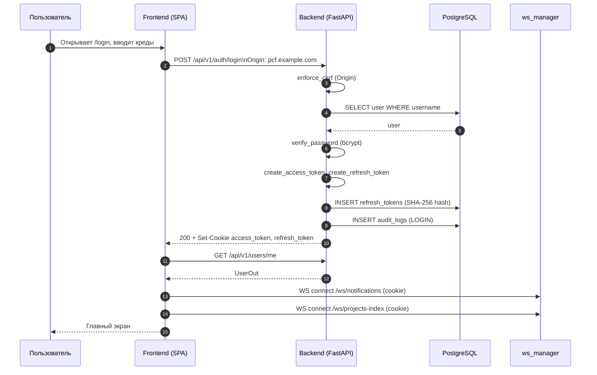

**Альтернативы.**
- Неверный пароль → `401`, запись `LOGIN_FAILED` в аудит.
- `is_active = false` → `403`.

### Процесс 2. Сброс пароля администратором

**Назначение.** Восстановить доступ пользователю, сгенерировав временный пароль и отправив его письмом.

**Используемые endpoints.** `PATCH /api/v1/users/{id}/password`.

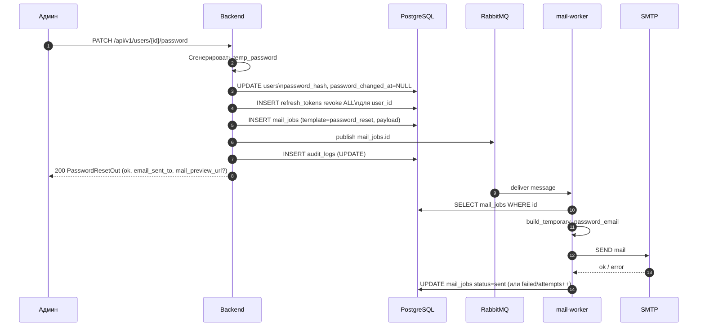

**Особенности.**
- Если RabbitMQ недоступен, `mail_jobs.status='pending'` остаётся; `relay_pending_jobs` периодически перепубликует задания.
- Mailpit (dev) показывает `mail_preview_url` в ответе.

### Процесс 3. Управление проектами

**Назначение.** Иерархическое управление проектами (папки + проекты) с drag&drop.

**Используемые endpoints.**
- `POST/PATCH/DELETE /api/v1/projects/folders`
- `POST/PUT/DELETE /api/v1/projects`
- `PATCH /api/v1/projects/folders/{id}/move`
- WS: `/ws/projects-index`

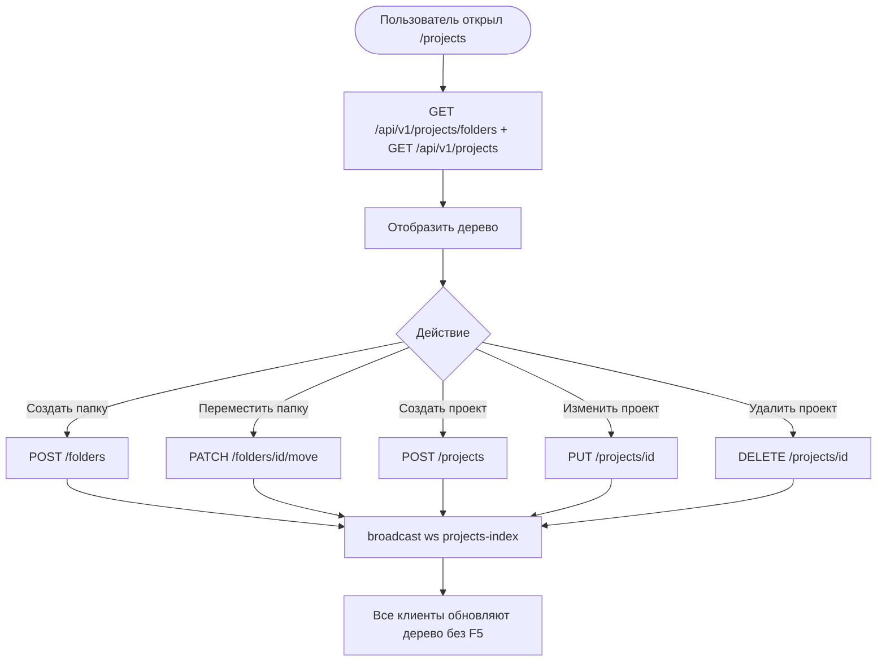

**Альтернативы.**
- Конфликт `(parent_id, name)` для папки → `409`.
- Удаление непустой папки → `409`.

### Процесс 4. Управление участниками проекта

**Используемые endpoints.**
- `GET /api/v1/projects/{id}/members`
- `POST /api/v1/projects/{id}/members`
- `DELETE /api/v1/projects/{id}/members/{user_id}`

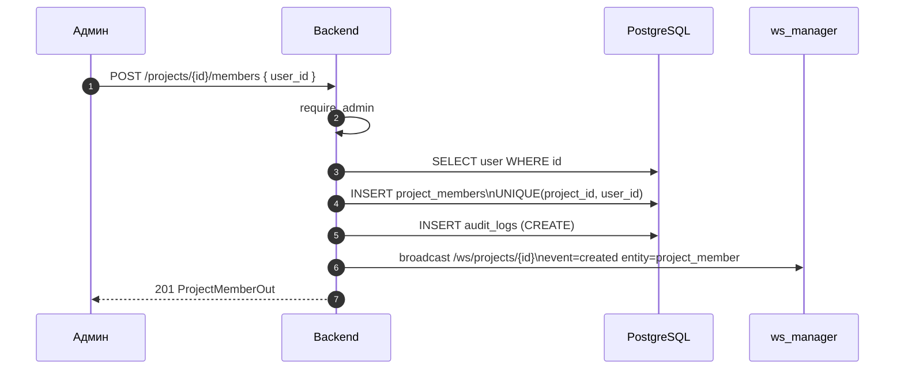

### Процесс 5. Инвентаризация активов

**Назначение.** Зафиксировать хосты, порты, сервисы и endpoints проекта.

**Используемые endpoints.**
- `POST/PUT/DELETE /api/v1/projects/{id}/hosts(...)`
- `POST .../hosts/{hid}/ports`, `.../services`, `.../endpoints`

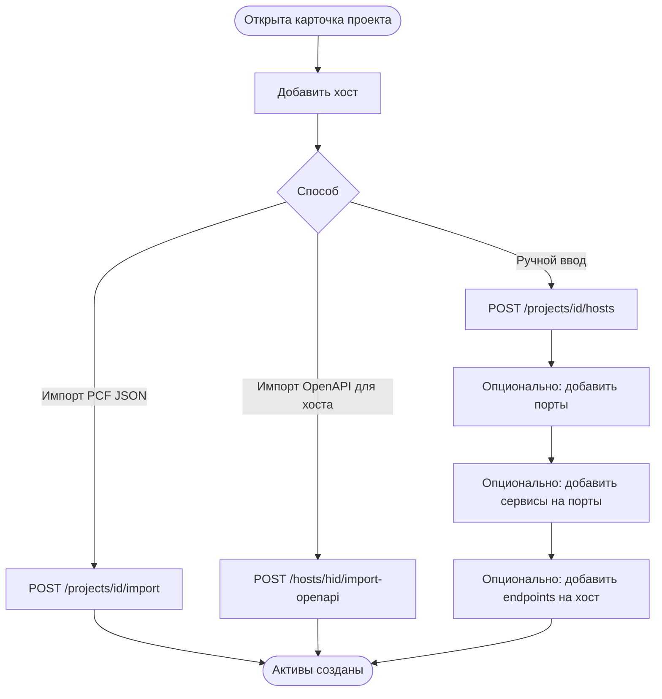

**Особенности.**
- Один хост может иметь несколько IP-адресов (`host_ip_addresses`), один из которых `is_primary=true`.
- Уникальность портов: `(host_id, port_number, protocol)`.

### Процесс 6. Учёт уязвимостей

**Назначение.** Зафиксировать выявленную уязвимость с CVSS-оценкой, привязать к активам, подкрепить доказательной базой.

**Используемые endpoints.**
- `POST /api/v1/projects/{id}/vulnerabilities`
- `POST .../vulnerabilities/{vid}/assets`
- `PATCH .../vulnerabilities/{vid}/status`
- `POST .../vulnerabilities/{vid}/files`
- `POST .../vulnerabilities/{vid}/comments`

```mermaid
sequenceDiagram
    autonumber
    participant P as Пентестер
    participant F as Frontend
    participant B as Backend
    participant DB as PostgreSQL
    participant M as MinIO
    participant WS as ws_manager

    P->>F: «Создать уязвимость»
    F->>F: Расчёт cvss_score из вектора (cvss.ts)
    F->>B: POST /projects/{id}/vulnerabilities { ... }
    B->>B: require_project_access
    B->>B: ValidateCvssVector (cvss Python)
    B->>DB: INSERT vulnerabilities (status='open')
    B->>DB: INSERT audit_logs (CREATE)
    B->>WS: broadcast /ws/projects/{id}\nevent=created entity=vulnerability
    B-->>F: 201 VulnerabilityOut

    P->>F: Привязать актив (host/port/service/endpoint)
    F->>B: POST /vulnerabilities/{vid}/assets { asset_type, asset_id }
    B->>DB: INSERT vulnerability_assets
    B->>WS: broadcast event=updated entity=vulnerability
    B-->>F: 201

    P->>F: Загрузить PNG-доказательство
    F->>B: POST /vulnerabilities/{vid}/files (multipart)
    B->>B: python-magic real MIME; size<=50MB; sanitize name
    B->>M: PUT s3 object
    B->>DB: INSERT files
    B->>DB: INSERT audit_logs (FILE_UPLOAD)
    B->>WS: broadcast event=created entity=file
    B-->>F: 201 FileOut

    P->>F: Смена статуса -> in_progress
    F->>B: PATCH /vulnerabilities/{vid}/status { status }
    B->>DB: UPDATE vulnerabilities.status
    B->>DB: INSERT audit_logs (STATUS_CHANGE)
    B->>WS: broadcast event=updated entity=vulnerability
    B-->>F: 200
```

### Процесс 7. Доказательная база (файлы)

**Назначение.** Хранение бинарных доказательств уязвимости (скриншоты, PDF, дампы).

**Используемые endpoints.**
- `POST /api/v1/projects/{id}/vulnerabilities/{vid}/files` (multipart)
- `GET .../files/{file_id}/download`
- `DELETE .../files/{file_id}`

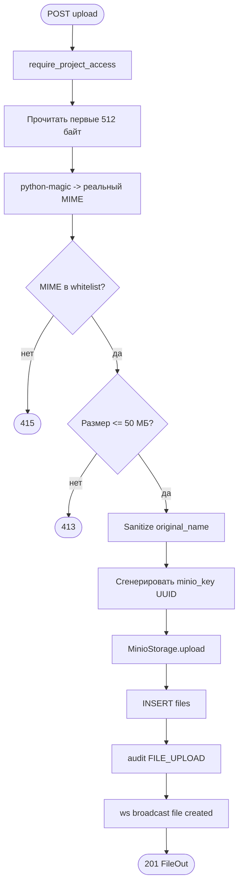

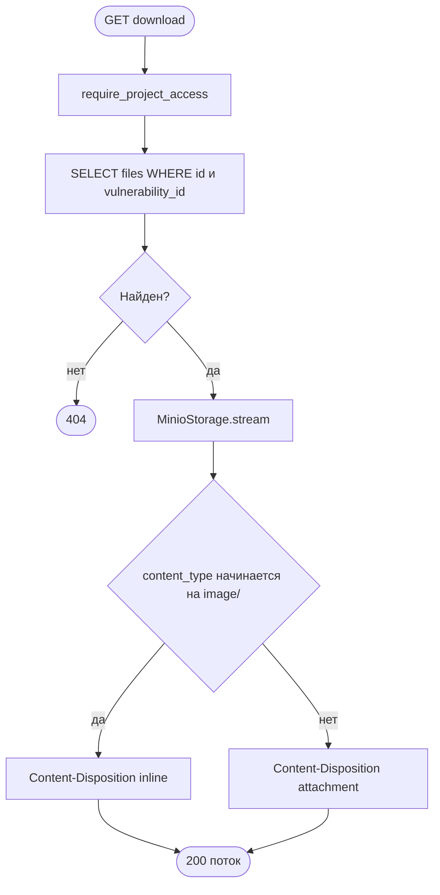

### Процесс 8. Комментирование уязвимости с упоминаниями

**Назначение.** Дискуссия по уязвимости с push-уведомлением упомянутых.

**Используемые endpoints.**
- `POST /api/v1/projects/{id}/vulnerabilities/{vid}/comments`
- WS: `/ws/projects/{project_id}`, `/ws/notifications`

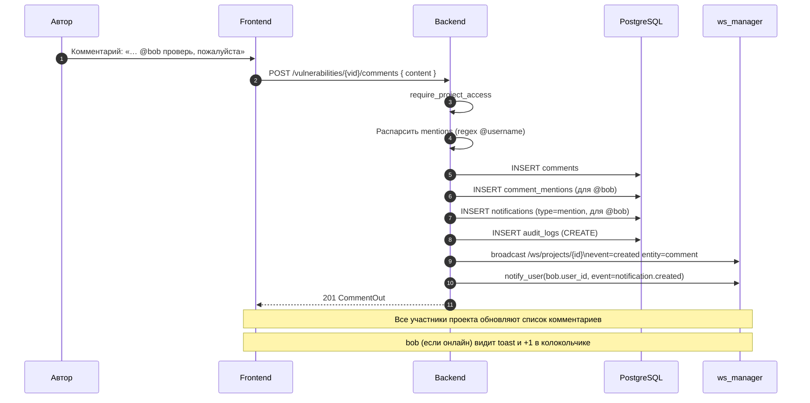

### Процесс 9. Уведомления

**Назначение.** Управление списком in-app уведомлений с push'ом.

**Используемые endpoints.**
- `GET /notifications`, `GET /notifications/unread-count`
- `PATCH /notifications/{id}/read`, `PATCH /notifications/read-all`
- WS: `/ws/notifications`

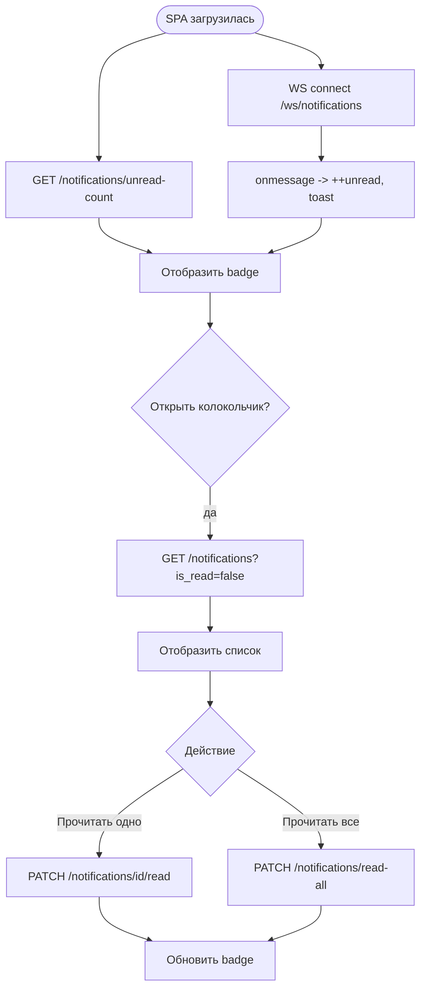

### Процесс 10. Заметки проекта

**Назначение.** Confluence-like иерархическое ведение знаний по проекту с комментариями.

**Используемые endpoints.**
- `GET/POST/PUT/DELETE /api/v1/projects/{id}/notes`
- `PATCH .../notes/{nid}/move`
- `PATCH .../notes/reorder`
- `GET/POST/PUT/DELETE .../notes/{nid}/comments`

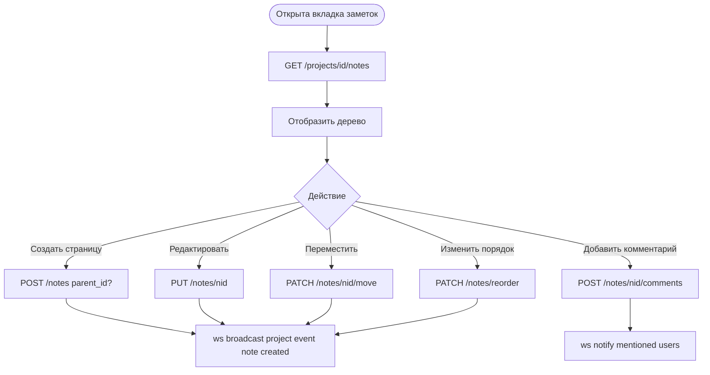

**Особенности.**
- Уникальность `(project_id, parent_id, title)` — `409` при конфликте.
- Удаление родителя удаляет дочерние страницы каскадно.

### Процесс 11. Импорт PCF JSON-дампа

**Назначение.** Залить массив активов и уязвимостей в проект из внешнего формата PCF.

**Используемые endpoints.** `POST /api/v1/projects/{id}/import`.

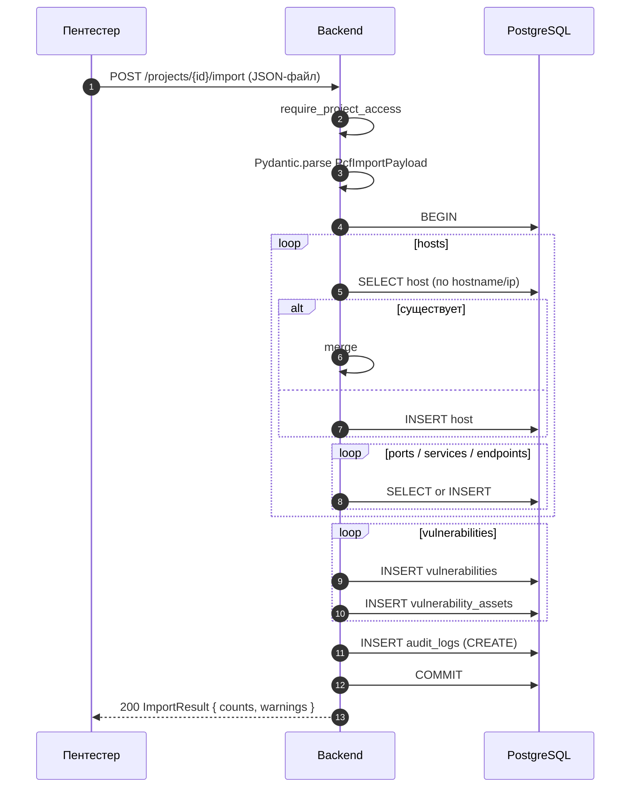

**Особенности.**
- Идемпотентность: повторный импорт того же файла не создаёт дубликатов.
- Битый JSON / схема → `422`.

### Процесс 12. Импорт/экспорт OpenAPI для хоста

**Назначение.** Заведение HTTP-endpoints из OpenAPI 3.x и обратная выгрузка.

**Используемые endpoints.**
- `POST /api/v1/projects/{id}/hosts/{hid}/import-openapi`
- `GET /api/v1/projects/{id}/hosts/{hid}/export-openapi`

```mermaid
flowchart TD
    A([POST import-openapi]) --> B[require_project_access]
    B --> C{Content-Type?}
    C -- "application/json" --> D[parse JSON]
    C -- "application/x-yaml / text/yaml" --> E[js-yaml -> JSON на фронте\nили yaml->json на backend]
    D --> F[ImportService.openapi_to_endpoints]
    E --> F
    F --> G[Для каждой operation:\nendpoint method+path+headers+body]
    G --> H[INSERT endpoints (idempotent by host+method+path)]
    H --> I[ws broadcast endpoint created]
    I --> Z([200 ImportResult])
```

### Процесс 13. Экспорт уязвимости в Jira

**Назначение.** Создать issue в Jira с описанием уязвимости и привязать его к записи.

**Используемые endpoints.**
- `PUT /api/v1/jira/config` (один раз — admin)
- `PUT /api/v1/projects/{id}/jira-link`
- `POST /api/v1/projects/{id}/vulnerabilities/{vid}/jira/export`
- `GET .../vulnerabilities/{vid}/jira`

```mermaid
sequenceDiagram
    autonumber
    participant U as Пентестер
    participant B as Backend
    participant DB as PostgreSQL
    participant J as Jira REST

    U->>B: POST /vulnerabilities/{vid}/jira/export
    B->>B: require_project_access
    B->>DB: SELECT vulnerability, project, project_jira_link, jira_instance
    B->>B: Проверить SSRF (base_url: https, не localhost, не private IP)
    B->>B: Расшифровать api_token
    B->>J: POST /rest/api/3/issue\n{ project_key, summary, description, issuetype }
    alt 2xx
        J-->>B: 201 issue { key, self }
        B->>DB: UPSERT jira_issue_link\n(status='linked', jira_issue_key, jira_issue_url)
        B->>DB: INSERT audit_logs (UPDATE)
        B-->>U: 200 JiraExportResult
    else 4xx/5xx
        J-->>B: error
        B->>DB: UPSERT jira_issue_link\n(status='error', last_error)
        B-->>U: 502 JiraError
    end
```

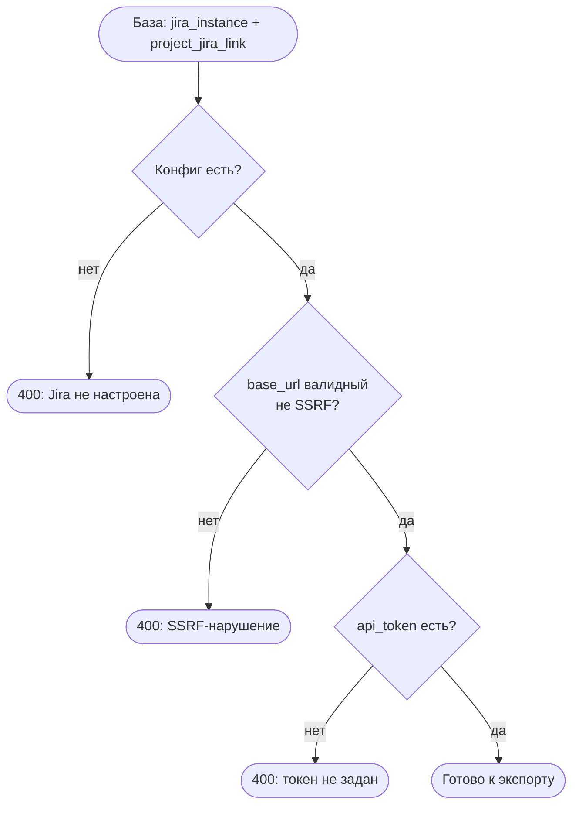

### Процесс 14. Генерация Word-отчётов

**Назначение.** Сформировать DOCX-отчёт «План пентеста» (ПП) или «Состояние защищённости» (СЗИ) по данным проекта.

**Используемые endpoints.**
- `POST /api/v1/projects/{id}/reports/pp`
- `POST /api/v1/projects/{id}/reports/szi`

```mermaid
sequenceDiagram
    autonumber
    participant U as Пользователь
    participant B as Backend
    participant DB as PostgreSQL

    U->>B: POST /projects/{id}/reports/pp
    B->>B: require_project_access
    B->>DB: SELECT project, members, hosts, vulnerabilities, files (метаданные)
    B->>B: ReportService.build_pp:\nload template .docx,\nреплейс плейсхолдеров,\nстилизация (landscape для ПП)
    B->>B: ReportService.build_szi (аналогично для СЗИ)
    B-->>U: 200 application/vnd.openxmlformats...\nContent-Disposition: attachment; filename*=UTF-8''Report.docx
```

### Процесс 15. Управление профилем и аватаром

**Используемые endpoints.**
- `GET /api/v1/users/me`, `GET /api/v1/users/me/profile`
- `PATCH /api/v1/users/me`, `PATCH /api/v1/users/me/password`
- `POST /api/v1/users/me/avatar`, `DELETE /api/v1/users/me/avatar`
- `GET /api/v1/users/{id}/avatar`

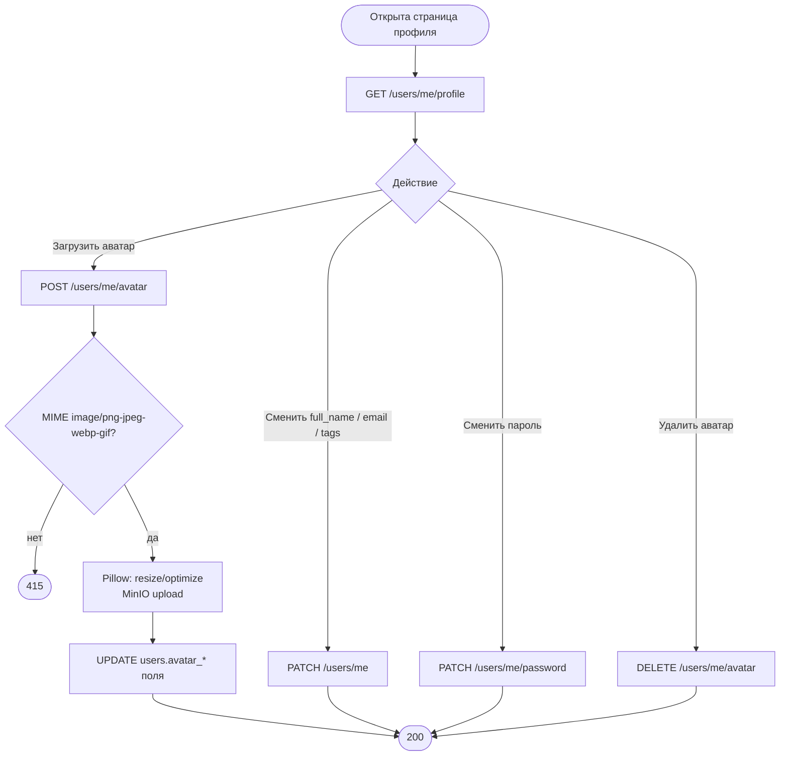

### Процесс 16. Выпуск Bearer-токена для AI-агента

**Используемые endpoints.**
- `POST /api/v1/agent-tokens` (создать)
- `PUT /api/v1/agent-tokens/{id}` (изменить)
- `DELETE /api/v1/agent-tokens/{id}` (отозвать)
- `GET /api/v1/agent-tokens`

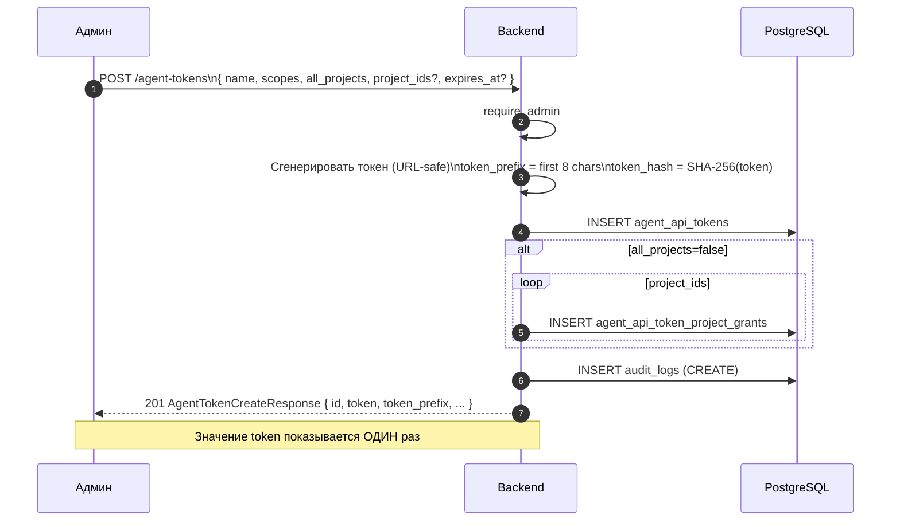

### Процесс 17. Работа AI-агента через `/api/v2`

**Используемые endpoints.** все `/api/v2/...` (см. раздел 4).

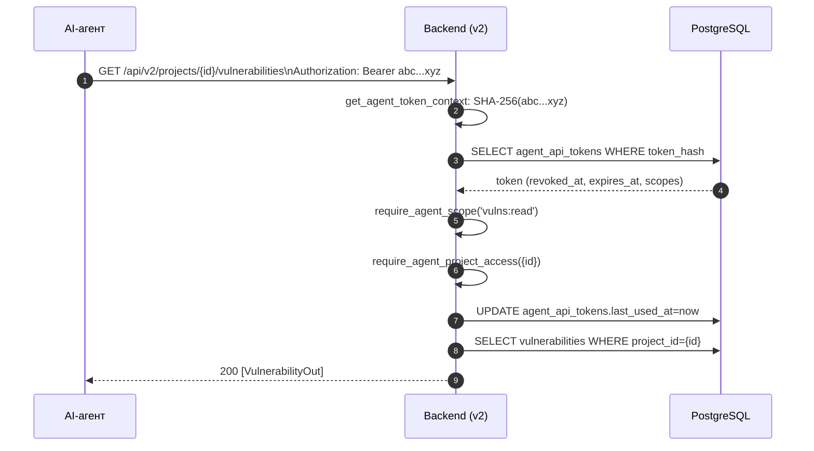

**Альтернативы.**
- Токен не найден / отозван / истёк → `401`;
- Скоупа не хватает → `403`;
- Проект недоступен (нет `all_projects` и нет grant) → `403`.

### Процесс 18. Просмотр журнала аудита

**Используемые endpoints.** `GET /api/v1/audit-logs`.

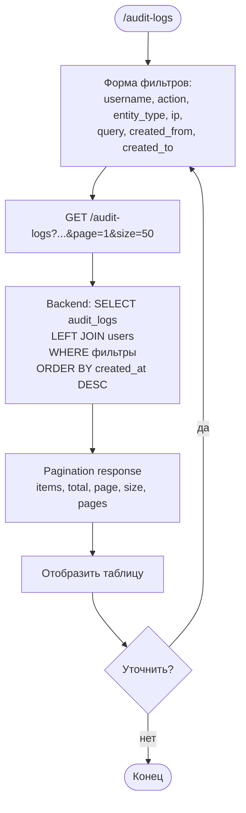

**Поля каждой записи.** `created_at`, `username`, `action`, `entity_type`,
`entity_id`, `ip_address`, `user_agent`, `details (JSON)`.

### Процесс 19. Real-time обновления через WebSocket

**Используемые каналы.** `/ws/notifications`, `/ws/projects/{id}`, `/ws/projects-index`.

```mermaid
sequenceDiagram
    autonumber
    participant F as Frontend
    participant B as Backend
    participant DB as PostgreSQL
    participant U2 as Другой пользователь

    F->>B: WS handshake /ws/projects/{id}\nCookie: access_token
    B->>B: Декодировать JWT\nrequire_project_access
    B-->>F: 101 Switching Protocols

    U2->>B: POST /projects/{id}/hosts {...}
    B->>DB: INSERT hosts
    B->>B: ws_manager.broadcast({id},\n{event:created,entity:host,data})
    B-->>F: WS message { event, entity, project_id, data }
    F->>F: Обновить дерево хостов в state
```

**Коды закрытия:** `4401` (не авторизован), `4403` (нет доступа к каналу).

---

## 8. Параметры безопасности на стыке всех процессов

| Контроль | Где применяется |
|----------|------------------|
| `enforce_csrf` (Origin whitelist) | Все state-changing методы `/api/v1` |
| `get_current_user` (JWT cookie) | Все `/api/v1` кроме `/auth/login` и `/auth/refresh` |
| `require_admin` | Управление пользователями, agent-токенами, конфигом Jira, чтение audit-logs |
| `require_project_access` | Все эндпоинты под `/projects/{id}/...` |
| `get_agent_token_context` + `require_agent_scope` | Все `/api/v2/...` |
| `require_agent_project_access` | Все `/api/v2/projects/{id}/...` |
| MIME-whitelist + size-check + filename sanitize | Все upload-эндпоинты файлов |
| SSRF-валидация | Конфигурация Jira `base_url` |
| Markdown URL whitelist (http/https/mailto + data:image) | `MarkdownEditor` и рендер на фронте |
| `audit_logs` запись | Все мутирующие операции и события аутентификации |

---

## 9. Полезные ссылки

- [GOST_34_DOCUMENTATION.md](GOST_34_DOCUMENTATION.md) — документация по ГОСТ 34;
- [openapi-v1.json](openapi-v1.json) — машинно-читаемая спецификация REST v1;
- [openapi-v2.json](openapi-v2.json) — машинно-читаемая спецификация REST v2;
- [ARCH.md](../ARCH.md) — архитектура backend/frontend;
- [DB_SCHEMA.md](../DB_SCHEMA.md) — структура БД;
- [USE_CASES.md](../USE_CASES.md) — пользовательские сценарии (для справки);
- [TEST_CASES.md](../TEST_CASES.md) — тест-кейсы QA.
