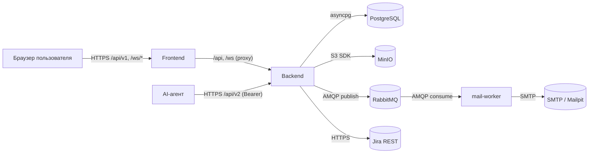
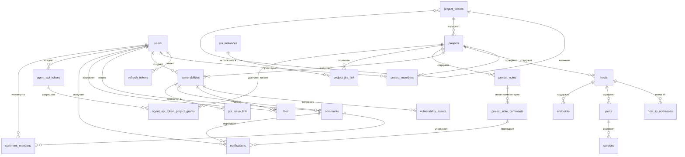
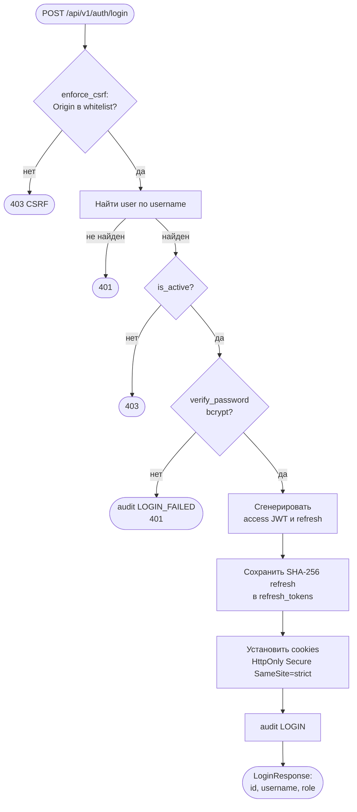
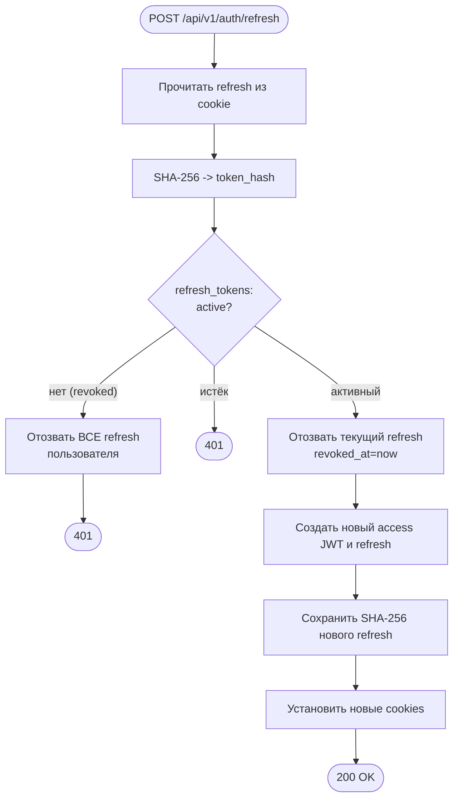
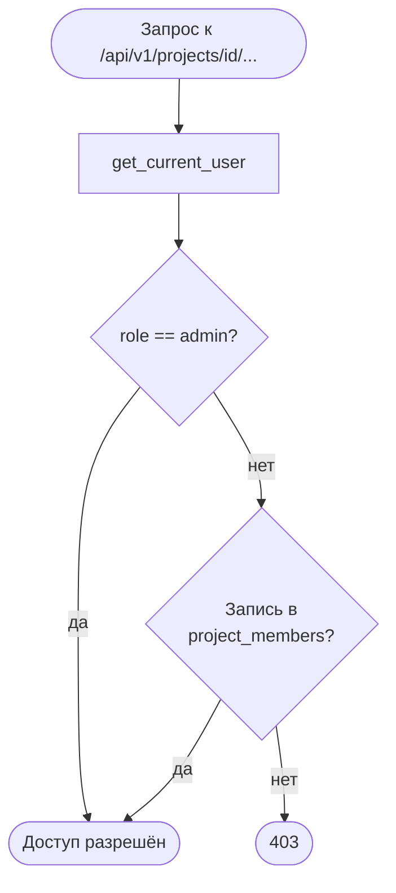
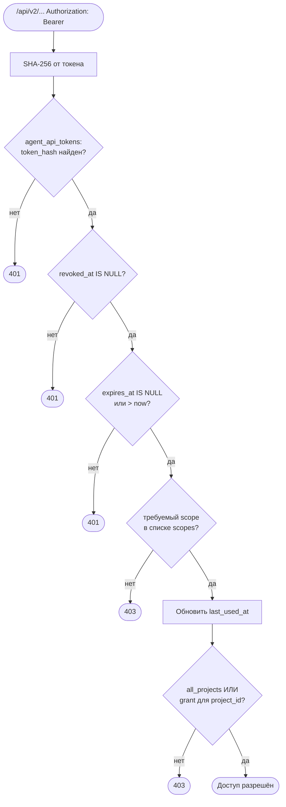
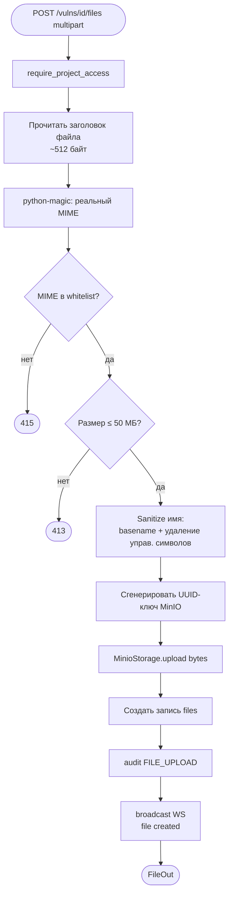
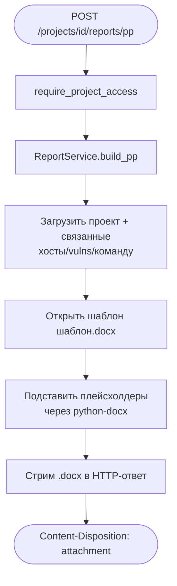
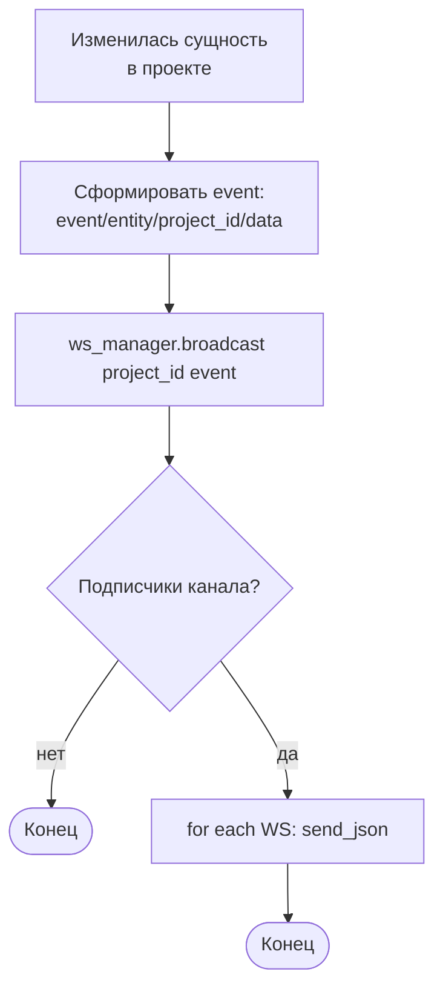

# Документация на автоматизированную систему «STORM»

> Документ составлен в соответствии с комплексом стандартов ГОСТ 34:
> ГОСТ 34.601-90 «Автоматизированные системы. Стадии создания»,
> ГОСТ 34.602-89 «Техническое задание на создание АС»,
> ГОСТ 34.201-89 «Виды, комплектность и обозначения документов при создании АС»,
> РД 50-34.698-90 «Требования к содержанию документов».

---

## Состав документации (в соответствии с ГОСТ 34.201-89)

Применительно к проекту STORM документация группируется следующим образом
(объединена в один настоящий файл; в скобках — типовое условное обозначение по ГОСТ 34.201-89):

| Раздел | Документ |
|--------|----------|
| 1 | Техническое задание на создание АС (ТЗ) |
| 2 | Ведомость технического проекта (ТП) |
| 3 | Пояснительная записка к техническому проекту (П2) |
| 4 | Описание автоматизируемых функций (П3) |
| 5 | Описание постановки задач (комплекса задач) (П4) |
| 6 | Описание информационного обеспечения системы (П5) |
| 7 | Описание организации информационной базы (П6) |
| 8 | Описание систем классификации и кодирования (П7) |
| 9 | Описание массивов информации (П8) |
| 10 | Описание комплекса технических средств (П9) |
| 11 | Описание программного обеспечения (ПА) |
| 12 | Описание алгоритма (ПБ) |
| 13 | Описание организационной структуры (П12) |
| 14 | Руководство пользователя (РП, ИЭ.4) |
| 15 | Руководство администратора (ИЭ.5) |
| 16 | Программа и методика испытаний (ПМ) |
| 17 | Формуляр (ФО) и паспорт (ПС) |

Описание API, бизнес-процессов и диаграмм вынесено в отдельный документ
[`API_PROCESSES.md`](API_PROCESSES.md).

---

# 1. Техническое задание на создание АС (ТЗ)

> Содержание раздела соответствует ГОСТ 34.602-89.

## 1.1. Общие сведения

### 1.1.1. Наименование системы

Полное наименование: **STORM — Offensive Security Research & Management** — корпоративная
платформа совместной работы команды пентестеров.

Краткое наименование: **STORM**.

### 1.1.2. Шифр темы

`SberPCF`.

### 1.1.3. Наименование организаций — заказчика и разработчика

- **Заказчик:** ПАО «Сбербанк» (подразделение информационной безопасности).
- **Разработчик:** внутренняя команда разработки заказчика.

### 1.1.4. Перечень документов, на основании которых ведётся разработка

- Внутренние регламенты заказчика по проведению работ по тестированию
  на проникновение и оценке защищённости.
- Требования к обработке и хранению результатов работ по ИБ.
- Корпоративные политики управления доступом, аудита и хранения данных.

### 1.1.5. Плановые сроки начала и окончания работ

Сроки определяются внутренним планом работ команды-разработчика и не
фиксируются в настоящем документе (внутренний продукт, развиваемый итеративно).

### 1.1.6. Источники и порядок финансирования

Внутренний бюджет заказчика.

### 1.1.7. Порядок оформления и предъявления результатов

Результаты работ предоставляются в виде:
- исходного кода в корпоративном git-репозитории;
- образов контейнеров `frontend`, `backend`, `mail-worker`;
- комплекта эксплуатационной документации (настоящий документ и [API_PROCESSES.md](API_PROCESSES.md));
- описаний OpenAPI 3.1 ([docs/openapi-v1.json](openapi-v1.json), [docs/openapi-v2.json](openapi-v2.json)).

## 1.2. Назначение и цели создания системы

### 1.2.1. Назначение системы

STORM — корпоративная закрытая платформа для централизованного ведения работ
по тестированию на проникновение и оценке защищённости информационных систем.

Назначение:

- агрегировать данные о проектах пентеста, инфраструктуре заказчика,
  выявленных уязвимостях и доказательной базе;
- обеспечить совместную работу команды пентестеров (комментарии,
  упоминания, real-time обновления);
- автоматизировать формирование отчётной документации (План пентеста,
  Состояние защищённости);
- интегрировать процесс с внешними системами учёта дефектов (Jira);
- предоставить машинное API для интеграции с AI-агентами / автоматическими
  сканерами.

### 1.2.2. Цели создания системы

| Код | Цель |
|-----|------|
| Ц-1 | Снизить трудоёмкость и время подготовки отчётов о работах |
| Ц-2 | Обеспечить единое доверенное хранилище результатов пентестов |
| Ц-3 | Обеспечить контроль доступа и аудит действий участников |
| Ц-4 | Сократить ручной труд за счёт интеграции с Jira и AI-агентами |
| Ц-5 | Обеспечить прослеживаемость уязвимостей от обнаружения до закрытия |
| Ц-6 | Снизить риск утечки доказательной базы за счёт централизованного хранения |

### 1.2.3. Критерии достижения целей

- Время подготовки итогового отчёта по проекту ≤ 30 минут (после ввода данных);
- Все CRUD-действия пользователей сохраняются в `audit_logs`;
- Доступ к проекту возможен только участникам проекта или администраторам;
- Передача доказательной базы возможна только через систему (без файловых обменов);
- Возможен экспорт уязвимости в Jira за один пользовательский шаг.

## 1.3. Характеристика объектов автоматизации

### 1.3.1. Объект автоматизации

Процесс **сопровождения работ по тестированию на проникновение**:
от инициации проекта пентеста до выпуска итоговой отчётной документации,
передачи дефектов в систему трекинга, повторной верификации устранения
уязвимостей и архивации проекта.

### 1.3.2. Действующие лица процесса

| Роль | Описание |
|------|----------|
| Администратор (`admin`) | Сопровождение системы, управление пользователями, проектами, интеграциями, agent-токенами, чтение журнала аудита |
| Пентестер (`pentester`) | Работа в проектах: инвентаризация, заведение уязвимостей, доказательная база, отчёты, экспорт в Jira |
| AI-агент (`agent`) | Внешний автоматический процесс/агент: использует машинный API `/api/v2` по Bearer-токену |
| Заказчик работ (косвенно) | Получает итоговые отчёты в формате DOCX, дефекты в Jira |

> Роль «разработчик» в системе не реализована.

### 1.3.3. Объекты автоматизации (сущности)

Проекты, папки проектов, участники, хосты (с несколькими IP-адресами),
порты, сервисы, HTTP-endpoints, уязвимости, доказательная база (файлы),
комментарии, заметки проекта (Confluence-like), уведомления, agent-токены,
конфигурация интеграции с Jira, журнал аудита.

## 1.4. Требования к системе

### 1.4.1. Требования к системе в целом

#### 1.4.1.1. Структура и функционирование

Система реализована как набор сетевых сервисов в среде Docker Compose:

| Сервис | Назначение |
|--------|------------|
| `frontend` | SPA на React + TypeScript (Vite), HTTPS на порту 3000 |
| `backend` | REST API `/api/v1`, `/api/v2`, WebSocket — FastAPI (uvicorn, порт 8000) |
| `db` | СУБД PostgreSQL 16 — доменные данные и журнал аудита |
| `minio` | S3-совместимое хранилище для файлов и аватаров |
| `rabbitmq` | Брокер очередей сообщений (очередь отправки e-mail) |
| `mail-worker` | Sidecar-процесс отправки писем по SMTP |
| `mailpit` (dev) | Перехват исходящих писем в среде разработки |

#### 1.4.1.2. Численность и квалификация персонала

- Администратор: знание основ администрирования Linux/Docker, знание JSON;
- Пентестер: знание методологий пентеста, владение интерфейсом веб-приложений;
- Разработчик (сопровождение продукта): Python 3.12 / FastAPI / SQLAlchemy /
  TypeScript / React.

#### 1.4.1.3. Показатели назначения

- Возможность одновременной работы не менее 50 авторизованных пользователей;
- Поддержка не менее 1000 активных проектов;
- Поддержка хранения файлов размером до 50 МБ (ограничение БД и приложения).

#### 1.4.1.4. Надёжность

- Все деструктивные операции проходят авторизацию и аудит;
- При сбое RabbitMQ задачи отправки писем сохраняются в БД (`mail_jobs`)
  и переиздаются worker'ом (`relay_pending_jobs`);
- Refresh-токены имеют ротацию при каждом обновлении; при попытке reuse
  отзываются все активные refresh-токены пользователя;
- Загруженные файлы хранятся в MinIO и не удаляются физически до удаления
  родительской уязвимости;
- При сбое MinIO бэкенд возвращает 5xx (без частичных записей метаданных).

#### 1.4.1.5. Безопасность

- Все cookie с JWT — `HttpOnly`, `Secure`, `SameSite=strict`;
- HTTPS обязателен для всех клиентских соединений (production);
- CSRF — проверка `Origin` для всех state-changing-методов;
- Парольная политика: минимум 8 символов, проверка на слабые дефолты
  (`admin`, `password`, `12345678`);
- bcrypt для паролей пользователей;
- SHA-256 для хранения хэшей refresh-токенов и agent-токенов;
- File uploads — проверка реального MIME через `python-magic`,
  whitelist допустимых типов, sanitization имени;
- Jira `base_url` — защита от SSRF (запрет схем кроме `https`,
  запрет `localhost`/loopback/private/link-local IP).

#### 1.4.1.6. Эргономика и техническая эстетика

- Веб-интерфейс на базе MUI 6 (Material Design);
- Поддержка тёмной / светлой тем (см. [DESIGN.md](DESIGN.md));
- Real-time обновление списков и счётчиков через WebSocket
  (без принудительного refresh страницы);
- Drag&drop в дереве проектов и заметок;
- Поддержка WYSIWYG / Markdown-редактирования заметок и описаний.

#### 1.4.1.7. Транспортабельность

Не требуется — стационарная серверная инсталляция.

#### 1.4.1.8. Эксплуатация, техническое обслуживание

- Развёртывание через `docker compose up --build`;
- Конфигурация через `.env` (см. `.env.example`);
- Применение миграций Alembic при необходимости;
- Логи доступны через `docker logs <service>`;
- Метрики: стандартный healthcheck `GET /health`.

#### 1.4.1.9. Защита информации от несанкционированного доступа

- Аутентификация по логину/паролю с JWT и refresh-ротацией;
- Авторизация: глобальная роль (`admin`/`pentester`) и членство в проектах
  (`project_members`);
- Agent-токены имеют scope-список и привязку к проектам (`all_projects` или
  явные `agent_api_token_project_grants`);
- Журнал аудита (`audit_logs`) — все CRUD-операции, события аутентификации
  и смены статусов;
- Markdown XSS: whitelist URL-схем (http/https/mailto + `data:image/...`).

#### 1.4.1.10. Сохранность информации при авариях

- БД PostgreSQL — резервируется по корпоративной схеме (вне scope STORM);
- MinIO — резервируется по корпоративной схеме (вне scope STORM);
- Удаление физическое (hard delete) — восстановление возможно только из резервной копии.

#### 1.4.1.11. Требования к защите от внешних воздействий

В составе СЗИ не предусмотрено (стандартная серверная инсталляция).

#### 1.4.1.12. Патентная чистота

Используются только свободно распространяемые open-source-компоненты
(FastAPI/Pydantic/SQLAlchemy/React/MUI/MinIO/RabbitMQ/PostgreSQL/python-docx
и др.) под совместимыми лицензиями (MIT/Apache 2.0/PostgreSQL License и т.п.).

#### 1.4.1.13. Стандартизация и унификация

- HTTP API соответствует OpenAPI 3.1;
- WebSocket-сообщения — JSON с фиксированной структурой `{event, entity, project_id, data}`;
- Алгоритм оценки уязвимостей — CVSS v3.1 / v4.0;
- Идентификатор слабости — CWE;
- Внутренние идентификаторы — UUID v4.

### 1.4.2. Требования к функциям (задачам)

См. раздел [4. Описание автоматизируемых функций](#4-описание-автоматизируемых-функций).

### 1.4.3. Требования к видам обеспечения

#### 1.4.3.1. Информационное обеспечение

См. раздел [6. Описание информационного обеспечения](#6-описание-информационного-обеспечения-системы).

#### 1.4.3.2. Лингвистическое обеспечение

- Язык интерфейса: русский;
- Язык программного кода и идентификаторов БД: английский;
- Кодировка хранения и обмена данными: UTF-8;
- Дата/время хранятся в UTC (`TIMESTAMPTZ`); локализация — на стороне клиента.

#### 1.4.3.3. Программное обеспечение

См. раздел [11. Описание программного обеспечения](#11-описание-программного-обеспечения).

#### 1.4.3.4. Техническое обеспечение

См. раздел [10. Описание комплекса технических средств](#10-описание-комплекса-технических-средств).

#### 1.4.3.5. Метрологическое обеспечение

Не требуется.

#### 1.4.3.6. Организационное обеспечение

См. раздел [13. Описание организационной структуры](#13-описание-организационной-структуры).

#### 1.4.3.7. Методическое обеспечение

- Руководство пользователя (раздел [14](#14-руководство-пользователя));
- Руководство администратора (раздел [15](#15-руководство-администратора));
- API-документация (`/api/v1/docs`, `/api/v2/docs` — Swagger UI).

## 1.5. Состав и содержание работ по созданию системы

| Стадия (ГОСТ 34.601-90) | Содержание работ |
|-------------------------|------------------|
| Формирование требований к АС | Сбор требований от подразделений ИБ; согласование ролей и процессов |
| Разработка концепции АС | Архитектурный документ ARCH.md, DESIGN.md, DB_SCHEMA.md |
| Техническое задание | Настоящий документ, раздел 1 |
| Эскизный проект | ARCH_DIAGRAMS.md — концептуальные диаграммы |
| Технический проект | Разделы 2–13 настоящего документа + [API_PROCESSES.md](API_PROCESSES.md) |
| Рабочая документация | Разделы 14–17 настоящего документа |
| Ввод в действие | Развёртывание через `docker compose`; bootstrap admin |
| Сопровождение АС | Поправки через миграции Alembic, обновления `.env`, обновление образов |

## 1.6. Порядок контроля и приёмки системы

См. раздел [16. Программа и методика испытаний](#16-программа-и-методика-испытаний).

## 1.7. Требования к подготовке объекта автоматизации

- Подготовлены машины (виртуальные/физические) под Linux с установленным
  Docker и Docker Compose v2;
- Открыты сетевые порты согласно конфигурации `docker-compose.yml`;
- Подготовлены файл `.env` с реальными секретами и параметрами SMTP;
- Подготовлена резервная схема для PostgreSQL и MinIO.

## 1.8. Требования к документированию

- Документация в формате Markdown в корне репозитория и в каталоге `docs/`;
- OpenAPI 3.1 спецификации в каталоге `docs/`;
- Mermaid-диаграммы — встроены в Markdown-файлы.

## 1.9. Источники разработки

- ARCH.md, DESIGN.md, DB_SCHEMA.md, USE_CASES.md, TEST_CASES.md,
  ARCH_DIAGRAMS.md (внутренние документы проекта);
- Стандарты ГОСТ 34, РД 50-34.698-90;
- Стандарты CVSS v3.1, v4.0;
- Стандарт OpenAPI 3.1;
- Внутренние регламенты заказчика.

---

# 2. Ведомость технического проекта (ТП)

| № | Обозначение | Наименование документа |
|---|-------------|------------------------|
| 1 | П2 | Пояснительная записка к техническому проекту (раздел 3) |
| 2 | П3 | Описание автоматизируемых функций (раздел 4) |
| 3 | П4 | Описание постановки задач (раздел 5) |
| 4 | П5 | Описание информационного обеспечения (раздел 6) |
| 5 | П6 | Описание организации информационной базы (раздел 7) |
| 6 | П7 | Описание систем классификации и кодирования (раздел 8) |
| 7 | П8 | Описание массивов информации (раздел 9) |
| 8 | П9 | Описание комплекса технических средств (раздел 10) |
| 9 | ПА | Описание программного обеспечения (раздел 11) |
| 10 | ПБ | Описание алгоритма (раздел 12) |
| 11 | П12 | Описание организационной структуры (раздел 13) |
| 12 | ИЭ.4 | Руководство пользователя (раздел 14) |
| 13 | ИЭ.5 | Руководство администратора (раздел 15) |
| 14 | ПМ | Программа и методика испытаний (раздел 16) |
| 15 | — | Описание API и процессов: [API_PROCESSES.md](API_PROCESSES.md) |

---

# 3. Пояснительная записка к техническому проекту

## 3.1. Архитектура системы

Архитектура системы — клиент-серверная с разделением на:

- **Front-end** — одностраничное приложение (SPA) на React 18 + TypeScript;
- **Back-end** — приложение на FastAPI с двумя API-поверхностями (`/api/v1`
  для веб-клиента и `/api/v2` для AI-агентов) и WebSocket-каналами;
- **Хранилища** — PostgreSQL (структурированные данные и журнал аудита),
  MinIO (бинарные данные: аватары пользователей, файлы доказательной базы);
- **Шина сообщений** — RabbitMQ + sidecar mail-worker для асинхронной отправки писем;
- **Внешние интеграции** — Jira REST API (синхронно из backend).

## 3.2. Структура программного комплекса

### 3.2.1. Backend (плоская структура)

См. [ARCH.md](ARCH.md). Кратко:

- `app/main.py` — точка входа FastAPI, монтирование роутеров, error handlers,
  startup-инициализация (создание схемы БД, расширение enum'ов, bootstrap-admin);
- `app/config.py` — Pydantic Settings (загружаются из `.env`);
- `app/database.py` — async-движок и `async_sessionmaker`;
- `app/dependencies.py` — `get_current_user`, `require_admin`,
  `require_project_access`, `enforce_csrf`, `get_agent_token_context`,
  `require_agent_scope`, `require_agent_project_access`;
- `app/models.py` — все ORM-модели одним файлом;
- `app/schemas.py` — все Pydantic-схемы (request/response);
- `app/services.py` — сервисный слой (бизнес-логика);
- `app/security.py` — bcrypt, JWT, SHA-256 для refresh- и agent-токенов;
- `app/ws_manager.py` — менеджер WebSocket-подключений;
- `app/messaging.py` — публикация сообщений в RabbitMQ;
- `app/mail.py` — рендеринг шаблонов писем;
- `app/routers/` — REST-роутеры по доменам;
- `app/reports/` — генерация Word-отчётов;
- `app/storage/minio_client.py` — клиент MinIO;
- `app/worker/mail_worker.py` — sidecar отправки писем.

### 3.2.2. Frontend

- `src/main.tsx` — точка входа React;
- `src/App.tsx` — Router, PrivateLayout, AppBar, подключение WS-уведомлений;
- `src/api.ts` — axios-клиент с `withCredentials: true`;
- `src/store.ts` — Zustand-сторы (`useAuthStore`, `useToastStore`);
- `src/types.ts` — TypeScript DTO-типы;
- `src/cvss.ts` — клиентский расчёт CVSS;
- `src/components/` — переиспользуемые компоненты;
- `src/pages/` — экраны приложения.

## 3.3. Обоснование выбора решения

### 3.3.1. Выбор стека

- **FastAPI** — современный асинхронный Python-фреймворк, нативная поддержка
  OpenAPI, простая интеграция с Pydantic;
- **SQLAlchemy 2 async** — стандартный ORM Python с поддержкой `asyncio`;
- **PostgreSQL** — зрелая реляционная СУБД, наличие JSONB, full-text search,
  поддержка ENUM-типов;
- **MinIO** — S3-совместимое хранилище для контента, не требующее облака;
- **RabbitMQ** — корпоративный стандарт для асинхронной обработки;
- **React 18 + Vite 6** — современный фронтенд-стек;
- **MUI 6** — готовая дизайн-система Material Design.

### 3.3.2. Плоская структура backend

Backend намеренно реализован без Repository pattern — сервисы работают
напрямую с `AsyncSession`. Решение обосновано:

- объём бизнес-логики не требует промежуточного слоя;
- проще поддержка для небольшой команды;
- меньше уровней косвенности при чтении кода.

---

# 4. Описание автоматизируемых функций

> Состав соответствует РД 50-34.698-90 (документ П3).

## 4.1. Перечень функций

| Код | Функция |
|-----|---------|
| Ф-01 | Аутентификация и управление сессией |
| Ф-02 | Управление учётными записями пользователей |
| Ф-03 | Управление проектами и иерархией папок |
| Ф-04 | Управление участниками проекта |
| Ф-05 | Инвентаризация активов (хосты, порты, сервисы, endpoints) |
| Ф-06 | Учёт уязвимостей с расчётом CVSS |
| Ф-07 | Управление доказательной базой (файлы) |
| Ф-08 | Комментирование и упоминание (`@mention`) |
| Ф-09 | In-app уведомления и WebSocket push |
| Ф-10 | Заметки проекта (Confluence-like) и их комментирование |
| Ф-11 | Импорт PCF JSON-дампа |
| Ф-12 | Импорт/экспорт OpenAPI для хоста |
| Ф-13 | Экспорт уязвимости в Jira issue |
| Ф-14 | Генерация Word-отчётов (ПП, СЗИ) |
| Ф-15 | Управление профилем и аватаром |
| Ф-16 | Выпуск и отзыв agent-токенов |
| Ф-17 | Машинный доступ AI-агентов через `/api/v2` |
| Ф-18 | Просмотр журнала аудита |
| Ф-19 | Real-time оповещения через WebSocket |
| Ф-20 | Принудительная смена пароля при первом входе или после reset |

## 4.2. Распределение функций по ролям

| Функция | admin | pentester | agent |
|---------|:-----:|:---------:|:-----:|
| Ф-01 | ✓ | ✓ | — |
| Ф-02 | ✓ (CRUD) | ✓ (только `/me`) | — |
| Ф-03 | ✓ (CRUD) | ✓ (RO) | ✓ (RO, scope `projects:read`) |
| Ф-04 | ✓ | — | — |
| Ф-05 | ✓ | ✓ (в своих проектах) | ✓ (scope `assets:*`) |
| Ф-06 | ✓ | ✓ (в своих проектах) | ✓ (scope `vulns:*`) |
| Ф-07 | ✓ | ✓ (в своих проектах) | — |
| Ф-08 | ✓ | ✓ (в своих проектах) | — |
| Ф-09 | ✓ | ✓ | — |
| Ф-10 | ✓ | ✓ (в своих проектах) | ✓ (scope `notes:*`) |
| Ф-11 | ✓ | ✓ (в своих проектах) | — |
| Ф-12 | ✓ | ✓ (в своих проектах) | — |
| Ф-13 | ✓ | ✓ (в своих проектах) | — |
| Ф-14 | ✓ | ✓ (в своих проектах) | — |
| Ф-15 | ✓ | ✓ | — |
| Ф-16 | ✓ | — | — |
| Ф-17 | — | — | ✓ |
| Ф-18 | ✓ | — | — |
| Ф-19 | ✓ | ✓ | — |
| Ф-20 | ✓ | ✓ | — |

## 4.3. Описание функций

Каждая функция подробно описана в [API_PROCESSES.md](API_PROCESSES.md) с
диаграммой последовательности, перечнем API-endpoint'ов и обработкой ошибок.

---

# 5. Описание постановки задач (комплекса задач)

> Состав соответствует РД 50-34.698-90 (документ П4).

Ниже приводятся ключевые задачи; полный набор бизнес-процессов с диаграммами —
см. [API_PROCESSES.md](API_PROCESSES.md).

## 5.1. Задача «Учёт уязвимостей»

- **Назначение:** регистрация уязвимостей, выявленных в ходе работ, с
  оценкой критичности (CVSS), привязкой к активам, доказательной базой и
  workflow-этапами.
- **Входные данные:** проект, описание уязвимости, severity, опционально
  CVSS-вектор, привязка к активам, файлы.
- **Алгоритм:** см. [API_PROCESSES.md → Процесс «Учёт уязвимостей»](API_PROCESSES.md#процесс-7-учёт-уязвимостей).
- **Выходные данные:** запись `vulnerabilities`, связанные `vulnerability_assets`,
  `files`, события WebSocket, запись в `audit_logs`.
- **Периодичность:** по факту работы пентестера.

## 5.2. Задача «Управление проектами»

- **Назначение:** ведение перечня проектов пентеста с группировкой по
  папкам и контролем жизненного цикла (`active → handover_to_development →
  vulnerability_recheck → completed → archived`).
- **Входные данные:** атрибуты проекта (`name`, `folder`, `description`, даты),
  команда (`project_members`).
- **Алгоритм:** [API_PROCESSES.md → Процесс «Управление проектами»](API_PROCESSES.md#процесс-4-управление-проектами).
- **Выходные данные:** запись `projects`, связанные `project_members`,
  событие WebSocket `/ws/projects-index`.
- **Периодичность:** по факту инициации работ.

## 5.3. Задача «Генерация отчётов»

- **Назначение:** автоматическое формирование документов «План пентеста» (ПП)
  и «Состояние защищённости информации» (СЗИ).
- **Входные данные:** проект и все привязанные сущности.
- **Алгоритм:** [API_PROCESSES.md → Процесс «Генерация отчётов»](API_PROCESSES.md#процесс-15-генерация-word-отчётов).
- **Выходные данные:** `.docx` файл, переданный в ответе HTTP с заголовком
  `Content-Disposition: attachment`.

## 5.4. Задача «Экспорт уязвимости в Jira»

- **Назначение:** передача описания уязвимости в систему трекинга дефектов
  заказчика.
- **Входные данные:** уязвимость, конфигурация `jira_instance`,
  привязка `project_jira_link`.
- **Алгоритм:** [API_PROCESSES.md → Процесс «Экспорт в Jira»](API_PROCESSES.md#процесс-14-экспорт-уязвимости-в-jira).
- **Выходные данные:** issue в Jira, запись `jira_issue_link`.

## 5.5. Задача «Аудит действий»

- **Назначение:** фиксация всех значимых действий пользователей для
  последующего разбора.
- **Входные данные:** действие, инициатор, IP, контекст.
- **Алгоритм:** синхронная запись в `audit_logs` в той же транзакции, что и
  бизнес-операция (через `AuditService.log()`).
- **Выходные данные:** запись `audit_logs`.

---

# 6. Описание информационного обеспечения системы

## 6.1. Состав информационной базы

Информационная база системы состоит из двух частей:

1. **Структурированные данные** — PostgreSQL (база данных STORM):
   пользователи, токены, проекты, активы, уязвимости, комментарии,
   уведомления, заметки, конфигурация интеграций, журнал аудита.
2. **Бинарные данные** — MinIO:
   - бакет аватаров пользователей (PNG / JPEG / WEBP / GIF);
   - бакет файлов доказательной базы уязвимостей (whitelist MIME, ≤ 50 МБ).

## 6.2. Организация информационной базы

- Доступ к БД — только через сервисный слой backend'а через `AsyncSession`;
- Доступ к MinIO — через `MinioStorage` (`backend/app/storage/minio_client.py`);
- Транзакционность: операции, изменяющие более одной таблицы (например,
  загрузка файла = `files` + объект MinIO), выполняются с проверкой
  целостности на уровне приложения;
- Удаление файлов: при удалении записи `files` приложение обязано
  также удалить объект из MinIO (см. `FileService.delete`).

## 6.3. Описание классификаторов

См. раздел [8. Описание систем классификации и кодирования](#8-описание-систем-классификации-и-кодирования).

## 6.4. Соответствие документу П5

| Подраздел РД 50-34.698-90 | Раздел документа |
|----------------------------|------------------|
| Назначение информационного обеспечения | 6.1 |
| Структура информационной базы | 6.2, 7 |
| Состав хранимых данных | 9 |
| Классификация и кодирование | 8 |

---

# 7. Описание организации информационной базы

## 7.1. ER-диаграмма

## 7.2. Логическая модель данных

Подробное описание таблиц приведено в [DB_SCHEMA.md](DB_SCHEMA.md).
Кратко основные сущности:

| Сущность (таблица) | Назначение |
|--------------------|------------|
| `users` | Учётные записи пользователей |
| `refresh_tokens` | Хэши refresh-токенов |
| `mail_jobs` | Очередь отправки писем (mirror очереди RabbitMQ) |
| `projects` | Пентест-проекты |
| `project_folders` | Иерархия папок проектов |
| `project_members` | Членство пользователей в проектах |
| `hosts`, `host_ip_addresses` | Хосты и их IP-адреса |
| `ports`, `services`, `endpoints` | Сетевые активы хоста |
| `vulnerabilities`, `vulnerability_assets` | Уязвимости и их привязки к активам |
| `files` | Метаданные файлов доказательной базы |
| `comments`, `comment_mentions` | Комментарии и упоминания |
| `notifications` | In-app уведомления |
| `project_notes`, `project_note_comments` | Confluence-like заметки и обсуждения |
| `agent_api_tokens`, `agent_api_token_project_grants` | Токены AI-агентов |
| `jira_instances`, `project_jira_link`, `jira_issue_link` | Интеграция с Jira |
| `audit_logs` | Журнал действий пользователей |

## 7.3. Физическая модель данных

- СУБД: PostgreSQL 16;
- Все первичные ключи — `UUID` с `DEFAULT gen_random_uuid()`;
- Все временные метки — `TIMESTAMPTZ` (UTC);
- ENUM-типы создаются как нативные PostgreSQL `CREATE TYPE`;
- Удаление — физическое (hard delete);
- Миграции — Alembic (`backend/migrations/versions/`).

---

# 8. Описание систем классификации и кодирования

## 8.1. Внутренние идентификаторы

- UUID v4 — все первичные ключи (`gen_random_uuid()`);
- SHA-256 — хэши refresh- и agent-токенов;
- bcrypt — хэши паролей пользователей.

## 8.2. ENUM-типы

| Тип | Значения | Назначение |
|-----|----------|------------|
| `UserRole` | `admin`, `pentester` | Глобальная роль пользователя |
| `ProjectStatus` | `active`, `handover_to_development`, `vulnerability_recheck`, `completed`, `archived` | Статус проекта |
| `HostStatus` | `up`, `down`, `unknown` | Доступность хоста |
| `OsType` | `windows`, `linux`, `macos`, `freebsd`, `android`, `ios`, `other`, `unknown` | Тип ОС |
| `Protocol` | `tcp`, `udp` | Транспортный протокол |
| `PortState` | `open`, `closed`, `filtered` | Состояние порта |
| `HttpMethod` | `GET`, `POST`, `PUT`, `PATCH`, `DELETE`, `HEAD`, `OPTIONS` | HTTP-метод |
| `Severity` | `critical`, `high`, `medium`, `low`, `info` | Уровень критичности уязвимости |
| `CvssVersion` | `3.1`, `4.0` | Версия методики CVSS |
| `VulnerabilityStatus` | `open`, `in_progress`, `fixed`, `wont_fix`, `accepted_risk` | Статус уязвимости |
| `AssetType` | `host`, `port`, `service`, `endpoint` | Тип актива |
| `NotificationType` | `mention` | Тип уведомления |

## 8.3. Внешние классификаторы

- **CWE** — Common Weakness Enumeration (`cwe_id`, формат `CWE-NNN`);
- **CVSS** — Common Vulnerability Scoring System (`cvss_vector`, `cvss_score`);
- **CVE** — может присутствовать в произвольной текстовой части (не классифицируется).

## 8.4. Коды событий аудита

| Код | Описание |
|-----|----------|
| `LOGIN` | Успешный вход |
| `LOGIN_FAILED` | Неуспешная попытка входа |
| `LOGOUT` | Выход |
| `PASSWORD_CHANGED` | Смена пароля |
| `CREATE` | Создание сущности |
| `UPDATE` | Изменение сущности |
| `DELETE` | Удаление сущности |
| `STATUS_CHANGE` | Изменение статуса (уязвимость, проект) |
| `FILE_UPLOAD` | Загрузка файла |
| `FILE_DELETE` | Удаление файла |

---

# 9. Описание массивов информации

> Полное описание таблиц БД — в [DB_SCHEMA.md](DB_SCHEMA.md).
> Здесь приводится краткая сводка.

## 9.1. Состав массивов

| Массив | Тип | Хранилище | Объём (оценочный) |
|--------|-----|-----------|---------------------|
| Пользователи | Таблица | PostgreSQL.`users` | До 10 тыс. записей |
| Refresh-токены | Таблица | PostgreSQL.`refresh_tokens` | До 100 тыс. активных |
| Mail-задания | Таблица + очередь | PostgreSQL.`mail_jobs` + RabbitMQ | До 1 млн исторических |
| Проекты | Таблица | PostgreSQL.`projects` | До 10 тыс. |
| Папки проектов | Таблица | PostgreSQL.`project_folders` | Иерархическая |
| Участники проектов | Таблица | PostgreSQL.`project_members` | До 100 тыс. |
| Хосты, IP, порты, сервисы, endpoints | Таблицы | PostgreSQL | До 1 млн в сумме |
| Уязвимости | Таблица | PostgreSQL.`vulnerabilities` | До 100 тыс. |
| Файлы (метаданные) | Таблица | PostgreSQL.`files` | До 1 млн |
| Файлы (содержимое) | Объекты | MinIO | До нескольких ТБ |
| Комментарии и упоминания | Таблицы | PostgreSQL | До 1 млн |
| Уведомления | Таблица | PostgreSQL.`notifications` | До 1 млн |
| Заметки проекта | Таблицы | PostgreSQL | До 100 тыс. |
| Agent-токены | Таблицы | PostgreSQL | До 1 тыс. |
| Конфигурация Jira | Таблицы | PostgreSQL | Единицы (синглтон) |
| Журнал аудита | Таблица | PostgreSQL.`audit_logs` | До нескольких млн |

## 9.2. Соглашения по полям

- Все ключи — UUID v4;
- Все временные метки — UTC в `TIMESTAMPTZ`;
- JSON-поля (`workflow_steps`, `audit_logs.details`, `mail_jobs.payload`,
  `users.tags`) — JSON в PostgreSQL;
- Текстовые поля без ограничений — `TEXT`;
- Текстовые поля с ограничениями — `VARCHAR(N)`.

---

# 10. Описание комплекса технических средств

## 10.1. Состав комплекса

| Компонент | Назначение | Источник |
|-----------|------------|----------|
| Сервер приложений | Хост для контейнеров `frontend`, `backend`, `mail-worker` | На стороне заказчика |
| Сервер БД | PostgreSQL 16 | На стороне заказчика |
| Сервер объектного хранилища | MinIO | На стороне заказчика |
| Сервер брокера | RabbitMQ | На стороне заказчика |
| SMTP-сервер | Отправка писем (корпоративный SMTP или Gmail relay) | На стороне заказчика |
| Клиентское рабочее место | Современный браузер (Chrome / Firefox / Edge / Safari) | На стороне пользователей |

## 10.2. Требования к серверной части (минимальные)

| Параметр | Значение |
|----------|----------|
| CPU | 4 vCPU |
| RAM | 8 ГБ |
| Disk | 100 ГБ (под БД + MinIO для файлов) |
| ОС | Linux x86_64 |
| Docker | Docker Engine ≥ 24, Docker Compose v2 |
| Сеть | TCP 3000 (frontend HTTPS), TCP 8000 (backend, внутри), TCP 5432 / 9000 / 5672 (внутри) |

## 10.3. Требования к клиенту

| Параметр | Значение |
|----------|----------|
| Браузер | Chrome 120+ / Firefox 115+ / Edge 120+ / Safari 17+ |
| JavaScript | Включён |
| Cookies | Включены |
| HTTPS / WebSocket Secure | Поддержка обязательна |

## 10.4. Требования к сети

- HTTPS наружу (для пользователей и AI-агентов);
- TLS-терминация может выполняться на корпоративном reverse-proxy
  (frontend по умолчанию слушает HTTPS на 3000).

---

# 11. Описание программного обеспечения

> Состав соответствует РД 50-34.698-90 (документ ПА).

## 11.1. Внешнее программное обеспечение

| ПО | Версия | Лицензия | Назначение |
|----|--------|----------|------------|
| PostgreSQL | 16 | PostgreSQL License | СУБД |
| MinIO | latest stable | AGPL v3 / Commercial | Объектное хранилище |
| RabbitMQ | 3 | MPL 2.0 | Брокер очередей |
| Docker / Docker Compose | 24+ / v2 | Apache 2.0 | Контейнеризация |
| Mailpit | latest (dev) | MIT | Перехват писем в dev |

## 11.2. Программная платформа backend

| Библиотека | Версия | Назначение |
|------------|--------|------------|
| Python | 3.12 | Runtime |
| FastAPI | latest | HTTP-фреймворк |
| Uvicorn | latest | ASGI-сервер |
| SQLAlchemy | 2.x (async) | ORM |
| Alembic | latest | Миграции БД |
| asyncpg | latest | Драйвер PostgreSQL |
| Pydantic | 2.x | Валидация и сериализация |
| pydantic-settings | latest | Конфигурация из `.env` |
| python-jose | latest | JWT |
| passlib[bcrypt] | latest | Хэширование паролей |
| python-magic | latest | Детекция MIME-типа |
| Pillow | latest | Обработка изображений |
| cvss | latest | Расчёт CVSS |
| httpx | latest | HTTP-клиент (Jira) |
| minio | latest | SDK MinIO |
| aio-pika | latest | AMQP-клиент |
| aiosmtplib | latest | SMTP-клиент (worker) |
| python-docx | latest | Генерация DOCX-отчётов |

## 11.3. Программная платформа frontend

| Библиотека | Версия | Назначение |
|------------|--------|------------|
| Node.js | 20+ | Runtime сборки |
| React | 18 | UI-фреймворк |
| TypeScript | 5.x | Типизация |
| Vite | 6 | Сборщик |
| MUI | 6 | Дизайн-система |
| React Router | 6 | Маршрутизация |
| Zustand | latest | State management |
| axios | latest | HTTP-клиент |
| react-markdown | latest | Рендер Markdown |
| TipTap | 2.x | WYSIWYG-редактор |
| js-yaml | latest | Парсинг OpenAPI YAML |
| Vitest + Testing Library | latest | Unit-тесты |

## 11.4. Конфигурация (`.env`)

Перечень ключей `.env` см. в `.env.example`. Ключевые параметры:

| Ключ | Назначение |
|------|------------|
| `DATABASE_URL` | URL подключения к PostgreSQL (asyncpg) |
| `JWT_SECRET_KEY` | Секрет для подписи JWT (≥ 32 символа) |
| `JWT_ACCESS_TOKEN_EXPIRE_MINUTES` | TTL access cookie (по умолчанию 30) |
| `JWT_REFRESH_TOKEN_EXPIRE_DAYS` | TTL refresh cookie (по умолчанию 30) |
| `COOKIE_SECURE` / `COOKIE_SAMESITE` | Безопасные параметры cookie |
| `CSRF_ALLOWED_ORIGINS` | Whitelist Origin для state-changing методов |
| `MINIO_ENDPOINT`, `MINIO_ROOT_USER`, `MINIO_ROOT_PASSWORD`, `MINIO_*_BUCKET` | Параметры MinIO |
| `RABBITMQ_URL`, `MAIL_QUEUE_NAME`, `MAIL_MAX_ATTEMPTS` | Параметры RabbitMQ и worker'а |
| `SMTP_HOST`, `SMTP_PORT`, `SMTP_USE_TLS`, `SMTP_USE_SSL`, `SMTP_USERNAME`, `SMTP_PASSWORD`, `SMTP_FROM` | SMTP-конфигурация |
| `INITIAL_ADMIN_USERNAME`, `INITIAL_ADMIN_EMAIL`, `INITIAL_ADMIN_PASSWORD` | Bootstrap-администратор |

---

# 12. Описание алгоритмов

> Состав соответствует РД 50-34.698-90 (документ ПБ).
> Здесь приведены ключевые алгоритмы. Полный набор алгоритмов с
> диаграммами последовательности и блок-схемами — в [API_PROCESSES.md](API_PROCESSES.md).

## 12.1. Алгоритм аутентификации

## 12.2. Алгоритм ротации refresh-токена

## 12.3. Алгоритм проверки доступа к проекту

## 12.4. Алгоритм проверки agent-токена

## 12.5. Алгоритм загрузки файла доказательной базы

## 12.6. Алгоритм расчёта CVSS

- **Версия v3.1:** парсинг `cvss_vector` библиотекой `cvss`, расчёт
  Base Score, нормализация до диапазона `0..10` с шагом 0.1.
- **Версия v4.0:** парсинг по спецификации FIRST CVSS v4.0; учёт
  CIA-метрик, Threat-метрик, Environmental-метрик.
- Расчёт выполняется в backend (`cvss` Python) и frontend (`cvss.ts`);
  значения сверяются на отображении.

## 12.7. Алгоритм генерации Word-отчёта (ПП / СЗИ)

## 12.8. Алгоритм публикации события WebSocket

---

# 13. Описание организационной структуры

> Состав соответствует РД 50-34.698-90 (документ П12).

## 13.1. Подразделения и лица

| Подразделение / лицо | Функции в рамках АС |
|----------------------|---------------------|
| Команда пентеста (заказчик) | Использование системы для ведения работ |
| Подразделение ИБ | Постановка задач, контроль аудита |
| Команда сопровождения системы | Развёртывание, мониторинг, обновления |
| Администраторы PCF | Управление пользователями, проектами, интеграциями |

## 13.2. Распределение обязанностей

| Роль PCF | Ответственность |
|----------|------------------|
| `admin` | Полное администрирование: пользователи, проекты, члены, интеграция с Jira, agent-токены, чтение `audit_logs` |
| `pentester` | Работа внутри проектов, в которых пользователь является участником |

## 13.3. Численность

- Администраторов — от 1 человека (один пользователь с ролью `admin`
  создаётся при первом запуске через bootstrap).
- Пентестеров — без ограничения.

---

# 14. Руководство пользователя

> Состав соответствует РД 50-34.698-90 (документ ИЭ.4).

## 14.1. Общие сведения

PCF — веб-приложение. Установки клиентского ПО не требуется. Достаточно
современного браузера и сетевого доступа к серверу PCF.

## 14.2. Вход в систему

1. Открыть URL приложения (например, `https://pcf.example.com/`).
2. Ввести логин и пароль, выданные администратором.
3. При первом входе будет предложено сменить временный пароль —
   следовать инструкциям мастера.

## 14.3. Главные разделы интерфейса

| Раздел | Назначение |
|--------|------------|
| Проекты (`/projects`) | Дерево проектов и папок |
| Карточка проекта (`/projects/:id`) | Хосты, уязвимости, заметки, отчёты, импорт, команда |
| Карточка хоста (`/projects/:id/hosts/:host_id`) | Порты, сервисы, endpoints, привязки уязвимостей |
| Профиль (`/profile`) | Личные данные, смена пароля, аватар |
| Уведомления (колокольчик в шапке) | Список mention-уведомлений |
| AI-интеграции (`/ai-integration`) | Управление agent-токенами (только admin) |
| Журнал аудита (`/audit-logs`) | Просмотр действий пользователей (только admin) |

## 14.4. Типовые сценарии

Для каждого сценария — смотри [API_PROCESSES.md](API_PROCESSES.md), раздел
«Процессы». Кратко:

1. **Создание проекта** → раздел «Проекты» → «Создать проект».
2. **Добавление участника** → карточка проекта → «Команда» → «Добавить».
3. **Заведение хоста** → карточка проекта → «Добавить хост».
4. **Заведение уязвимости** → карточка проекта/хоста → «Создать уязвимость».
5. **Загрузка доказательной базы** → карточка уязвимости → «Файлы» → upload.
6. **Комментирование с упоминанием** → карточка уязвимости → блок
   «Комментарии» → ввод `@username` → отправка.
7. **Экспорт в Jira** → карточка уязвимости → «Экспортировать в Jira».
8. **Генерация отчёта** → карточка проекта → меню «Отчёты» →
   «План пентеста» / «СЗИ».
9. **Импорт OpenAPI** → карточка хоста → «Импорт OpenAPI».
10. **Импорт PCF JSON-дампа** → карточка проекта → «Импорт».

## 14.5. Обработка ошибок

- 401 — необходимо повторно войти в систему;
- 403 — действие недоступно для текущей роли или вне проекта;
- 404 — запрашиваемая сущность не найдена;
- 409 — конфликт уникальности (имя/email/папка);
- 413 — файл превышает 50 МБ;
- 415 — недопустимый MIME-тип файла;
- 422 — ошибка валидации (поля выделяются красным);
- 5xx — сообщить администратору (с указанием времени и действия).

## 14.6. Завершение работы

Кнопка «Выйти» в меню пользователя инициирует `POST /api/v1/auth/logout`,
отзывает refresh-токены и очищает cookies.

---

# 15. Руководство администратора

> Состав соответствует РД 50-34.698-90 (документ ИЭ.5).

## 15.1. Развёртывание

1. Подготовить хост (Linux + Docker + Docker Compose v2).
2. Склонировать репозиторий.
3. Скопировать `.env.example` в `.env` и заполнить секреты.
4. Выполнить `docker compose up --build -d`.
5. Открыть `https://localhost:3000/` (или внешний URL) и войти под
   `INITIAL_ADMIN_USERNAME` / `INITIAL_ADMIN_PASSWORD`.
6. Сменить пароль администратора.

## 15.2. Управление пользователями

- Создание: `/users` → «Создать пользователя» (имя, email, роль,
  опционально временный пароль и письмо-приглашение).
- Активация / деактивация: переключатель `is_active` в карточке.
- Сброс пароля: кнопка «Сбросить пароль» → отправка письма со временным
  паролем; пользователь обязан сменить пароль при следующем входе.
- Удаление: возможно физическое удаление через UI/API.

## 15.3. Управление интеграцией с Jira

- Глобальный конфиг: `/ai-integration` (или специальная вкладка) →
  настройка `base_url`, `email`, `api_token`, `default_issue_type`.
- Привязка проекта к Jira: карточка проекта → «Интеграции» → выбрать
  Jira project key.

## 15.4. Управление agent-токенами

- Выпуск: `/ai-integration` → «Создать токен» (имя, scopes,
  `all_projects` или список проектов, опциональный `expires_at`);
  выпущенное значение токена показывается **один раз**.
- Отзыв: кнопка «Отозвать» в списке токенов.

## 15.5. Чтение журнала аудита

- `/audit-logs` → фильтры по пользователю, действию, типу сущности,
  IP, периоду + full-text-поиск по `details`.
- Пагинация — по умолчанию 50 записей на страницу.

## 15.6. Обслуживание базы данных

- Применение миграций Alembic выполняется вручную через
  `alembic upgrade head` (внутри контейнера backend).
- Резервное копирование PostgreSQL и MinIO — по корпоративному
  регламенту (вне scope STORM).
- Логи RabbitMQ / mail-worker доступны через `docker logs`.

## 15.7. Конфигурация SMTP

- Dev: используется Mailpit (`http://localhost:8025`);
- Prod: настройка SMTP-сервера через `SMTP_*` параметры `.env`;
  поддерживается STARTTLS (`SMTP_USE_TLS=true`) и SSL
  (`SMTP_USE_SSL=true`).

## 15.8. Восстановление при сбоях

| Симптом | Действие |
|---------|----------|
| Не отправляются письма | Проверить состояние `rabbitmq` и `mail-worker`; задания остаются в `mail_jobs.status='pending'` и будут переизданы |
| Не сохраняется аватар / файл | Проверить состояние `minio` и сетевую доступность |
| Не пускает в систему после ротации refresh | Очистить cookies, выполнить логин заново |
| Не работает экспорт в Jira | Проверить корректность `JiraInstance.api_token`, доступность Jira `base_url`, отсутствие SSRF-нарушений |

---

# 16. Программа и методика испытаний

> Состав соответствует ГОСТ 34.603-92 и РД 50-34.698-90 (документ ПМ).

## 16.1. Виды испытаний

- **Предварительные** — на стенде разработчика (unit + integration
  тесты, ручная проверка ключевых сценариев).
- **Опытная эксплуатация** — на стенде заказчика с реальными
  пользователями.
- **Приёмочные** — формальная проверка соответствия настоящему ТЗ.

## 16.2. Состав тестового покрытия

- Backend: `pytest` + `pytest-asyncio` (≥ 94 теста; модули `tests/`);
- Frontend: `vitest` + Testing Library;
- Ручные тест-кейсы — см. [TEST_CASES.md](TEST_CASES.md).

## 16.3. Методика приёмочных испытаний

| № | Сценарий | Ожидаемый результат |
|---|----------|---------------------|
| 1 | Вход admin'а под bootstrap-кредами; смена пароля | Авторизация успешна; флаг сброшен; событие LOGIN и PASSWORD_CHANGED в `audit_logs` |
| 2 | Создание пользователя с письмом-приглашением | Получено письмо (Mailpit) с временным паролем; запись в `users`; запись в `mail_jobs.status='sent'` |
| 3 | Создание проекта и добавление участника | Проект виден в дереве; участник получает доступ |
| 4 | Создание хоста с двумя IP, портом, сервисом, endpoint'ом | Все сущности созданы; WS-broadcast получен |
| 5 | Создание уязвимости с CVSS v3.1 вектором | Score рассчитан корректно; запись создана; broadcast получен |
| 6 | Загрузка PNG-файла доказательной базы 4 МБ | Файл загружен; в MinIO появился объект; событие FILE_UPLOAD в audit |
| 7 | Загрузка SVG как аватара пользователя | Запрос отклонён 415 |
| 8 | Комментарий с `@username` | Уведомление получено упомянутым пользователем (WS + REST) |
| 9 | Импорт OpenAPI 3.0 файла | Созданы соответствующие endpoints |
| 10 | Экспорт уязвимости в Jira | Создан issue; в `jira_issue_link.status='linked'`; ссылка показана в UI |
| 11 | Генерация отчёта «ПП» и «СЗИ» | Получен `.docx`, плейсхолдеры заполнены |
| 12 | Выпуск agent-токена, обращение по `/api/v2` с правильным scope и проектом | 200 OK; `last_used_at` обновлён |
| 13 | Обращение по `/api/v2` с недостаточным scope | 403 |
| 14 | Обращение по `/api/v2` с недопустимым проектом | 403 |
| 15 | Просмотр `audit_logs` с full-text-фильтром | Записи отображаются; фильтры работают |
| 16 | Logout, попытка использовать старый refresh | 401; все refresh пользователя отозваны |
| 17 | Попытка POST без правильного `Origin` | 403 CSRF |

## 16.4. Критерии приёмки

- 100 % приведённых выше сценариев успешны;
- Все unit-тесты проходят на CI;
- Нет регрессий по существующим тест-кейсам [TEST_CASES.md](TEST_CASES.md);
- Все обнаруженные в ходе испытаний дефекты класса «Critical/High»
  устранены или согласованы как «accepted_risk».

---

# 17. Формуляр и паспорт

## 17.1. Состав комплекса поставки

| Компонент | Источник |
|-----------|----------|
| Исходный код | Корпоративный git-репозиторий |
| Контейнеры | Сборка из репозитория командой `docker compose build` |
| Конфигурация | `.env.example` — шаблон |
| Документация | Каталог `/` и `docs/` репозитория |
| Тестовые данные | `backend/scripts/reset_and_seed.py` (только для dev) |

## 17.2. Срок службы и условия эксплуатации

Срок службы — определяется внутренним регламентом заказчика.
Условия эксплуатации — серверное помещение или ЦОД заказчика,
без специальных требований.

## 17.3. История версий

История изменений — git-история репозитория (`git log`),
миграции БД — `backend/migrations/versions/`.

---

# Приложения

## Приложение А. Глоссарий

| Термин | Расшифровка |
|--------|-------------|
| АС | Автоматизированная система |
| API | Application Programming Interface |
| BSON / JSON | Форматы обмена данными |
| CVSS | Common Vulnerability Scoring System |
| CWE | Common Weakness Enumeration |
| CSRF | Cross-Site Request Forgery |
| HTTPS | HTTP over TLS |
| JWT | JSON Web Token |
| ORM | Object-Relational Mapping |
| PCF | Pentest Collaboration Framework |
| ПП | План пентеста (отчёт) |
| СЗИ | Состояние защищённости информации (отчёт) |
| SPA | Single Page Application |
| SMTP | Simple Mail Transfer Protocol |
| SSRF | Server-Side Request Forgery |
| WebSocket / WS | Двунаправленный протокол поверх TCP |
| XSS | Cross-Site Scripting |

## Приложение Б. Перечень внешних ссылок документации

- [README.md](../README.md) — точка входа в документацию проекта;
- [ARCH.md](ARCH.md) — архитектурный документ;
- [ARCH_DIAGRAMS.md](ARCH_DIAGRAMS.md) — расширенные mermaid-диаграммы;
- [DB_SCHEMA.md](DB_SCHEMA.md) — детальная схема БД;
- [DESIGN.md](DESIGN.md) — UI/UX дизайн-документ;
- [DEV_RULES.md](DEV_RULES.md) — правила разработки;
- [USE_CASES.md](USE_CASES.md) — пользовательские сценарии;
- [TEST_CASES.md](TEST_CASES.md) — тест-кейсы QA;
- [TASK.md](TASK.md) — реестр задач и backlog;
- [API_PROCESSES.md](API_PROCESSES.md) — описание API, функционала и диаграмм процессов;
- [openapi-v1.json](openapi-v1.json) — OpenAPI 3.1 для `/api/v1`;
- [openapi-v2.json](openapi-v2.json) — OpenAPI 3.1 для `/api/v2`.
